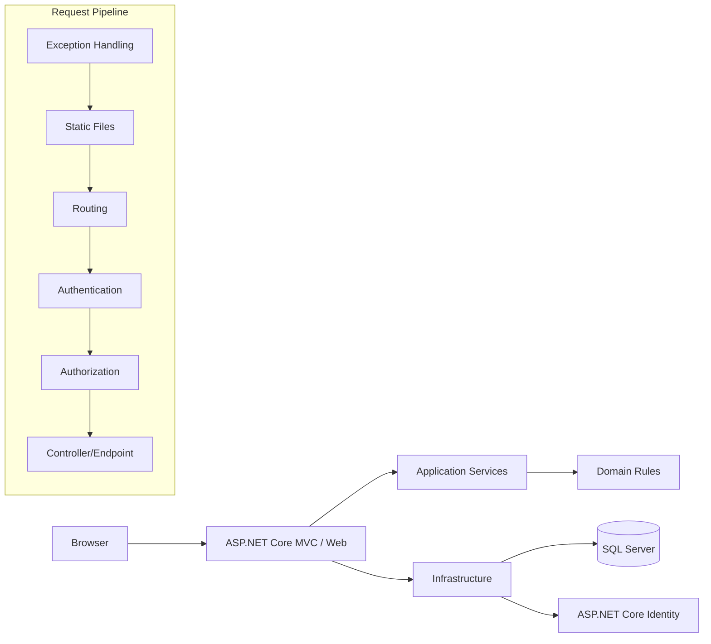

# Kiến trúc hệ thống

## Quy tắc dependency

`Domain <- Application <- Infrastructure <- Web` theo reference direction hiện tại; Domain không phụ thuộc framework/database.

## Điểm vấn đáp cần nắm

1. Middleware chạy theo thứ tự nào và vì sao AuthN đứng trước AuthZ.
2. DI lifetime: singleton/scoped/transient; DbContext là scoped.
3. EF Core tracking, relationship, migration, unique index.
4. Identity tạo password hash, cookie auth, role.
5. Controller không chứa business logic scoring; scoring nằm ở Application service.
6. CI build/test mọi PR; CD đóng gói container khi merge main/tag release.
