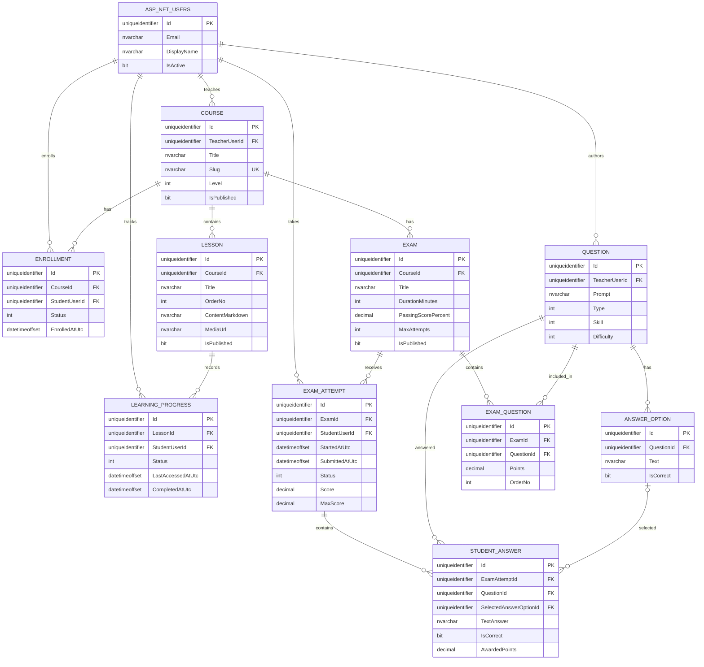

# ERD — MVP

> Đây là ERD nghiệp vụ. Bảng ASP.NET Core Identity (`AspNetUsers`, `AspNetRoles`, ...) do Identity tạo riêng; các cột `StudentUserId`/`TeacherUserId` tham chiếu logic tới `AspNetUsers.Id`.

## Ràng buộc quan trọng

- `Course.Slug` unique.
- Một student chỉ có một `Enrollment` cho mỗi course.
- Một student chỉ có một `LearningProgress` cho mỗi lesson.
- Một question chỉ xuất hiện một lần trong một exam.
- Một attempt chỉ có một `StudentAnswer` cho mỗi question.
- Xóa `Question` đã được dùng trong exam/answer nên bị `Restrict` để tránh mất lịch sử.
