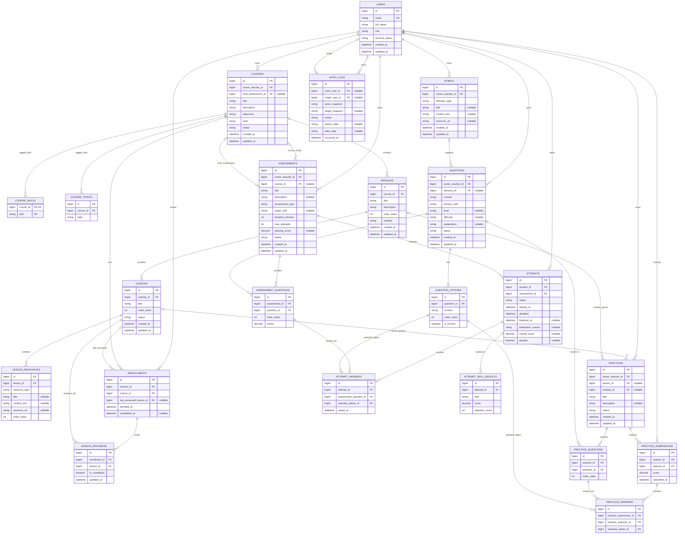

# ERD — MVP

> Đây là ERD nghiệp vụ. Bảng ASP.NET Core Identity (`AspNetUsers`, `AspNetRoles`, ...) do Identity tạo riêng; các cột `StudentUserId`/`TeacherUserId` tham chiếu logic tới `AspNetUsers.Id`.

## Ràng buộc toàn vẹn đi kèm ERD v1

> ERD trên mô tả quan hệ và thuộc tính chính. Các ràng buộc nhiều bảng, ràng buộc trạng thái và thao tác đồng thời sau đây là một phần của thiết kế dữ liệu/nghiệp vụ; FK đơn lẻ không đủ để bảo đảm chúng.

| Nhóm dữ liệu | Ràng buộc cần thực thi |
| --- | --- |
| `ENROLLMENTS` | Unique (`student_id`, `course_id`). User phải có quyền Student khi tạo Enrollment; role đổi sau này không xóa lịch sử. |
| `LESSON_PROGRESS` | Unique (`enrollment_id`, `lesson_id`); Lesson phải thuộc đúng Course của Enrollment. `last_accessed_lesson_id` cũng phải thuộc Course đó. |
| `PRACTICES` | Không đồng thời có `lesson_id` và `module_id`; `Published` bắt buộc có đúng một parent thuộc Course của Owner, ≥1 Question khác nhau; bản Draft chưa gắn parent thì không khả dụng. `Unpublished` không được Start/Submit. |
| `PRACTICE_QUESTIONS`, `ASSESSMENT_QUESTIONS` | Unique (`practice_id`, `question_id`) và unique (`assessment_id`, `question_id`); Question cùng Owner với Practice/Assessment. Mỗi Question trong Assessment có `points > 0`. |
| `PRACTICE_SUBMISSIONS` | Unique (`student_id`, `practice_id`): chỉ một kết quả gần nhất. Khi làm lại, thay score và bộ `PRACTICE_ANSWERS` tương ứng một cách nhất quán. |
| `ATTEMPT_ANSWERS`, `PRACTICE_ANSWERS` | Unique (`attempt_id`, `assessment_question_id`) và unique (`practice_submission_id`, `practice_question_id`); câu phải thuộc đúng Assessment/Practice của lần làm, Option chọn phải thuộc đúng Question đó. Câu bỏ trống không cần tạo Answer row. |
| `ATTEMPT_SKILL_RESULTS` | Unique (`attempt_id`, `skill`); chỉ sử dụng nhóm đủ ngưỡng theo TBR08 để phân loại điểm yếu/gợi ý. |
| `COURSES.final_assessment_id` | Khi Course chưa Archived, Final phải trỏ tới Assessment `Published` thuộc **chính Course** và cùng Owner, có Type/PassingScore hợp lệ. Với Course Archived, Final lịch sử có thể Archived theo TBR14. Trước khi đổi `ASSESSMENTS.course_id` phải kiểm tra Course nào đang trỏ tới nó làm Final. |
| `QUESTIONS`, `QUESTION_OPTIONS`, `STIMULI` | Một Question phải có ≥2 Option, đúng một Option đúng; Stimulus phải cùng Owner với Question. Khi Question từng được Published hoặc có dữ liệu làm bài, nội dung/Option/Stimulus liên quan bất biến theo TBR05; tài nguyên audio không được ghi đè tại cùng URL. |
| `ATTEMPTS` | Start, kiểm tra `MaxAttempts`, xử lý Attempt quá Deadline, giới hạn một Attempt còn hiệu lực và finalize/chấm một lần phải nhất quán khi nhiều request cùng lúc. `ATTEMPT_ANSWERS` phải thuộc đúng Attempt còn hiệu lực. |
| `USERS`, `AUDIT_LOGS` | Kiểm tra Active Admin cuối cùng khi cập nhật đồng thời. Hard-delete User hợp lệ thì FK actor/target của Audit được để null, giữ `actor_snapshot`/`target_snapshot` và thời điểm; không xóa dây chuyền Audit Log. |

Các điều kiện cùng Course, cùng Question, trạng thái Published và cập nhật đồng thời cần được kiểm tra trong thao tác nghiệp vụ tương ứng; chỉ ghi FK trong ERD không thể hiện đầy đủ các điều kiện này.
