# ERD — Nền tảng học và đánh giá năng lực tiếng Anh

Đây là ERD nghiệp vụ đích cho MVP và các giai đoạn tiếp theo, chưa phải mô tả các migration hiện có. Các bảng trong sơ đồ dùng tên `UPPER_SNAKE_CASE`; cột dùng `PascalCase`. Khóa chính của Identity và các thực thể chính là `uniqueidentifier`, phù hợp với `IdentityUser<Guid>` và `IdentityRole<Guid>` trong dự án.

`ASP_NET_USERS` đại diện logic cho bảng `AspNetUsers` do ASP.NET Core Identity quản lý. Role Student/Teacher/Admin và các bảng nội bộ như `AspNetRoles`, `AspNetUserRoles`, claims, logins, tokens được **lược bỏ khỏi business ERD**; không tạo hệ thống tài khoản hoặc mật khẩu thứ hai. `StudentUserId`, `TeacherUserId`, `CreatedByUserId` và các FK tương tự trỏ tới `AspNetUsers.Id`. Quyền Teacher/Admin phải được kiểm tra ở tầng ứng dụng.

## Sơ đồ Mermaid

```mermaid
erDiagram
    ASP_NET_USERS ||--o| USER_PROFILE : has
    ASP_NET_USERS ||--o{ COURSE : teaches
    ASP_NET_USERS ||--o{ ENROLLMENT : enrolls
    ASP_NET_USERS ||--o{ MEDIA_ASSET : uploads
    ASP_NET_USERS ||--o{ QUESTION : authors
    ASP_NET_USERS ||--o{ EXAM : creates
    ASP_NET_USERS ||--o{ EXAM_ATTEMPT : takes
    ASP_NET_USERS o|--o{ STUDENT_ANSWER : reviews
    ASP_NET_USERS ||--o| ASSESSMENT_PROFILE : has
    ASP_NET_USERS ||--o{ USER_SKILL_SCORE : has
    ASP_NET_USERS o|--o{ AUDIT_LOG : performs

    COURSE_CATEGORY o|--o{ COURSE : categorizes
    MEDIA_ASSET o|--o{ COURSE : covers
    COURSE ||--o{ LESSON : contains
    COURSE ||--o{ ENROLLMENT : receives
    COURSE o|--o{ EXAM : hosts
    SKILL ||--o{ LESSON_SKILL : classifies
    LESSON ||--o{ LESSON_SKILL : teaches
    ENROLLMENT ||--o{ LEARNING_PROGRESS : tracks
    LESSON ||--o{ LEARNING_PROGRESS : records
    LESSON ||--o{ LESSON_MEDIA : attaches
    MEDIA_ASSET ||--o{ LESSON_MEDIA : supplies

    SKILL ||--o{ QUESTION : classifies
    QUESTION ||--o{ ANSWER_OPTION : offers
    MEDIA_ASSET o|--o{ ANSWER_OPTION : illustrates
    QUESTION ||--o{ QUESTION_MEDIA : attaches
    MEDIA_ASSET ||--o{ QUESTION_MEDIA : supplies
    QUESTION ||--o{ QUESTION_TAG_MAP : is_tagged
    QUESTION_TAG ||--o{ QUESTION_TAG_MAP : labels

    EXAM ||--o{ EXAM_QUESTION : contains
    QUESTION ||--o{ EXAM_QUESTION : appears_in
    EXAM ||--o{ EXAM_ATTEMPT : receives
    EXAM_ATTEMPT ||--o{ STUDENT_ANSWER : contains
    QUESTION ||--o{ STUDENT_ANSWER : answers
    MEDIA_ASSET o|--o{ STUDENT_ANSWER : stores_response
    STUDENT_ANSWER ||--o{ STUDENT_ANSWER_OPTION : selects
    ANSWER_OPTION ||--o{ STUDENT_ANSWER_OPTION : is_selected
    EXAM_ATTEMPT ||--o{ ATTEMPT_SKILL_SCORE : yields
    SKILL ||--o{ ATTEMPT_SKILL_SCORE : measures
    EXAM_ATTEMPT ||--o| ASSESSMENT_PROFILE : establishes
    EXAM_ATTEMPT o|--o{ USER_SKILL_SCORE : sources

    ASP_NET_USERS {
        uniqueidentifier Id PK
        nvarchar Email
        nvarchar DisplayName
        bit IsActive
        datetimeoffset CreatedAtUtc
    }
    USER_PROFILE {
        uniqueidentifier UserId PK, FK
        nvarchar NativeLanguageCode
        int TargetLevel
        nvarchar LearningGoal
        nvarchar TimeZoneId
        datetimeoffset UpdatedAtUtc
    }
    COURSE_CATEGORY {
        uniqueidentifier Id PK
        nvarchar Name
        nvarchar Slug UK
        nvarchar Description
        bit IsActive
    }
    COURSE {
        uniqueidentifier Id PK
        uniqueidentifier TeacherUserId FK
        uniqueidentifier CourseCategoryId FK
        uniqueidentifier CoverMediaAssetId FK
        nvarchar Title
        nvarchar Slug UK
        nvarchar Description
        int Level
        int CourseStatus
        datetimeoffset PublishedAtUtc
        datetimeoffset CreatedAtUtc
        datetimeoffset UpdatedAtUtc
    }
    SKILL {
        uniqueidentifier Id PK
        nvarchar Code UK
        nvarchar Name
        bit IsActive
    }
    LESSON {
        uniqueidentifier Id PK
        uniqueidentifier CourseId FK
        nvarchar Title
        nvarchar ContentMarkdown
        int OrderNo
        int EstimatedMinutes
        int LessonStatus
        datetimeoffset CreatedAtUtc
        datetimeoffset UpdatedAtUtc
    }
    LESSON_SKILL {
        uniqueidentifier LessonId PK, FK
        uniqueidentifier SkillId PK, FK
    }
    ENROLLMENT {
        uniqueidentifier Id PK
        uniqueidentifier CourseId FK
        uniqueidentifier StudentUserId FK
        int EnrollmentStatus
        datetimeoffset EnrolledAtUtc
        datetimeoffset LastAccessedAtUtc
        datetimeoffset CompletedAtUtc
    }
    LEARNING_PROGRESS {
        uniqueidentifier Id PK
        uniqueidentifier EnrollmentId FK
        uniqueidentifier LessonId FK
        int ProgressStatus
        datetimeoffset LastAccessedAtUtc
        datetimeoffset CompletedAtUtc
    }
    MEDIA_ASSET {
        uniqueidentifier Id PK
        uniqueidentifier UploadedByUserId FK
        nvarchar OriginalFileName
        nvarchar StoragePath UK
        int MediaType
        nvarchar MimeType
        bigint SizeBytes
        int DurationSeconds
        datetimeoffset CreatedAtUtc
    }
    LESSON_MEDIA {
        uniqueidentifier LessonId PK, FK
        uniqueidentifier MediaAssetId PK, FK
        int MediaRole
        int OrderNo
    }
    QUESTION_MEDIA {
        uniqueidentifier QuestionId PK, FK
        uniqueidentifier MediaAssetId PK, FK
        int MediaRole
        int OrderNo
    }
    QUESTION {
        uniqueidentifier Id PK
        uniqueidentifier TeacherUserId FK
        uniqueidentifier SkillId FK
        nvarchar Prompt
        nvarchar Explanation
        nvarchar ExpectedAnswerText
        int QuestionType
        int Difficulty
        int QuestionStatus
        datetimeoffset CreatedAtUtc
        datetimeoffset UpdatedAtUtc
    }
    ANSWER_OPTION {
        uniqueidentifier Id PK
        uniqueidentifier QuestionId FK
        uniqueidentifier MediaAssetId FK
        nvarchar Text
        int OrderNo
        bit IsCorrect
    }
    QUESTION_TAG {
        uniqueidentifier Id PK
        nvarchar Name
        nvarchar Slug UK
    }
    QUESTION_TAG_MAP {
        uniqueidentifier QuestionId PK, FK
        uniqueidentifier QuestionTagId PK, FK
    }
    EXAM {
        uniqueidentifier Id PK
        uniqueidentifier CourseId FK
        uniqueidentifier CreatedByUserId FK
        nvarchar Title
        int ExamType
        int ExamStatus
        int DurationMinutes
        decimal PassingScorePercent
        int MaxAttempts
        bit RandomizeQuestionOrder
        datetimeoffset PublishedAtUtc
        datetimeoffset CreatedAtUtc
        datetimeoffset UpdatedAtUtc
    }
    EXAM_QUESTION {
        uniqueidentifier Id PK
        uniqueidentifier ExamId FK
        uniqueidentifier QuestionId FK
        decimal Points
        int OrderNo
    }
    EXAM_ATTEMPT {
        uniqueidentifier Id PK
        uniqueidentifier ExamId FK
        uniqueidentifier StudentUserId FK
        int AttemptNo
        int AttemptStatus
        datetimeoffset StartedAtUtc
        datetimeoffset DeadlineAtUtc
        datetimeoffset SubmittedAtUtc
        datetimeoffset GradedAtUtc
        decimal Score
        decimal MaxScore
        bit Passed
    }
    STUDENT_ANSWER {
        uniqueidentifier Id PK
        uniqueidentifier ExamAttemptId FK
        uniqueidentifier QuestionId FK
        uniqueidentifier ResponseMediaAssetId FK
        uniqueidentifier ReviewedByUserId FK
        nvarchar TextAnswer
        bit IsCorrect
        decimal AwardedPoints
        datetimeoffset AnsweredAtUtc
        datetimeoffset ReviewedAtUtc
    }
    STUDENT_ANSWER_OPTION {
        uniqueidentifier StudentAnswerId PK, FK
        uniqueidentifier AnswerOptionId PK, FK
    }
    ATTEMPT_SKILL_SCORE {
        uniqueidentifier ExamAttemptId PK, FK
        uniqueidentifier SkillId PK, FK
        decimal EarnedPoints
        decimal MaxPoints
    }
    ASSESSMENT_PROFILE {
        uniqueidentifier StudentUserId PK, FK
        uniqueidentifier LatestPlacementAttemptId FK, UK
        int CurrentLevel
        datetimeoffset AssessedAtUtc
    }
    USER_SKILL_SCORE {
        uniqueidentifier StudentUserId PK, FK
        uniqueidentifier SkillId PK, FK
        uniqueidentifier SourceExamAttemptId FK
        int SourceType
        decimal ScorePercent
        datetimeoffset UpdatedAtUtc
    }
    AUDIT_LOG {
        uniqueidentifier Id PK
        uniqueidentifier ActorUserId FK
        nvarchar Action
        nvarchar EntityType
        uniqueidentifier EntityId
        datetimeoffset TimestampUtc
        nvarchar IpAddress
        nvarchar ChangeSummaryJson
    }
```

## Phạm vi và quy tắc thiết kế

- Một `COURSE` có đúng một `TeacherUserId`; chưa tạo `COURSE_TEACHER` vì yêu cầu hiện tại không có đồng giảng viên. Một course có tối đa một category để tránh bảng nối không cần thiết.
- `SKILL` là bảng dữ liệu dùng chung, seed Listening, Reading, Writing, Speaking, Grammar, Vocabulary. Một lesson có thể gắn nhiều skill; một question có **một skill chính** để phân bổ điểm rõ ràng.
- `QUESTION_TAG` dùng để lọc ngân hàng câu hỏi theo chủ đề cụ thể như thì quá khứ; tag khác skill. Có thể triển khai sau MVP.
- `EXAM.ExamType = Placement` dùng chung `EXAM_QUESTION`, `EXAM_ATTEMPT`, `STUDENT_ANSWER` và cơ chế chấm điểm; không tạo bộ bảng placement trùng lặp. `CourseId` của placement là `NULL`.
- `EXAM_ATTEMPT` là kết quả cuối của một lượt thi, không tạo `EXAM_RESULT`. `Score`, `MaxScore`, `Passed` được chốt khi chấm xong; phần trăm tính từ `Score / MaxScore * 100`. `ATTEMPT_SKILL_SCORE` lưu kết quả lịch sử theo skill; `USER_SKILL_SCORE` lưu trạng thái năng lực hiện tại và có thể cập nhật từ placement mới.
- Tiến độ phần trăm của course tính từ `LEARNING_PROGRESS` và các lesson thuộc course, không lưu thêm `COURSE_PROGRESS`. `ENROLLMENT.CompletedAtUtc` là mốc hoàn thành lịch sử. Nếu thay đổi giáo trình sau khi có học viên, nhóm cần quy định rõ cách tính lại phần trăm hoặc tạo phiên bản course mới.
- `COURSE_RECOMMENDATION`, bảng report và bảng CSV export chưa cần thiết: gợi ý course, báo cáo, item analysis và export được tính từ dữ liệu nghiệp vụ khi yêu cầu.
- `MEDIA_ASSET` chứa metadata và storage key. `LESSON_MEDIA`, `QUESTION_MEDIA` cho phép nhiều file; course cover, option image và câu trả lời speaking dùng FK tùy chọn trực tiếp. Không lặp URL trong từng bảng.

## Nullability

Trong **thiết kế đích**, các cột không liệt kê dưới đây là `NOT NULL`. Mermaid ERD không biểu diễn `NULL`/`NOT NULL` ổn định trên mọi phiên bản, nên danh sách này là nguồn quy định khi cấu hình EF Core và migration. Cột PK luôn `NOT NULL`.

| Bảng | Cột nullable | Lý do |
|---|---|---|
| `USER_PROFILE` | `NativeLanguageCode`, `TargetLevel`, `LearningGoal`, `TimeZoneId` | Người dùng có thể chưa nhập thông tin học tập |
| `COURSE_CATEGORY` | `Description` | Mô tả tùy chọn |
| `COURSE` | `CourseCategoryId`, `CoverMediaAssetId`, `Description`, `PublishedAtUtc`, `UpdatedAtUtc` | Bản nháp có thể chưa phân loại, chưa có cover hoặc chưa publish |
| `LESSON` | `UpdatedAtUtc` | Chưa từng sửa sau khi tạo |
| `ENROLLMENT` | `LastAccessedAtUtc`, `CompletedAtUtc` | Có thể chưa mở course hoặc chưa hoàn thành |
| `LEARNING_PROGRESS` | `LastAccessedAtUtc`, `CompletedAtUtc` | Có thể chưa học hoặc chưa hoàn thành lesson |
| `MEDIA_ASSET` | `DurationSeconds` | Ảnh/tài liệu không có thời lượng |
| `QUESTION` | `Explanation`, `ExpectedAnswerText`, `UpdatedAtUtc` | Không phải loại câu hỏi nào cũng cần đáp án dạng text |
| `ANSWER_OPTION` | `MediaAssetId`, `Text` | Option có thể là text, media hoặc cả hai; phải có ít nhất một |
| `EXAM` | `CourseId`, `PublishedAtUtc`, `UpdatedAtUtc` | Placement không thuộc course; bản nháp chưa publish |
| `EXAM_ATTEMPT` | `SubmittedAtUtc`, `GradedAtUtc`, `Score`, `Passed` | Lượt thi đang làm/chưa chấm chưa có kết quả cuối |
| `STUDENT_ANSWER` | `ResponseMediaAssetId`, `ReviewedByUserId`, `TextAnswer`, `IsCorrect`, `AwardedPoints`, `ReviewedAtUtc` | Phụ thuộc loại câu hỏi và trạng thái chấm; selection nằm ở bảng nối |
| `USER_SKILL_SCORE` | `SourceExamAttemptId` | Có thể là đánh giá thủ công có audit |
| `AUDIT_LOG` | `ActorUserId`, `EntityId`, `IpAddress`, `ChangeSummaryJson` | Sự kiện hệ thống hoặc sự kiện không gắn một entity cụ thể |

`ASSESSMENT_PROFILE` chỉ được tạo sau một placement attempt đã chấm; do đó `LatestPlacementAttemptId`, `CurrentLevel`, `AssessedAtUtc` là `NOT NULL`. `EXAM_ATTEMPT.DeadlineAtUtc` và `MaxScore` được chốt khi bắt đầu lượt thi. `ASP_NET_USERS.Email` được xem là bắt buộc cho luồng đăng ký của dự án; cấu trúc Identity mặc định có thể cho phép `NULL`, nên cần cấu hình/validation tương ứng khi triển khai.

## Unique, composite, check và business constraints

### Unique/composite

- `UNIQUE(COURSE.Slug)`, `UNIQUE(COURSE_CATEGORY.Slug)`, `UNIQUE(QUESTION_TAG.Slug)`, `UNIQUE(SKILL.Code)`, `UNIQUE(MEDIA_ASSET.StoragePath)`. Chuẩn hóa slug/code trước khi lưu. Với Identity, nên có unique index trên `NormalizedEmail` khi khác `NULL`, ngoài `RequireUniqueEmail` ở tầng ứng dụng.
- `UNIQUE(LESSON.CourseId, LESSON.OrderNo)`.
- `UNIQUE(ENROLLMENT.CourseId, ENROLLMENT.StudentUserId)`.
- `UNIQUE(LEARNING_PROGRESS.EnrollmentId, LEARNING_PROGRESS.LessonId)`; `StudentUserId` đi qua `ENROLLMENT`, không lưu lặp trong progress.
- `UNIQUE(ANSWER_OPTION.QuestionId, ANSWER_OPTION.OrderNo)`.
- PK kép `(LessonId, SkillId)`, `(QuestionId, QuestionTagId)`, `(LessonId, MediaAssetId)`, `(QuestionId, MediaAssetId)` cho các bảng nối tương ứng. Thêm `UNIQUE(LESSON_MEDIA.LessonId, OrderNo)` và `UNIQUE(QUESTION_MEDIA.QuestionId, OrderNo)`.
- `UNIQUE(EXAM_QUESTION.ExamId, EXAM_QUESTION.QuestionId)` và `UNIQUE(EXAM_QUESTION.ExamId, EXAM_QUESTION.OrderNo)`.
- `UNIQUE(EXAM_ATTEMPT.ExamId, EXAM_ATTEMPT.StudentUserId, EXAM_ATTEMPT.AttemptNo)`. Có thể thêm filtered unique index cho một attempt `InProgress` trên `(ExamId, StudentUserId)` để ngăn mở hai lượt thi đồng thời.
- `UNIQUE(STUDENT_ANSWER.ExamAttemptId, STUDENT_ANSWER.QuestionId)`; PK kép `(StudentAnswerId, AnswerOptionId)` ở `STUDENT_ANSWER_OPTION` ngăn chọn lặp một option. Một answer vẫn có thể chọn nhiều option.
- PK kép `(ExamAttemptId, SkillId)` của `ATTEMPT_SKILL_SCORE`; PK kép `(StudentUserId, SkillId)` của `USER_SKILL_SCORE`; `ASSESSMENT_PROFILE.StudentUserId` là PK, và `LatestPlacementAttemptId` là unique.

### Check và quy tắc liên bảng

- `Difficulty BETWEEN 1 AND 5`; `OrderNo >= 1`; `Points > 0`; `DurationMinutes > 0`; `MaxAttempts > 0`; `AttemptNo > 0`; `SizeBytes > 0`; `DurationSeconds >= 0` khi có giá trị.
- `PassingScorePercent` và `ScorePercent` nằm trong `0..100`; `0 <= Score <= MaxScore`; `0 <= EarnedPoints <= MaxPoints`; `AwardedPoints >= 0`. Số điểm của một answer không vượt `EXAM_QUESTION.Points` tương ứng, kiểm tra trong service vì đây là quy tắc liên bảng.
- `EXAM.CourseId` bắt buộc cho course assessment và phải `NULL` cho placement. Chỉ publish exam khi có ít nhất một question và mỗi question hợp lệ.
- Với `ANSWER_OPTION`, `Text` hoặc `MediaAssetId` phải có giá trị. Single choice/true-false có đúng một option đúng; multiple select có ít nhất một option đúng. Việc này phụ thuộc `QUESTION.QuestionType`, nên service kiểm tra trong transaction.
- `LEARNING_PROGRESS.EnrollmentId -> ENROLLMENT.CourseId` **phải bằng** `LEARNING_PROGRESS.LessonId -> LESSON.CourseId`. Hai FK đơn lẻ không bảo đảm điều này; service phải kiểm tra khi tạo/cập nhật progress trong cùng transaction.
- `STUDENT_ANSWER.QuestionId` phải nằm trong `EXAM_QUESTION` của `EXAM_ATTEMPT.ExamId`. Mỗi `STUDENT_ANSWER_OPTION.AnswerOptionId` phải thuộc cùng `QuestionId` của `STUDENT_ANSWER`. **Không lưu `QuestionId` trong `STUDENT_ANSWER_OPTION`**; service kiểm tra bằng join tới `ANSWER_OPTION.QuestionId` khi nhận bài và khi chấm. FK vẫn bảo đảm answer và option đều tồn tại.
- `ASSESSMENT_PROFILE.LatestPlacementAttemptId` phải trỏ tới attempt đã chấm, thuộc cùng student và có `ExamType = Placement`. `USER_SKILL_SCORE.SourceExamAttemptId`, khi có, phải thuộc cùng student và có kết quả cho skill tương ứng.
- Đếm `MaxAttempts`, quyền Teacher/Admin, quyền truy cập course exam, chuyển trạng thái, chống nộp lại và auto-submit được bảo vệ ở tầng ứng dụng. Dùng transaction/concurrency control khi tạo attempt và chốt điểm.
- Index các FK và đường lọc thường dùng, đặc biệt `(StudentUserId, EnrollmentStatus)`, `(StudentUserId, StartedAtUtc)`, `(TeacherUserId, QuestionStatus, SkillId)`, `(ExamId, AttemptStatus)`, `(EntityType, EntityId, TimestampUtc)` cho audit.

## Bảo toàn lịch sử thi và xóa dữ liệu

Ngay khi một `EXAM_ATTEMPT` đầu tiên được tạo cho exam, **không được destructive-edit hoặc xóa vật lý** `EXAM`, `EXAM_QUESTION`, question được dùng, `ANSWER_OPTION`, media của question, thời lượng, điểm từng câu hoặc ngưỡng đậu. Một question được tái sử dụng sẽ bị khóa nếu **bất kỳ** exam chứa nó đã có attempt. Điều kiện khóa phải được kiểm tra cùng transaction với thao tác tạo attempt hoặc sửa nội dung để tránh race condition. Trước attempt đầu tiên có thể sửa bản đề theo quy trình publish của nhóm.

Nếu cần sửa lỗi sau khi đã có lịch sử, tạo question/exam mới với ID mới và đóng exam cũ đối với attempt mới. `EXAM_ATTEMPT.Score`, `MaxScore`, `Passed`, `STUDENT_ANSWER.AwardedPoints` và `ATTEMPT_SKILL_SCORE` giữ nguyên kết quả đã chấm. Việc chấm lại có chủ đích, nếu được phép, phải là thao tác riêng có audit. File media được tham chiếu bởi lịch sử thi phải được giữ trong storage, không chỉ giữ row metadata.

| Quan hệ | EF Core delete behavior khuyến nghị | Lý do |
|---|---|---|
| User → course/enrollment/question/exam/attempt/review | `Restrict` / `NoAction` | Khóa hoặc vô hiệu hóa tài khoản, giữ lịch sử và người chịu trách nhiệm |
| User → audit actor | `SetNull` nếu buộc phải xóa tài khoản vật lý | Giữ sự kiện audit; thông thường chỉ deactivate |
| Course → lesson/enrollment/exam | `Restrict` / `NoAction` | Archive course có dữ liệu học hoặc thi |
| Lesson → learning progress | `Restrict` / `NoAction` | Không mất tiến độ học |
| Question → option/exam question/student answer/question media | `Restrict` / `NoAction` | Không mất căn cứ chấm và nội dung lịch sử |
| Exam → exam question/attempt | `Restrict` / `NoAction` | Không mất lượt thi |
| Exam attempt → answer/skill score/profile source | `Restrict` / `NoAction` | Giữ toàn bộ kết quả |
| Student answer → selected option rows | `Restrict` / `NoAction` | Giữ chính xác lựa chọn đã nộp |
| Media asset → các vị trí tham chiếu | `Restrict` / `NoAction` | Không xóa file đang dùng trong lesson hoặc lịch sử thi |
| Các bảng nối draft không có lịch sử như `LESSON_SKILL`, `QUESTION_TAG_MAP` | Có thể `Cascade` khi parent được xóa hợp lệ | Bảng nối không có ý nghĩa độc lập |

`COURSE`, `LESSON`, `QUESTION`, `EXAM` có lịch sử nên đổi trạng thái Archived/Closed thay vì xóa. Các báo cáo được truy vấn từ dữ liệu nghiệp vụ, không cascade xóa theo course hoặc exam.

## Enum và lộ trình triển khai

Các tập giá trị ổn định nên lưu `int` và ánh xạ C# enum: `CourseStatus`, `LessonStatus`, `EnrollmentStatus`, `ProgressStatus`, `QuestionType` (SingleChoice, MultipleSelect, TrueFalse, ShortAnswer, Writing, Speaking), `QuestionStatus`, `ExamType` (CourseAssessment, Placement), `ExamStatus` (Draft, Published, Closed, Archived), `AttemptStatus` (InProgress, Submitted, AutoSubmitted, Graded), `MediaType`, `MediaRole`, `SourceType`, `Course.Level`. `SKILL` vẫn là bảng seed, không phải enum. Listening question = skill Listening + audio media, không cần `QuestionType` riêng.

**MVP:** `ASP_NET_USERS`, `COURSE`, `SKILL`, `LESSON`, `ENROLLMENT`, `LEARNING_PROGRESS`, `QUESTION`, `ANSWER_OPTION`, `EXAM`, `EXAM_QUESTION`, `EXAM_ATTEMPT`, `STUDENT_ANSWER`, `STUDENT_ANSWER_OPTION`. Các FK tùy chọn tới bảng extension chỉ cần thêm khi triển khai bảng liên quan.

**Giai đoạn sau:** profile, category, lesson-skill, media, question tags, placement profile, điểm theo skill và audit. Dùng exam engine hiện có cho placement; course recommendation và report được tính động.
