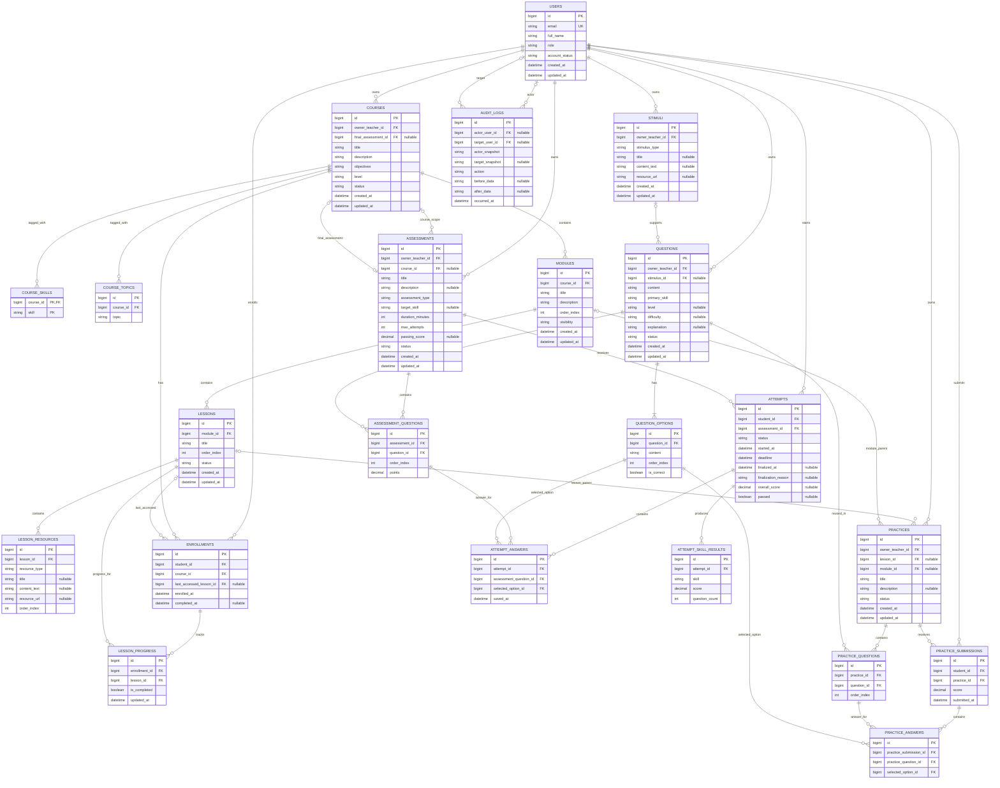

## TỔNG KẾT

> Đề tài: Công nghệ .NET - Xây dựng nền tảng học tập và đánh giá năng lực tiếng Anh trực tuyến trên nền web

## Bối cảnh:

- Đề tài là dự án gộp chung của 3 môn:
  - Công nghệ .NET
  - Các công nghệ lập trình hiện đại
  - Quản lý dự án phần mềm

1. Lý do gộp chung:

- Giảm khối lượng mã nguồn
- Tập trung sâu vào chất lượng sản phẩm
- Môn quản lý dự án phần mềm không yêu cầu đồ án riêng

## Yêu cầu của từng môn:


| Môn                  | CCNLTHD                                                                                                                                                                            | QLDAPM                                                                                     | .NET                                                                                                                         |
| --------------------- | ---------------------------------------------------------------------------------------------------------------------------------------------------------------------------------- | ------------------------------------------------------------------------------------------ | ---------------------------------------------------------------------------------------------------------------------------- |
| Yêu cầu chức năng | Không cần quá nhiều chức năng; quan trọng là **dùng ASP.NET Core đúng bản chất và chứng minh được**.Phân tích công nghệ + minh chứng thực hành + bài học | Sản phẩm chỉ là đối tượng để quản lý; cần scope rõ, acceptance criteria rõ. | Đây là môn cần **demo đẹp, chức năng hợp lý, navigation thông minh**.                                             |
| Yêu cầu kỹ thuật  | Bắt buộc chú ý middleware, DI, controller/Minimal API; thêm Git/PR/review, test, CI, bảo mật, Docker khi phù hợp                                                          | WBS, timeline, milestone, dependency, cost, risk, resource, change request, status report. | ASP.NET Core, EF Core, Identity/Auth, validation, logging, testing, DB hợp lý.                                             |
| Yêu cầu báo cáo   | Báo cáo theo hướng **phân tích công nghệ + minh chứng thực hành + đồ án + bài học**; có log tuần, Git, slide, demo/hands-on.                                      | Đồ án 40%, nộp **file Word**, báo cáo khoảng tuần 13, cả nhóm tham gia.           | Chưa có yêu cầu chính thức, theo kinh nghiệm của tôi thì cần báo cáo **đầy đủ, chuẩn, đẹp, dễ đọc**. |

## Quy nạp lại:

- Công nghệ lập trình hiện đại -> Đi sâu vào **độ hiểu biết** và **kỹ thuật**
- QL dự án -> **Quản lý quá trình & quy trình** phát triển sản phẩm
- .NET -> **Chất lượng & độ hoàn thiện** của sản phẩm

## Dự án

### Phân tích tên dự án

> Công nghệ .NET - Xây dựng nền tảng học tập và đánh giá năng lực tiếng Anh trực tuyến trên nền web


| Thành phần               | Hiểu như thế nào                                                                                                                                                                    | Hàm ý đối với sản phẩm                                                                                                                                                                   |
| -------------------------- | --------------------------------------------------------------------------------------------------------------------------------------------------------------------------------------- | ----------------------------------------------------------------------------------------------------------------------------------------------------------------------------------------------- |
| **Nền tảng**             | Không phải một công cụ đơn lẻ hay một trang web chỉ có vài chức năng. Nó là một hệ thống có nhiều nhóm người dùng và nhiều chức năng liên kết với nhau. | Có tài khoản, phân quyền, dữ liệu được lưu lâu dài, các module liên hệ với nhau. Ví dụ người học học → làm bài → kết quả được lưu → theo dõi tiến độ.     |
| **Học tập**              | Phần giúp người dùng **tiếp nhận và luyện tập kiến thức tiếng Anh**.                                                                                                        | Phải có nội dung học hoặc hoạt động học. Có thể là khóa học, bài học, tài liệu, bài luyện tập, tiến độ. Nếu chỉ có thi thì tên “học tập” không còn hợp lý. |
| **Đánh giá năng lực** | Không đơn thuần là “làm quiz”. Hệ thống phải có cách dùng kết quả bài làm để đưa ra một nhận định nào đó về khả năng của người học.                 | Cần bài đánh giá, cách tính điểm, kết quả, lịch sử; sau này phải xác định đánh giá theo kỹ năng nào và kết quả có ý nghĩa gì.                                    |
| **Tiếng Anh**             | Xác định miền nghiệp vụ. Đây không phải LMS tổng quát cho mọi môn học.                                                                                                   | Nội dung, dạng câu hỏi, kết quả và UX nên mang đặc trưng học ngoại ngữ. Nội dung tập trung vào Reading, Listening, Vocabulary, Grammar (các kỹ năng đánh giá tự động, khách quan); tạm gác Writing và Speaking sang các giai đoạn nâng cao.      |
| **Trực tuyến**           | Người dùng sử dụng hệ thống thông qua mạng, không phụ thuộc vào một máy cài đặt cố định.                                                                           | Có đăng nhập từ xa, dữ liệu tập trung, nhiều người dùng, lưu trạng thái học/làm bài. Các vấn đề session, timeout, submit bài, mất kết nối bắt đầu có ý nghĩa.   |
| **Trên nền web**         | Phương thức cung cấp sản phẩm là ứng dụng web chạy qua browser.                                                                                                               | Frontend web + backend .NET + database. Cần navigation rõ, responsive hợp lý, HTTP/request-response, authentication/authorization. Không bắt buộc phải có mobile app native.           |
| **Công nghệ .NET**       | Đây là nền công nghệ dùng để hiện thực hóa hệ thống.                                                                                                                      | ASP.NET Core là trung tâm; các công nghệ như EF Core, Identity… chỉ được chọn khi phù hợp với chức năng sau này.                                                              |

#### **Chi tiết phần HỌC TẬP**

**Phần học tập nên được hiểu là:**

> Người học tìm một khóa phù hợp với mục tiêu của mình, tham gia khóa đó, học nội dung trong cấu trúc Module → Lesson được sắp xếp rõ ràng nhưng **không bắt buộc truy cập tuần tự**, và theo dõi được tiến độ.


| Thành phần                | Ý nghĩa trong sản phẩm                                                                           |
| --------------------------- | ---------------------------------------------------------------------------------------------------- |
| **Danh mục khóa học**    | Người học xem các khóa đang có: TOEIC 700+, Basic Listening, Vocabulary B1…                  |
| **Thông tin khóa học**   | Tên, mô tả, mục tiêu, trình độ, kỹ năng/chủ đề, giáo viên, nội dung tổng quan       |
| **Tham gia khóa học**     | Người học chọn một khóa và đăng ký/enroll vào khóa đó                                  |
| **Cấu trúc học**         | Khóa học được chia thành`Chương/Module → Bài học/Lesson`                                  |
| **Nội dung bài học**     | Văn bản, hình ảnh, video, audio, tài liệu hoặc nội dung hướng dẫn                         |
| **Bài luyện trong khóa** | Có thể gắn bài luyện sau một bài/chương, nhưng phần chấm/đánh giá sẽ phân tích sau |
| **Tiến độ học**         | Biết đã học bài nào, đang ở đâu, hoàn thành bao nhiêu                                   |
| **Tiếp tục học**         | Khi quay lại, hệ thống đưa người học về bài đang học dở hoặc bài kế tiếp            |
| **Quản lý khóa học**    | Giáo viên tạo/sửa/ẩn khóa học, chương, bài học và sắp xếp thứ tự                     |

Luồng người học cơ bản sẽ là:

```
Trang khóa học
    ↓
Tìm / lọc khóa phù hợp
    ↓
Xem chi tiết khóa
    ↓
Tham gia khóa
    ↓
Module 1
    ↓
Lesson 1 → Lesson 2 → Lesson 3
    ↓
Module 2
    ↓
...
    ↓
Hoàn thành khóa
```

Sơ đồ trên mô tả **thứ tự tổ chức/hiển thị nội dung**, không phải điều kiện tiên quyết bắt buộc; sau khi enroll, Student được tự do mở các Lesson đang khả dụng theo BR02.

Tốt nhất là **không ép mọi khóa học phải giống nhau**

Ví dụ:
```
TOEIC 700+
├── Listening
├── Reading
├── Vocabulary
└── Practice

Basic Listening
├── Sounds
├── Short conversations
└── Longer conversations

Vocabulary B1
├── Daily life
├── Education
├── Work
└── Travel
```

Tức là `Course -> Module -> Lesson` chỉ là **khung**, còn giáo viên tự quyết định nội dung

Còn các thứ như khóa **trả phí, chứng chỉ, comment, forum, livestream, gamification** thì hiện tại chưa có lý do đủ mạnh để đưa vào. Có thể ghi vào danh sách ý tưởng, chưa coi là yêu cầu.

Có thể chốt lại phần HỌC TẬP bằng một câu:

> **Hệ thống cho phép người học lựa chọn khóa học theo mục tiêu, tham gia khóa học, học nội dung được tổ chức theo module/bài học và theo dõi tiến độ học tập; giáo viên có thể xây dựng và quản lý nội dung các khóa học.**


#### **Chi tiết phần ĐÁNH GIÁ NĂNG LỰC**

> Người học thực hiện một bài đánh giá có cấu trúc; hệ thống chấm kết quả và đưa ra nhận định về mức độ thành thạo của người học ở một phạm vi tiếng Anh cụ thể.

**"Đánh giá" khác "luyện tập"**

```
Luyện tập
→ làm bài để học / củng cố kiến thức

Đánh giá
→ làm bài để đo năng lực hiện tại
```

ví dụ:

```
Quiz sau Lesson 3
→ luyện tập / kiểm tra bài vừa học

Placement Test
→ đánh giá trình độ ban đầu

Mock TOEIC
→ đánh giá mức độ đạt mục tiêu TOEIC

Reading Skill Test
→ đánh giá riêng kỹ năng Reading
```

-> Phần đánh giá **không nên đồng nhất** với mọi bài quiz

**Một bài đánh giá cần trả lời được 4 câu**

| Câu hỏi               | Ví dụ                                                 |
| --------------------- | ----------------------------------------------------- |
| Đánh giá **cái gì**?  | Reading, Listening, Grammar, Vocabulary, tổng hợp     |
| Đánh giá **bằng gì**? | Bộ câu hỏi, passage, audio, multiple choice…          |
| **Chấm thế nào**?     | Điểm thô, %, điểm từng kỹ năng                        |
| **Kết luận gì**?      | Yếu Reading, Listening khá, đạt 72%, nên học khóa nào |

Điều quan trọng nhất
- Nếu hệ thống chỉ trả `17/20`. Thì đó mới chỉ là **chấm điểm**

- Còn nếu:
```
Overall: 72%

Reading: 82%
Listening: 48%
Vocabulary: 75%

Cần cải thiện: Listening
```

Thì nó bắt đầu mang tính **đánh giá năng lực**

**MVP chốt 3 loại Assessment**
```
Assessment
├── Placement Test
├── Skill Assessment
└── Mock / Practice Exam
```

**Placement Test**

Dùng trước khi học hoặc người dùng muốn biết trình độ hiện tại.

Ví dụ:
```
Overall: 72%
Reading: 82%
Listening: 48%
Vocabulary: 70%
Grammar: 70%

Cần cải thiện: Listening
```

Trong MVP, Placement Test **không tự suy ra CEFR hoặc các nhãn như Beginner/Intermediate/Advanced**. Nếu sau này có mapping trình độ, đó phải là một bảng quy đổi nội bộ được mô tả rõ, không được trình bày như chứng nhận CEFR/TOEIC chính thức.

**Skill Assessment**

Chỉ đánh giá **một `TargetSkill`**. Trong MVP, mọi Question của Skill Assessment phải có `PrimarySkill` trùng với `TargetSkill`:
```
Reading Assessment
Listening Assessment
Vocabulary Assessment
```

**Mock / Practice Exam**

Mô phỏng một bài thi/mục tiêu:
```
TOEIC Practice Test
General English Test
```

**Chức năng tối thiểu của phần đánh giá**
```
Người học
→ chọn bài đánh giá
→ bắt đầu attempt
→ trả lời câu hỏi
→ submit
→ hệ thống chấm
→ xem:
     tổng điểm
     điểm theo nhóm/kỹ năng
     skill breakdown / kỹ năng cần cải thiện
     lịch sử lần làm
     gợi ý học tiếp
```

```
Teacher
→ tạo bài đánh giá
→ chọn câu hỏi
→ cấu hình thời gian / điểm / ngưỡng
→ publish
→ xem kết quả người học
```

>Hệ thống cho phép người học thực hiện các bài đánh giá tổng hợp hoặc theo từng kỹ năng, tự động chấm các dạng câu hỏi phù hợp, phân tích kết quả theo từng nhóm năng lực và xác định các kỹ năng cần cải thiện để định hướng nội dung học tiếp theo.

#### **Chi tiết phần TRỰC TUYẾN**

Cụm này không chỉ có nghĩa là “mở bằng Internet”. Nó kéo theo một số hành vi hệ thống rất cụ thể.

> Người dùng có thể truy cập, học và làm bài từ xa thông qua một phiên làm việc được hệ thống quản lý; dữ liệu học tập và kết quả được lưu tập trung.

| Ý nghĩa               | Hệ quả chức năng                                                                  |
| --------------------- | --------------------------------------------------------------------------------- |
| **Truy cập từ xa**    | Người học đăng nhập ở bất kỳ máy nào có trình duyệt và Internet                   |
| **Dữ liệu tập trung** | Khóa học, tiến độ, bài làm, điểm số đều lưu trên server                           |
| **Nhiều người dùng**  | Nhiều Student/Teacher/Admin có thể dùng hệ thống cùng lúc                         |
| **Phiên làm bài**     | Khi bắt đầu bài test phải có trạng thái `InProgress`, thời gian bắt đầu, thời hạn |
| **Lưu trạng thái**    | Refresh trang không nên làm mất toàn bộ bài đang làm                              |
| **Timeout / hết giờ** | Bài đánh giá có thời gian thì server phải biết khi nào hết hạn                    |
| **Mất kết nối**       | Cần xác định người dùng reconnect thì tiếp tục thế nào                            |
| **Đồng bộ kết quả**   | Submit xong thì kết quả phải được lưu, không phụ thuộc browser hiện tại           |

Ví dụ phần **học** thì trực tuyến khá đơn giản:
```
Login
 ↓
Mở khóa học
 ↓
Học Lesson 4
 ↓
Đóng browser
 ↓
Ngày mai đăng nhập máy khác
 ↓
Tiếp tục Lesson 4
```
Đây chính là giá trị của việc lưu progress trên server.

Phần **đánh giá** phức tạp hơn:
```
Start Exam
 ↓
Server tạo Attempt
 ↓
StartedAt = 10:00
Duration = 45 phút
Deadline = 10:45
 ↓
Người học trả lời
 ↓
Autosave / save answer
 ↓
10:45
 ↓
Submit hoặc auto-submit
```

Điểm cần lưu ý là **server mới là nguồn thời gian đáng tin**, không phải JavaScript countdown trên browser.

> Hệ thống cho phép nhiều người dùng truy cập qua mạng, duy trì dữ liệu học tập và kết quả tập trung, quản lý trạng thái các phiên học/làm bài và bảo đảm người dùng có thể tiếp tục quá trình học tập một cách nhất quán giữa các phiên truy cập.

#### **Chi tiết phần TRÊN NỀN WEB**

> Toàn bộ hệ thống được cung cấp qua trình duyệt, người dùng không cần cài phần mềm riêng; giao diện web giao tiếp với backend .NET để xử lý nghiệp vụ và dữ liệu.

Có thể hiểu thành 3 lớp rất đơn giản:
```
Browser
   ↓
Web application
   ↓
ASP.NET Core + Database
```
Phần **browser/UI** chịu trách nhiệm:

- hiển thị khóa học, bài học, bài thi, kết quả
- navigation
- form nhập liệu
- countdown hiển thị
- responsive
- trải nghiệm người dùng

Phần **backend .NET** chịu trách nhiệm:

- authentication / authorization
- xử lý nghiệp vụ
- validation phía server
- tính điểm
- kiểm tra thời gian làm bài
- lưu progress
- truy xuất DB

Phần **database** chịu trách nhiệm:

- tài khoản
- khóa học
- nội dung học
- câu hỏi
- attempt
- kết quả
- tiến độ

Điểm quan trọng là **web không có nghĩa frontend phải React.**

Với đề tài này, hoàn toàn có thể dùng:
```
ASP.NET Core MVC / Razor
+ HTML/CSS/JS
+ EF Core
+ SQL Server
```
và vẫn đúng nghĩa “nền web”.

> Một ứng dụng web nhiều người dùng, truy cập qua trình duyệt, sử dụng ASP.NET Core làm backend và xử lý nghiệp vụ, với dữ liệu học tập/đánh giá được lưu tập trung trên hệ thống.


#### **Chi tiết phần NỀN TẢNG**

Nếu chỉ làm một website có vài trang học + vài bài test thì gọi là “website học tiếng Anh” cũng được. Khi đã dùng chữ **nền tảng**, nghĩa là nó phải có:

> nhiều vai trò người dùng, nhiều nhóm chức năng, dữ liệu liên kết với nhau, và một vòng sử dụng tương đối hoàn chỉnh.

Tạm chia thành 3 actor chính:

| Actor       | Vai trò                                                         |
| ----------- | --------------------------------------------------------------- |
| **Student** | Học, luyện tập, làm đánh giá, xem tiến độ/kết quả               |
| **Teacher** | Tạo và quản lý nội dung học, bài kiểm tra, xem kết quả học viên |
| **Admin**   | Quản lý tài khoản, phân quyền, trạng thái tài khoản và các chức năng quản trị hệ thống |

Điểm quan trọng là các module phải **nối với nhau**, chứ không đứng riêng:

```
Student
├── Learning
│   └── Course → Module → Lesson → Progress
│
└── Assessment
    └── Quiz / Placement / Skill Test / Practice Exam
                    ↓
                  Result
                    ↓
             Skill Analysis
                    ↓
          Rule-based Recommendation


Teacher
├── Course / Module / Lesson
├── Question Bank
├── Quiz / Assessment
├── Publish trực tiếp
└── Xem kết quả học viên

Teacher tạo Question
→ Question được lưu trong Question Bank
→ Quiz / Assessment chọn Question từ Question Bank


Admin
├── User
├── Role
├── Lock / Unlock
└── System administration
```

Vậy chữ **nền tảng** kéo theo ít nhất 5 nhóm chức năng:

```
1. Identity & Access
2. Learning
3. Assessment
4. Progress & Results
5. Administration
```
> Nền tảng là hệ thống web tích hợp nhiều chức năng học tập và đánh giá cho nhiều vai trò người dùng, trong đó dữ liệu khóa học, quá trình học và kết quả đánh giá được liên kết thành một quy trình thống nhất.


### Tóm lại

Hệ thống là một nền tảng web học tập và đánh giá năng lực tiếng Anh trực tuyến, xây dựng trên công nghệ ASP.NET Core với cơ chế phân quyền theo vai trò (Student, Teacher, Admin). Hệ thống hỗ trợ tổ chức nội dung học tập theo cấu trúc bài học rõ ràng, cho phép người học đăng ký, theo dõi tiến độ và làm các bài đánh giá khách quan (Reading, Listening và Language Knowledge (Vocabulary, Grammar)). Kết quả làm bài được chấm tự động, phân tích theo từng nhóm năng lực/kỹ năng cụ thể để xác định các kỹ năng cần cải thiện và gợi ý nội dung ôn tập phù hợp. Giáo viên có thể quản lý ngân hàng câu hỏi, tạo khóa học và theo dõi phổ điểm của học viên. Phạm vi cốt lõi khép kín từ khâu tiếp thu kiến thức đến đo lường năng lực; các tính năng tương tác chuyên sâu, chấm tự luận/nói bằng AI hoặc thanh toán trực tuyến sẽ được định hướng phát triển ở các giai đoạn sau.


### Triển khai

#### Chốt Actor và mục tiêu

> Từ phạm vi hiện tại, hệ thống có 3 actor nghiệp vụ chính: Student, Teacher, Admin.  Đề nghị thêm **Guest** như một actor phụ trước khi đăng nhập.

| Actor       | Mục tiêu chính                          | Họ muốn đạt được gì trong hệ thống                                                                                                                    |
| ----------- | --------------------------------------- | ----------------------------------------------------------------------------------------------------------------------------------------------------- |
| **Guest**   | Tìm hiểu hệ thống                       | Xem danh sách/chi tiết khóa học công khai, đăng ký tài khoản, đăng nhập                                                                               |
| **Student** | Học và tự đánh giá năng lực             | Tìm khóa phù hợp → tham gia → học theo module/lesson → theo dõi tiến độ → luyện tập/làm assessment → xem kết quả, skill breakdown/kỹ năng cần cải thiện → nhận gợi ý học tiếp |
| **Teacher** | Xây dựng nội dung và theo dõi người học | Tạo/quản lý Course, Module, Lesson; xây Question Bank; tạo Quiz/Assessment; publish nội dung; xem kết quả và tình hình học tập                        |
| **Admin**   | Duy trì hệ thống và quyền truy cập      | Quản lý tài khoản, role, trạng thái tài khoản, lock/unlock và các thao tác quản trị hệ thống                                                          |

Student hiện là actor có vòng đời đầy đủ nhất:

```text
Discover
  ↓
Enroll
  ↓
Learn
  ↓
Practice
  ↓
Assessment
  ↓
Result
  ↓
Recommendation
  ↓
Learn again
```

Luồng này đúng với định hướng hiện tại là Learning và Assessment phải liên kết với nhau, không phải hai module độc lập.

Teacher thì không nên hiểu đơn giản là “người upload khóa học”. Mục tiêu của Teacher có hai nhánh:

```text
Teacher
├── Teaching Content
│   └── Course → Module → Lesson
│
└── Assessment Content
    ├── Question Bank
    └── Quiz / Assessment
```

Sau đó Teacher theo dõi kết quả của nội dung mình tạo. Cấu trúc này cũng khớp với phạm vi đã chốt.

Admin thì nên giữ **nhẹ**. Với đề tài này Admin không cần tham gia vào quy trình học hay duyệt từng khóa học. Vai trò của Admin là bảo đảm hệ thống vận hành và người dùng có đúng quyền.

**Quy tắc vai trò đã chốt trong MVP:**

```text
Guest   = actor chưa xác thực, không phải Role của User
User.Role ∈ { Student, Teacher, Admin }
Một User chỉ có đúng một Role đang hoạt động
Teacher không đồng thời thực hiện nghiệp vụ Student
```

**Vì sao không dùng `Teacher : Student`:**

1. **Quan hệ nghiệp vụ không phải "is-a"** – Teacher và Student là hai vai trò ngang hàng của cùng một User, có quyền và mục tiêu khác nhau.
2. **LSP không được bảo đảm** – Nếu `Teacher` kế thừa `Student`, mọi contract/invariant của `Student` như enroll khóa học, ghi progress, mở attempt và submit assessment phải vẫn có ý nghĩa hợp lệ khi thay bằng một `Teacher`. Trong phạm vi MVP, các hành vi đó không thuộc contract của Teacher, nên quan hệ subtype này không phù hợp.
3. **Khó mở rộng** – Nếu tương lai hỗ trợ multi-role hoặc Teaching Assistant, inheritance cứng sẽ khó thay đổi hơn mô hình User + Role/Policy.

Vì vậy phần domain/authorization sẽ mô hình hóa **User và Role**, không dùng kế thừa giữa Student và Teacher.


Nếu gom thành mục tiêu hệ thống thì:

> **Student học và tự đánh giá. Teacher tạo nội dung và theo dõi kết quả. Admin quản trị người dùng và hệ thống. Guest tiếp cận hệ thống và trở thành người dùng.**


#### Use Case của Student

| Mã       | Use Case                     | Tiền điều kiện                       | Luồng chính                                                                        | Ngoại lệ / quy tắc                                             | Kết quả                                   |
| -------- | ---------------------------- | ------------------------------------ | ---------------------------------------------------------------------------------- | -------------------------------------------------------------- | ----------------------------------------- |
| **ST01** | Đăng ký tài khoản            | Chưa đăng nhập                       | Nhập email, mật khẩu, thông tin cơ bản → hệ thống kiểm tra → tạo tài khoản Student | Email trùng, mật khẩu không hợp lệ, dữ liệu thiếu              | Có tài khoản Student                      |
| **ST02** | Đăng nhập                    | Có tài khoản hợp lệ                  | Nhập thông tin → xác thực → chuyển vào hệ thống                                    | Sai mật khẩu, tài khoản bị khóa                                | Có phiên đăng nhập                        |
| **ST03** | Đăng xuất                    | Đang đăng nhập                       | Chọn logout → hủy phiên                                                            | —                                                              | Trở về trạng thái Guest                   |
| **ST04** | Xem / sửa hồ sơ              | Đã đăng nhập                         | Xem thông tin → chỉnh các trường cho phép → lưu                                    | Không được tự đổi role                                         | Hồ sơ được cập nhật                       |
| **ST05** | Xem Dashboard                | Đã đăng nhập                         | Hệ thống tổng hợp khóa đang học, tiến độ, bài đang làm dở, kết quả gần đây         | Không có dữ liệu thì hiển thị trạng thái rỗng                  | Student biết nên làm gì tiếp              |
| **ST06** | Xem danh mục khóa học        | Có thể chưa enroll                   | Xem các Course đã publish                                                          | Course Draft/Unpublished/Archived không hiện trong danh mục công khai (Student đã enroll từ trước vẫn thấy qua "Khóa học của tôi" — ST10)                               | Có danh sách khóa khả dụng                |
| **ST07** | Tìm kiếm / lọc khóa học      | —                                    | Tìm theo từ khóa, level, skill/chủ đề, giáo viên...                                | Không có kết quả                                               | Danh sách được thu hẹp                    |
| **ST08** | Xem chi tiết khóa học        | Course đang được phép xem            | Xem mô tả, mục tiêu, giáo viên, cấu trúc module/lesson, level                      | Trước khi enroll chỉ xem metadata Course và tiêu đề Module/Lesson; không xem nội dung/resource của Lesson | Có đủ thông tin để quyết định tham gia    |
| **ST09** | Tham gia khóa học            | Đăng nhập, chưa enroll               | Chọn tham gia → xác nhận → hệ thống ghi nhận enrollment                            | Đã enroll rồi thì không tạo lần hai                            | Course xuất hiện trong “Khóa học của tôi” |
| **ST10** | Xem khóa học của tôi         | Đã đăng nhập                         | Hiển thị khóa đã tham gia cùng tiến độ                                             | —                                                              | Student quản lý các khóa đang học         |
| **ST11** | Xem cấu trúc khóa học        | Đã enroll                            | Xem Module → Lesson theo thứ tự                                                    | Nội dung chưa publish không hiện                               | Biết lộ trình của khóa                    |
| **ST12** | Mở bài học                   | Đã enroll, lesson đang `Published` | Chọn lesson → hệ thống hiển thị nội dung                                           | Không có khái niệm khóa theo thứ tự (BR02); chỉ chặn khi Lesson `Draft/Hidden` hoặc Module chứa nó đang ẩn                 | Bắt đầu/tiếp tục học                      |
| **ST13** | Học nội dung lesson          | Đã mở lesson                         | Đọc text, xem hình/video, nghe audio, mở tài liệu                                  | Resource lỗi phải báo phù hợp                                  | Nội dung học được tiêu thụ                |
| **ST14** | Điều hướng bài học           | Đang học course                      | Previous / Next / chọn lesson từ sidebar                                           | Tự do nhảy tới bất kỳ Lesson `Published` nào trong Course (BR02); không có rule khóa theo thứ tự                 | Navigation nhất quán                      |
| **ST15** | Đánh dấu hoàn thành lesson   | Đã truy cập lesson; Course chưa `Archived` | Student chủ động bấm `Mark as Completed` / `Mark as Incomplete` (toggle) | Không có auto-completion trong MVP; Course `Archived` là read-only nên không cho thay đổi completion (BR03, TBR03) | Progress được cập nhật |
| **ST16** | Tiếp tục học                 | Có progress trước đó                 | Vào Dashboard/Course → chọn Continue → hệ thống mở lesson gần nhất                 | Nếu lesson đã bị teacher ẩn thì chuyển tới lesson hợp lệ khác  | Tiếp tục đúng vị trí                      |
| **ST17** | Xem tiến độ khóa học         | Đã enroll                            | Xem số lesson/module hoàn thành, %, bài tiếp theo                                  | —                                                              | Student biết mức độ hoàn thành            |
| **ST18** | Làm bài luyện tập            | Đã enroll Course; Practice đang khả dụng | Start → trả lời → submit → chấm | Practice làm lại không giới hạn; chỉ lưu kết quả gần nhất. Không Start Practice mới nếu Course đã `Archived` (BR05, TBR03, TBR16) | Nhận phản hồi để củng cố kiến thức |
| **ST19** | Xem bài đánh giá             | Assessment đã publish                | Xem danh sách Placement / Skill / Practice Exam                                    | Assessment độc lập (không gắn Course): mọi Student đã đăng nhập đều thấy; Assessment gắn Course (TC37): chỉ Student đã enroll Course đó mới thấy             | Chọn bài phù hợp                          |
| **ST20** | Xem hướng dẫn bài đánh giá   | Assessment khả dụng                  | Xem thời lượng, số câu, số lần làm, phạm vi, cách tính điểm                        | Không tiết lộ đáp án                                           | Biết điều kiện trước khi bắt đầu          |
| **ST21** | Bắt đầu Assessment Attempt   | Đã đăng nhập (nếu Independent) hoặc đã enroll Course chứa Assessment (nếu Course-linked) | Chọn Start → server kiểm tra → tạo attempt → bắt đầu thời gian | Từ chối khi hết `MaxAttempts`, Assessment `Unpublished/Archived`, hoặc Course-linked Assessment thuộc Course `Archived`. Independent Assessment của Teacher `Disabled` không nhận Attempt mới; Student đã enroll Course trước khi Teacher bị Disable vẫn được Start Course-linked Assessment hiện có (BR06, TBR11, ABR04) | Có một attempt `InProgress` |
| **ST22** | Trả lời câu hỏi              | Attempt đang hợp lệ                  | Chọn/nhập đáp án → hệ thống lưu                                                    | Không chấp nhận thao tác khi attempt đã hết hạn                | Answer được ghi nhận                      |
| **ST23** | Điều hướng trong bài thi     | Attempt đang chạy                    | Previous / Next / question navigator                                               | Có thể cho đánh dấu câu chưa chắc                              | Dễ kiểm soát bài làm                      |
| **ST24** | Lưu / khôi phục bài đang làm | Attempt đang chạy                    | Đáp án được lưu → refresh/relogin → tải lại attempt                                | Nếu deadline đã qua thì không cho tiếp tục                     | Không mất bài do refresh                  |
| **ST25** | Theo dõi thời gian còn lại   | Assessment có giới hạn thời gian     | UI hiển thị countdown từ deadline server                                           | Client timer chỉ để hiển thị                                   | Student biết thời gian còn lại            |
| **ST26** | Nộp bài thủ công             | Attempt đang chạy                    | Chọn Submit → xác nhận → server khóa attempt → chấm                                | Có thể cảnh báo còn câu chưa trả lời                           | Attempt chuyển `Submitted/Graded`         |
| **ST27** | Tự động nộp khi hết giờ      | Deadline đạt                         | Server xác định hết hạn → khóa attempt → chấm phần đã làm                          | Client tắt vẫn không làm thay đổi deadline                     | Không thể kéo dài thời gian gian lận      |
| **ST28** | Xem kết quả tổng quát        | Attempt đã được chấm                 | Xem score, %, pass/fail nếu có                                                     | Không có cấu hình thời điểm công bố; luôn hiển thị ngay sau khi chấm xong (Instant Feedback — BR09)                      | Biết kết quả lần làm                      |
| **ST29** | Xem phân tích theo năng lực  | Có dữ liệu phân nhóm câu hỏi         | Hệ thống tổng hợp Reading/Listening/Vocabulary/Grammar                             | Chỉ hiển thị nhóm có đủ dữ liệu                                | Nhận biết skill breakdown và kỹ năng cần cải thiện |
| **ST30** | Xem chi tiết câu trả lời (Practice) | Đã submit một lần làm Practice | Xem câu đã chọn, đúng/sai, đáp án đúng và giải thích cho từng câu | Chỉ áp dụng cho Practice; với Assessment, Student chỉ xem kết quả tổng theo BR10 | Học từ lỗi sai |
| **ST31** | Xem lịch sử làm bài          | Có nhiều attempt                     | Xem ngày, điểm, trạng thái, loại assessment                                        | —                                                              | Theo dõi thay đổi qua thời gian           |
| **ST32** | Nhận gợi ý học tiếp          | Có result/progress                   | Hệ thống áp dụng rule dựa trên điểm yếu + metadata khóa học                        | Không phải AI trong MVP                                        | Course/Lesson phù hợp được đề xuất        |
| **ST33** | Làm lại Assessment           | Assessment cho phép retake           | Chọn làm lại → kiểm tra limit → tạo attempt mới | Không ghi đè attempt cũ; áp dụng cùng điều kiện truy cập như ST21 | Có lịch sử nhiều lần làm |

Nhìn ở mức nghiệp vụ, Student thực ra có **5 vòng chức năng**:

```text
ACCOUNT
Register → Login → Profile → Dashboard

DISCOVERY
Browse → Search → Course Detail → Enroll

LEARNING
My Courses
→ Course Structure
→ Lesson
→ Navigate
→ Complete
→ Progress
→ Continue
→ Practice

ASSESSMENT
Browse Assessment
→ Instructions
→ Start Attempt
→ Answer
→ Save
→ Submit / Auto-submit

RESULT
Score
→ Skill Breakdown
→ Answer Review (chỉ Practice — Assessment không cho xem chi tiết, theo BR10)
→ History
→ Recommendation
→ quay lại Learning
```

Có một điểm rất quan trọng: **Practice và Assessment dùng nhiều cơ chế giống nhau nhưng mục đích khác nhau**.

```text
Practice
→ phục vụ học
→ có thể làm lại tự do
→ thường xem đáp án ngay
→ feedback chi tiết

Assessment
→ phục vụ đo năng lực
→ có attempt chính thức
→ có thể giới hạn thời gian/lần làm
→ result mang ý nghĩa phân tích
```

Sau này khi thiết kế kỹ thuật, có thể tái sử dụng chung engine câu hỏi/làm bài. Nhưng ở **nghiệp vụ**, không nên nhập hai khái niệm thành một.

**Business Rules — Student & Assessment (đã chốt)**

| Mã | Vấn đề / câu hỏi nghiệp vụ | Quy định chốt | Vì sao |
|---|---|---|---|
| **BR01 – Enrollment** | Course Published có cần duyệt/mã mời không? | Bất kỳ Student đã đăng nhập đều có thể enroll Course `Published`. Không duyệt, không mã mời. | Giữ scope gọn, UX rõ và tránh thêm quy trình phê duyệt không cần thiết. |
| **BR02 – Lesson access** | Học tuần tự hay tự do? | Sau khi enroll, Student được mở mọi Lesson **effective published**; không khóa theo thứ tự. | Phù hợp tự học tiếng Anh và giúp demo/navigation thuận tiện. |
| **BR03 – Lesson completion** | Khi nào Lesson được tính hoàn thành? | Student chủ động toggle `Mark as Completed / Mark as Incomplete`. Không auto-completion trong MVP. | Tránh tracking heartbeat/video phức tạp; rule dễ hiểu và kiểm thử. |
| **BR04 – Progress** | Progress tính thế nào? | `Progress% = Completed effective published lessons / Total effective published lessons × 100`. **Effective published lesson** = Lesson `Published` và Module chứa nó đang hiển thị. Nếu tổng số effective published lesson = `0`, hệ thống **không tính phần trăm**, hiển thị **“Chưa có nội dung khả dụng”**, không tự coi là `0%`/`100%` và không trigger Course completion. | Công thức xác định rõ, không phụ thuộc quiz; xử lý đúng khi ẩn Module/Lesson và tránh ngữ nghĩa sai ở trường hợp mẫu số bằng 0. |
| **BR05 – Practice** | Practice có giới hạn/lưu lịch sử không? | Không giới hạn số lần làm; hệ thống chỉ lưu **kết quả Practice gần nhất**. Practice dùng **equal-weight scoring** trong MVP: `PracticeScore = số câu đúng / tổng số câu × 100%`. Sau submit được xem đúng/sai, đáp án đúng và giải thích. | Practice là formative learning, khác Assessment; không cần point/weight riêng và tránh sinh lịch sử attempt cồng kềnh. |
| **BR06 – Single Active Attempt** | Có được mở nhiều Attempt cùng Assessment không? | Mỗi Student chỉ có tối đa **1 Attempt `InProgress` trên cùng một Assessment**. Attempt đã quá `Deadline` không còn được xem là active. | Giữ state chặt, tránh mở nhiều tab cùng đề và tạo bài toán concurrency có ý nghĩa. |
| **BR07 – Resume** | Đóng browser/mất mạng có tiếp tục được không? | Cho Resume nếu Attempt còn hạn; đáp án đã lưu được khôi phục, `Deadline` không pause. | Server giữ trạng thái tập trung; đúng bản chất hệ thống online. |
| **BR08 – Deadline / Auto-submit** | Hết giờ xử lý thế nào? | 3 lớp: **Client** timer về 0 trigger submit; **request-time server** từ chối đáp án sau `Deadline` và finalize; **lazy check** khi đọc Attempt quá hạn thì finalize trước khi trả dữ liệu. | Không phụ thuộc JS timer và không để Attempt bỏ ngang kẹt `InProgress`. |
| **BR09 – Result visibility** | Khi nào công bố kết quả? | Chấm và công bố kết quả ngay sau submit/expire. | MVP chỉ có câu hỏi objective, nên không cần chờ chấm tay. |
| **BR10 – Answer review** | Student có xem đáp án chi tiết không? | **Assessment:** chỉ xem kết quả tổng, skill breakdown, pass/fail; không xem đáp án từng câu. **Practice:** xem đúng/sai, đáp án và giải thích sau submit. | Giữ ý nghĩa đo lường của Assessment khi còn retake, đồng thời Practice vẫn hỗ trợ học từ lỗi sai. |
| **BR11 – Retake** | Assessment làm lại bao nhiêu lần? | Teacher cấu hình `MaxAttempts`; điểm chính thức trên Dashboard/Profile là **highest score** trong các Attempt hợp lệ. | Có lịch sử tiến bộ nhưng vẫn có một giá trị đại diện nhất quán. |
| **BR11.1 – Representative Result** | Kết quả đại diện lấy từ Attempt nào? | Dashboard/Profile lấy Overall Score và Skill Breakdown từ **cùng một Attempt có Overall Score cao nhất** trên cùng Assessment. Nếu đồng highest score, chọn Attempt hoàn thành gần nhất; nếu timestamp vẫn bằng nhau, chọn Attempt có Id lớn hơn. Trang kết quả từng Attempt vẫn hiển thị kết quả riêng. | Giữ Overall và Skill Breakdown nhất quán và chọn deterministic ngay cả khi timestamp trùng nhau. |
| **BR11.2 – Attempt Counting** | Khi nào một lượt làm được tính? | Mỗi Attempt được tạo thành công tiêu thụ một lượt làm, kể cả khi Student không trả lời câu nào hoặc để hết giờ. Refresh/Resume Attempt hiện có không tiêu thụ thêm lượt. | Tránh mơ hồ khi Student bỏ dở và bảo đảm `MaxAttempts` được thực thi nhất quán. |
| **BR12 – Scoring** | Chuẩn hóa và so sánh điểm thế nào? | `Point/Weight` được cấu hình khi Question được dùng trong một Assessment, không thuộc Question Bank. `OverallScore = tổng point đạt / tổng point tối đa của cả đề × 100`; `SkillScore = tổng point đạt của PrimarySkill / tổng point tối đa của chính PrimarySkill × 100`. Câu sai/bỏ trống nhận 0 point, không trừ điểm. Lưu/tính toán với độ chính xác đủ dùng; hiển thị tối đa **2 chữ số thập phân**, nhưng so sánh `PassingScore` và `WeakSkillThreshold` bằng giá trị **trước khi làm tròn để hiển thị**. | Tái sử dụng Question với trọng số riêng, tránh nhầm mẫu số theo skill và tránh kết quả pass/fail thay đổi do làm tròn trên giao diện. |
| **BR13 – Weak skill** | Khi nào coi một kỹ năng là yếu? | `WeakSkillThreshold = 60%` cố định trong MVP. Skill Score < 60% được đánh dấu là điểm yếu; độc lập với `PassingScore` của Assessment. | Tách rule recommendation khỏi tiêu chí pass/fail của từng bài. |
| **BR14 – Course completion** | Khi nào Course hoàn thành và ghi mốc thời gian? | Nếu có Final: `Progress = 100%` và highest Final score ≥ `FinalAssessment.PassingScore`; Final bắt buộc có PassingScore. Nếu không có Final: `Progress = 100%`. Trường hợp không có effective published Lesson **không** đạt điều kiện hoàn thành. Khi điều kiện đạt lần đầu, ghi `CompletedAt` và không xóa về sau. Hệ thống kiểm tra điều kiện sau mỗi thay đổi có thể làm nó đúng: toggle Lesson, thay đổi tập Lesson khả dụng, hoàn tất/chấm Final và gắn/gỡ/thay Final; thay đổi do Teacher phải cập nhật các Enrollment liên quan, không đợi Student mở trang. Mốc đã ghi vẫn là lịch sử hoàn thành dù điều kiện hiện tại thay đổi. | Giữ Current Progress động nhưng ghi nhận đúng lần đầu hoàn thành kể cả khi Teacher thay nội dung. |
| **BR15 – Primary Skill** | Một Question thuộc bao nhiêu kỹ năng để tính Skill Score? | Mỗi Question có **đúng 1 `PrimarySkill`** trong `Reading`, `Listening`, `Vocabulary`, `Grammar`; Skill Score nhóm theo trường này. | Tránh denominator mơ hồ và giúp LINQ/analytics rõ ràng. |
| **BR16 – Question type & auto-grading** | MVP hỗ trợ dạng câu hỏi nào? | MVP dùng **Single-choice MCQ**: mỗi Question có ≥2 Option và đúng 1 Correct Option. Question Bank không có point toàn cục. Reading có thể dùng passage; Question mang `PrimarySkill = Listening` phải có audio stimulus khả dụng khi được dùng để Publish Assessment hoặc Practice. | Bảo đảm chấm khách quan và không kết luận Listening dựa trên câu hỏi chỉ có chữ. |
| **BR17 – Placement interpretation** | Placement Test có trả CEFR/Intermediate không? | MVP **không tự suy ra CEFR/TOEIC hay nhãn Beginner/Intermediate/Advanced**. Kết quả chỉ gồm Overall, skill breakdown, các kỹ năng cần cải thiện và recommendation. Mapping level nếu có sau này phải ghi rõ là mapping nội bộ. | Tránh tuyên bố năng lực vượt quá cơ sở đo lường của đồ án. |
| **BR18 – Skill Assessment scope** | Skill Assessment có được trộn nhiều PrimarySkill không? | Mỗi `Skill Assessment` phải xác định đúng **1 `TargetSkill`** trong `Reading`, `Listening`, `Vocabulary`, `Grammar`; mọi Question của Assessment đó phải có `PrimarySkill = TargetSkill`. `Placement Test` và `Practice Exam` có thể kết hợp nhiều PrimarySkill. | Giữ đúng ngữ nghĩa “đánh giá một kỹ năng” và làm Skill Score/analytics dễ diễn giải. |
| **BR19 – Assessment runtime configuration** | Duration, MaxAttempts và PassingScore được cấu hình thế nào? | Mọi Assessment phải có `Duration` là số phút nguyên dương (`> 0`) và `MaxAttempts` là số nguyên `>= 1`. `PassingScore`, khi được dùng, phải nằm trong `0–100%`. `PassingScore` là **optional** với `Skill Assessment`/`Practice Exam`; nếu không có thì không hiển thị pass/fail. `Placement Test` không dùng `PassingScore`/pass-fail. Assessment được chọn làm Final bắt buộc phải có `PassingScore`. | Loại bỏ cấu hình vô nghĩa, phân biệt đo năng lực đầu vào với tiêu chí đạt/rớt và làm điều kiện Final rõ ràng. |

#### Use Case của Teacher


| Mã       | Use Case                          | Tiền điều kiện              | Luồng chính                                                            | Quy tắc / ngoại lệ                                      | Kết quả                           |
| -------- | --------------------------------- | --------------------------- | ---------------------------------------------------------------------- | ------------------------------------------------------- | --------------------------------- |
| **TC01** | Đăng nhập / đăng xuất             | Có tài khoản Teacher hợp lệ | Xác thực → vào khu vực Teacher                                         | Tài khoản bị khóa thì từ chối                           | Có phiên làm việc                 |
| **TC02** | Xem Teacher Dashboard             | Đã đăng nhập                | Hiển thị course đang quản lý, assessment, số học viên, kết quả gần đây | Chỉ thấy dữ liệu thuộc phạm vi mình quản lý             | Có tổng quan công việc            |
| **TC03** | Xem / cập nhật hồ sơ              | Đã đăng nhập                | Xem và sửa thông tin cá nhân cho phép                                  | Không tự đổi role                                       | Hồ sơ được cập nhật               |
| **TC04** | Xem danh sách khóa học của mình   | Đã đăng nhập                | Xem Draft / Published / Unpublished / Archived                                       | Không xem/sửa course của Teacher khác                   | Quản lý được portfolio khóa học   |
| **TC05** | Tạo khóa học                      | Teacher hợp lệ              | Nhập tên, mô tả, mục tiêu, level, skill/topic… → lưu Draft             | Chưa publish thì Student không thấy                     | Có Course mới                     |
| **TC06** | Chỉnh sửa thông tin khóa học      | Là owner của Course         | Sửa metadata/course info → lưu | Được sửa cả khi Published theo TBR02; cảnh báo nếu thay đổi cấu trúc khi Course đã có Student | Course được cập nhật |
| **TC07** | Publish khóa học                  | Có ít nhất 1 Module khả dụng chứa ít nhất 1 Lesson `Published` | Teacher bấm Publish → hệ thống validate điều kiện tối thiểu → chuyển Published             | Không qua Admin duyệt; Course rỗng (0 Module hoặc 0 Lesson Published) bị từ chối Publish để tránh Progress `0/0`                                   | Student có thể thấy/enroll        |
| **TC08** | Unpublish khóa học                | Course đang Published       | Chuyển sang trạng thái `Unpublished` (**không** quay lại `Draft`)      | Student đã enroll không mất quyền truy cập, vẫn học/làm bài bình thường; chỉ chặn Student mới enroll và ẩn khỏi danh mục công khai (xem TBR03) | Course không nhận học viên mới    |
| **TC09** | Archive khóa học                  | Course không còn sử dụng    | Chuyển `Archived` | Student cũ chỉ còn read-only; không tạo learning mutation/Practice/Assessment mới, nhưng Attempt `InProgress` vẫn finish tới Deadline (TBR03) | Course được đóng về mặt nghiệp vụ |
| **TC10** | Tạo Module                        | Có Course                   | Nhập tên/mô tả/thứ tự → lưu                                            | Module thuộc đúng một Course                            | Course có cấu trúc học            |
| **TC11** | Sửa / sắp xếp Module              | Là owner Course             | Đổi tên, mô tả, order                                                  | Không làm mất progress cũ                               | Cấu trúc được cập nhật            |
| **TC12** | Ẩn / hiện Module                  | Có Module                   | Chuyển `Visible ↔ Hidden` | Module Hidden làm toàn bộ Lesson con không còn effective published; Module không có trạng thái Archived trong MVP (BR04, TBR02) | Module được kiểm soát |
| **TC13** | Tạo Lesson                        | Có Module                   | Nhập title, nội dung, resource → lưu                                   | Có thể để Draft                                         | Có Lesson mới                     |
| **TC14** | Chỉnh sửa Lesson                  | Là owner                    | Sửa nội dung Lesson | Được sửa cả khi Published theo TBR02; nếu Course đã có Student thì cảnh báo khi thay đổi lớn | Lesson được cập nhật |
| **TC15** | Sắp xếp Lesson                    | Có nhiều lesson             | Drag/drop hoặc đổi order                                               | BR02 cho phép Student học không tuần tự                 | Navigation được cập nhật          |
| **TC16** | Publish / ẩn Lesson               | Lesson hợp lệ               | Chuyển `Draft / Published / Hidden` theo luồng hợp lệ | Lesson không dùng Archived trong MVP; chỉ effective published Lesson mới tính progress (BR04, TBR02) | Điều khiển nội dung học |
| **TC17** | Gắn tài nguyên học tập            | Có Lesson                   | Thêm text, image, audio, video, link/tài liệu                          | Resource lỗi phải không làm hỏng toàn lesson            | Lesson phong phú hơn              |
| **TC18** | Gắn Practice vào Lesson/Module | Practice còn Draft và chưa từng Published | Chọn đúng một Lesson hoặc Module thuộc Course của Owner | Practice đã từng Published thì parent bất biến; muốn gắn nơi khác phải Clone | Student có bài luyện đúng Course |
| **TC19** | Xem danh sách học viên của Course | Course có enrollment        | Xem Student đã tham gia                                                | Chỉ course của Teacher                                  | Theo dõi enrollment               |
| **TC20** | Xem tiến độ học viên              | Course có Student           | Xem progress từng Student                                              | Theo BR03–04                                            | Theo dõi quá trình học            |

**Question Bank**

| Mã       | Use Case                       | Tiền điều kiện               | Luồng chính                                                    | Quy tắc / ngoại lệ                                                             | Kết quả                            |
| -------- | ------------------------------ | ---------------------------- | -------------------------------------------------------------- | ------------------------------------------------------------------------------ | ---------------------------------- |
| **TC21** | Xem Question Bank              | Đã đăng nhập Teacher         | Xem / tìm / lọc câu hỏi                                        | Chỉ phạm vi được phép                                                          | Có danh sách câu hỏi               |
| **TC22** | Tạo câu hỏi                    | Teacher hợp lệ               | Nhập nội dung MCQ → tạo các lựa chọn → chọn đúng 1 đáp án đúng → gán PrimarySkill/metadata → lưu | Chỉ Single-choice MCQ trong MVP; Question Bank không lưu point toàn cục; Question thuộc Question Bank của chính Teacher (BR12, BR16, TBR07) | Có Question mới |
| **TC23** | Phân loại câu hỏi              | Có Question                  | Gán đúng 1 `PrimarySkill` (Reading/Listening/Vocabulary/Grammar), level, difficulty… | `PrimarySkill` là cơ sở duy nhất để tính Skill Score trong MVP (BR15) | Question có ngữ nghĩa rõ |
| **TC24** | Sửa câu hỏi | Có quyền sở hữu | Chỉnh nội dung / đáp án | Tuân TBR05: Question đã dùng trong Assessment/Practice Published hoặc có dữ liệu làm bài thì nội dung, Option, PrimarySkill và Stimulus liên quan bị khóa; tạo Question mới để sửa | Question được cập nhật an toàn |
| **TC25** | Archive câu hỏi                | Không muốn dùng tiếp         | Chuyển `Archived` | Không hard-delete nếu đã từng được sử dụng; Assessment/Practice lịch sử vẫn tham chiếu được (TBR05) | Không xuất hiện khi tạo nội dung mới |
| **TC26** | Tìm / lọc câu hỏi              | Có Question Bank             | Filter theo skill, level, type, difficulty…                    | —                                                                              | Dễ tạo đề                          |
| **TC27** | Tạo nhanh câu hỏi khi soạn bài | Đang tạo Practice/Assessment | Chọn “Create new question” → tạo → tự thêm vào Bank            | Không tạo bản câu hỏi riêng nằm ngoài Bank                                     | Workflow nhanh nhưng vẫn nhất quán |

**Practice / Assessment**

| Mã       | Use Case                       | Tiền điều kiện                     | Luồng chính                                                    | Quy tắc / ngoại lệ                                      | Kết quả                       |
| -------- | ------------------------------ | ---------------------------------- | -------------------------------------------------------------- | ------------------------------------------------------- | ----------------------------- |
| **TC28** | Tạo Practice | Có Question Bank | Tạo Practice Draft → chọn Question → gắn vào đúng 1 Lesson/Module → validate và Publish khi có ≥1 Question hợp lệ | Sau lần Publish đầu tiên, Question set/grading definition bị khóa theo TBR18; chỉ lưu kết quả gần nhất, làm lại không giới hạn | Có bài luyện |
| **TC29** | Tạo Assessment                 | Có Question Bank                   | Nhập thông tin → cấu hình → chọn câu hỏi → lưu Draft           | `Type` chỉ nhận một trong 3 giá trị: Placement / Skill / Practice Exam. `Skill Assessment` phải có đúng 1 `TargetSkill` theo BR18. "Final" không phải một Type — xem TC38 | Có Assessment mới |
| **TC30** | Cấu hình Assessment | Assessment Draft hoặc Published chưa có Attempt | Thiết lập `Duration`, `MaxAttempts`, `PassingScore` khi áp dụng và `TargetSkill` nếu là Skill Assessment | Published sau sửa phải còn hợp lệ theo TBR06; Placement không dùng PassingScore; Final bắt buộc có PassingScore. Không có OpenAt/CloseAt trong MVP | Assessment có rule rõ |
| **TC31** | Thêm câu hỏi vào Assessment | Assessment còn chỉnh sửa | Search Question Bank → chọn → thêm | Không thêm cùng Question hai lần vào cùng Assessment; đề Published phải được kiểm tra lại điều kiện Publish | Có cấu trúc đề |
| **TC32** | Sắp xếp câu hỏi                | Có danh sách câu                   | Đổi thứ tự                                                     | Có thể giữ deterministic cho MVP                        | Đề có order                   |
| **TC33** | Thiết lập điểm câu hỏi         | Có Question trong Assessment       | Gán `point/weight > 0` cho lần Question đó được dùng trong Assessment | Point/weight thuộc cấu hình của Question **trong Assessment**, không thuộc Question Bank; tổng điểm sau cùng chuẩn hóa % theo BR12 | Chấm điểm nhất quán |
| **TC34** | Preview Assessment | Owner có Assessment Draft hoặc Published | Teacher xem như Student để kiểm tra nội dung/cấu hình | Không tạo Attempt thật hoặc Result | Kiểm tra UX/nội dung |
| **TC35** | Publish Assessment | Assessment hợp lệ | Validate minimum content, Question/skill metadata, type-specific scope và runtime configuration → Publish | Sau đó, mọi cập nhật trước Attempt vẫn phải giữ Assessment/Final hợp lệ theo TBR06; phải thỏa TBR08 và BR15–19 | Student có thể làm |
| **TC36** | Unpublish / Archive Assessment | Assessment đã publish              | Ngừng nhận Attempt mới | Attempt `InProgress` hiện hữu vẫn Resume tới Deadline. Nếu Assessment là Final của Course chưa Archived thì phải xử lý liên kết Final theo TBR14/TBR17 trước; Course Archived có thể giữ/Archive Final để bảo toàn lịch sử | Không phá lịch sử |
| **TC37** | Gắn/chuyển Assessment vào Course | Course và Assessment cùng Owner Teacher | Gắn hoặc chuyển Assessment sang Course theo TBR12 | Chỉ một Course tại một thời điểm; CourseId bất biến từ Attempt đầu tiên; nếu Assessment là Final thì xử lý liên kết Final hợp lệ trước khi chuyển | Assessment có scope rõ |
| **TC38** | Chỉ định / thay Final Assessment | Course chưa có Final hoặc Final hiện tại chưa phát sinh Attempt của Student trong Course | Chọn Assessment Published đã gắn đúng Course, loại Skill hoặc Practice Exam, có PassingScore làm Final; Preview để kiểm tra trước khi Student làm | Final không phải Type; Placement không làm Final. Final đã có Attempt thì không được thay/remove; Clone không mở khóa liên kết (TBR17) | Có tiêu chí hoàn thành Course |
| **TC39** | Tạo Assessment độc lập         | Không cần Course                   | Tạo Placement / Skill Test / Practice Exam                     | Mọi Student đã đăng nhập đều thấy và Start được, không cần enroll Course nào; Assessment độc lập không thể là Final của Course nào (Final chỉ áp dụng cho Assessment đã gắn Course qua TC37) | Có khu vực đánh giá độc lập   |

**Results & Analytics**

| Mã       | Use Case                      | Tiền điều kiện          | Luồng chính                           | Quy tắc / ngoại lệ            | Kết quả                      |
| -------- | ----------------------------- | ----------------------- | ------------------------------------- | ----------------------------- | ---------------------------- |
| **TC40** | Xem danh sách Attempt         | Assessment có người làm | Xem Student, thời gian, status, score | Không sửa attempt của Student | Theo dõi bài làm             |
| **TC41** | Xem kết quả từng Student      | Có attempt đã graded    | Xem overall + skill breakdown         | Không cần chấm tay trong MVP  | Hiểu năng lực cá nhân        |
| **TC42** | Xem kết quả theo Assessment | Có Attempt đã chấm | Tổng hợp số Attempt, điểm và tỷ lệ pass theo Student có Representative Attempt nếu Assessment có PassingScore | Dữ liệu cùng Assessment/version, không trộn clone | Đánh giá chất lượng đề |
| **TC43** | Xem kết quả theo Course       | Course có Student       | Tổng hợp progress + Final Assessment  | Theo BR04 + BR14              | Theo dõi hiệu quả course     |
| **TC44** | Xem học viên yếu theo kỹ năng | Có skill score          | Lọc Student có Skill Score < `WeakSkillThreshold` | Dựa BR13 | Teacher thấy nhóm cần hỗ trợ |
| **TC45** | Clone Assessment | Là Owner Assessment cần thay định nghĩa hoặc tái sử dụng | Tạo bản sao Draft từ Assessment cũ → chỉnh sửa và Publish | Bản mới không kế thừa Attempt/history; việc thay Course link/Final vẫn tuân TBR12/TBR17 | Có định nghĩa đề mới độc lập |

Nhìn gọn lại, Teacher có 5 vùng trách nhiệm:

```text
TEACHER
│
├── Course Management
│   ├── Course
│   ├── Module
│   ├── Lesson
│   └── Resource
│
├── Question Bank
│   ├── Create
│   ├── Classify
│   ├── Search
│   └── Archive
│
├── Practice
│   └── Question Bank → Practice → Lesson/Module
│
├── Assessment
│   ├── Create
│   ├── Configure
│   ├── Question Bank
│   ├── Preview
│   ├── Publish
│   └── Course / Independent
│
└── Monitoring
    ├── Enrollment
    ├── Progress
    ├── Attempts
    └── Results / Skill Analysis
```

Điểm quan trọng là Teacher **không “tạo Assessment từ Course”**. Hai domain này tương đối độc lập rồi mới liên kết:

```text
Course ───────────────┐
                      ├── liên kết khi cần
Assessment ───────────┘
```

Nhờ vậy một `Placement Test` tồn tại độc lập, còn `Final Assessment` thì được gắn vào Course.

**Business Rules — Teacher & Content Management (đã chốt)**

| Mã | Vấn đề / câu hỏi nghiệp vụ | Quy định chốt | Vì sao |
|---|---|---|---|
| **TBR01 – Ownership** | Có co-teaching/shared ownership không? | Mỗi Course/Question/Assessment có **đúng 1 Owner Teacher**. Không co-teaching trong MVP; Admin không sửa content. | Quyền sở hữu rõ, authorization đơn giản, tránh conflict resolution. |
| **TBR02 – Course content editing** | Content Published được sửa/xóa thế nào? | Metadata và nội dung Course/Lesson được sửa khi Published. **Không hard-delete Module/Lesson**. Module chỉ `Visible/Hidden`; Lesson dùng `Draft/Published/Hidden`; không dùng Archived cho nested content trong MVP. Thay đổi lớn khi Course có Student phải cảnh báo. | Cho phép sửa lỗi/nâng chất lượng nhưng giảm state explosion và không phá dữ liệu lịch sử. |
| **TBR03 – Course Unpublish/Archive** | Student cũ bị ảnh hưởng ra sao? | `Unpublished`: chặn enroll mới, ẩn catalog, **Student cũ vẫn học/Practice/Assessment bình thường**. `Archived`: chặn enroll mới và chuyển Course sang **read-only** cho Student cũ: vẫn xem content/progress/history nhưng không Mark Complete, không Start Practice/Assessment mới; Attempt `InProgress` có trước khi Archive vẫn được hoàn thành tới Deadline. | Tách rõ “tạm ngừng public” và “kết thúc vòng đời”, đồng thời không phá lịch sử. |
| **TBR04 – Dynamic Progress** | Teacher thêm/ẩn Lesson thì progress thế nào? | Current Progress tính live trên effective published lessons nên có thể tăng/giảm. Hệ thống cảnh báo khi Course có Student. `CompletedAt` đã ghi thì bất biến. | Phân biệt trạng thái hiện tại và lịch sử hoàn thành. |
| **TBR05 – Question immutability** | Question/Stimulus đã công bố được sửa thế nào? | Question chưa từng nằm trong Assessment hoặc Practice `Published` và chưa được dùng tạo Attempt/kết quả → có thể sửa. Từ lần đầu Question được dùng trong nội dung `Published`, hoặc đã có Attempt/kết quả liên quan, khóa nội dung Question, tập Option (text, thứ tự, đúng/sai), `PrimarySkill`, `StimulusId` và nội dung passage/audio của Stimulus liên quan. Nếu một Stimulus được dùng chung, không sửa/xóa tài nguyên đó; để thay đổi, tạo Question/Stimulus mới và dùng trong phiên bản nội dung mới. Chỉ metadata không làm thay nghĩa đề, scoring/analytics mới có thể sửa; việc thay file tại cùng URL phải được ngăn hoặc dùng tài nguyên bất biến. | Nội dung Student đã thấy và kết quả lịch sử không thay đổi qua các bảng tham chiếu. |
| **TBR06 – Assessment immutability/versioning** | Assessment đã Published/có Attempt sửa thế nào? | Trước Attempt đầu tiên, Owner được sửa cấu trúc/cấu hình nhưng mọi thay đổi của Assessment đang `Published` phải **kiểm tra lại toàn bộ điều kiện Publish và điều kiện Final trước khi lưu**; không cho lưu nếu làm định nghĩa đang khả dụng trở nên không hợp lệ. Khi đã có ≥1 Attempt, kể cả `InProgress`, khóa Question set, points, duration, MaxAttempts, PassingScore và cấu trúc scoring. Muốn thay định nghĩa: Clone → chỉnh/publish bản mới → chuyển liên kết khi TBR12/TBR17 cho phép → rồi mới Unpublish/Archive bản cũ. Clone **không** cho phép thay Final đã bị khóa theo TBR17. | Không nhận Attempt trên đề sai cấu hình, giữ định nghĩa ổn định cho Attempt đã tạo. |
| **TBR07 – Question Bank scope** | Question Bank dùng chung hay riêng? | Question Bank **private theo từng Teacher**. | Nhất quán ownership, giảm bài toán phân quyền và rò rỉ câu hỏi. |
| **TBR08 – Minimum assessment content** | Publish Assessment tối thiểu bao nhiêu câu? | Assessment phải có ≥ **5 Question khác nhau**; không dùng lặp cùng Question để đạt ngưỡng. Một PrimarySkill chỉ hiển thị Skill Breakdown khi đề có ≥ **3 Question khác nhau** thuộc skill đó. | Đây là minimum-content rule của MVP, không tuyên bố độ tin cậy thống kê/học thuật. |
| **TBR09 – Final optional** | Course có bắt buộc Final không? | Không. Course có Final áp dụng BR14 nhánh có Final; Course không Final hoàn thành chỉ bằng Progress 100%. | Cho phép Course học ngắn/ôn tập mà không ép thêm exam. |
| **TBR10 – Teacher result detail** | Teacher xem tới mức nào? | Owner của Assessment được xem Student chọn gì, đúng/sai từng Question, overall và skill breakdown. | Cần cho phân tích chất lượng câu hỏi và theo dõi học viên; khác quyền Student ở BR10. |
| **TBR11 – Assessment access scope** | Independent và Course-linked khác nhau thế nào? | Independent Assessment: mọi Student đăng nhập có thể thấy/start nếu Published. Course-linked: chỉ Student đã enroll Course tương ứng mới thấy/start, trừ khi Course Archived. | Không làm lộ assessment nội bộ của khóa cho người ngoài khóa. |
| **TBR12 – Assessment ↔ Course** | Một Assessment gắn nhiều Course hoặc đổi scope được không? | Mỗi Assessment gắn tối đa **1 Course** và Course/Assessment phải cùng Owner. **Trước Attempt đầu tiên**, được gắn/gỡ hoặc chuyển từ Course A sang Course B bằng cách bỏ liên kết cũ rồi gắn liên kết mới; không được đồng thời thuộc hai Course. Nếu đang là Final, phải gỡ/thay Final hợp lệ theo TBR17 **trước khi** đổi CourseId. **Sau Attempt đầu tiên**, CourseId/access scope bất biến; muốn đổi scope hoặc tái sử dụng ở Course khác phải Clone. | Tránh trộn cohort và không để Final trỏ sang Assessment thuộc Course khác. |
| **TBR13 – Final type** | Assessment nào được làm Final? | Chỉ `Skill Assessment` hoặc `Practice Exam` **đang Published**, đã Course-linked đúng Course và có `PassingScore`. `Placement Test` không được làm Final. | Placement đo đầu vào, còn Final là tiêu chí hoàn thành nên phải có định nghĩa đạt/rớt và trạng thái khả dụng rõ ràng. |
| **TBR14 – Unpublish/Archive Assessment** | Có Attempt đang chạy hoặc đang làm Final thì sao? | Attempt `InProgress` hiện hữu luôn được hoàn thành tới Deadline dù Assessment bị Unpublish/Archive. Nếu Assessment là Final của Course **chưa Archived**, không được Unpublish/Archive trước khi Final được gỡ/thay hợp lệ theo TBR17. Nếu Course đã Archived, Final có thể được Archive vì Course đã read-only. | Không cắt ngang bài đang làm và không biến điều kiện completion thành bất khả thi. |
| **TBR15 – Course publish validation** | Course rỗng có Publish được không? | Course chỉ Publish khi có ≥1 Module `Visible` chứa ≥1 Lesson `Published`. | Tránh catalog có Course trống; nếu về sau Teacher ẩn toàn bộ nội dung thì BR04 xử lý trạng thái “Chưa có nội dung khả dụng”. |
| **TBR16 – Practice lifecycle** | Practice gắn ở đâu và Publish thế nào? | Practice thuộc đúng 1 Owner Teacher, không có catalog độc lập; có các trạng thái `Draft/Published/Unpublished`. `Draft` được phép chưa gắn parent, nhưng không bao giờ có đồng thời LessonId và ModuleId. Để `Published`, Practice bắt buộc có **đúng 1 parent** (Lesson XOR Module) thuộc Course của Owner, Course chưa `Archived`, có **≥1 Question hợp lệ, không trùng**, và Question Listening thỏa BR16. Practice `Unpublished` không khả dụng; kết quả đã lưu vẫn xem được. Khi làm/submit, Practice phải còn Published, parent còn effective visible, Course chưa Archived và Student đã enroll. Không hard-delete Practice từng Published hoặc đã được submit; Practice Draft chưa từng Published/chưa có kết quả có thể hard-delete. | Không có bài luyện rỗng hoặc không có nơi truy cập, tránh phép chia cho 0 khi chấm và không chấm bài sau khi nội dung bị rút khỏi Course. |
| **TBR17 – Final replacement** | Teacher có thể đổi Final giữa chừng không? | Final hiện tại chưa có Attempt nào của Student thuộc Course → có thể thay/remove. Có ≥1 Attempt của Student trong Course → không được thay/remove Final trong MVP. Vì thế Clone một Final có Attempt **không thể** thay Final của Course đó; lỗi nội dung/cấu hình phát hiện sau Attempt đầu tiên chưa có quy trình sửa điểm/đổi Final trong MVP và cần được nêu là giới hạn vận hành. Owner nên Preview và kiểm tra kỹ Final trước Attempt đầu tiên. | Tránh thay tiêu chí hoàn thành giữa chừng; nêu đúng giới hạn khi đề Final đã được sử dụng. |
| **TBR18 – Practice immutability/versioning** | Practice được sửa nội dung chấm/liên kết tới khi nào? | Khi Practice còn `Draft` và chưa từng Published/chưa có result, Owner có thể sửa Question set, grading definition và parent. Từ **lần Publish đầu tiên**, Question set, thứ tự, định nghĩa chấm **và parent** bị khóa, kể cả chưa có Student submit; Unpublish chuyển sang `Unpublished` nhưng không mở khóa. Muốn sửa hoặc gắn sang Lesson/Module khác phải tạo/clone Practice mới; Practice cũ và kết quả gần nhất vẫn được giữ. Practice không có Attempt lưu trên server, nên không được đổi đề khi Student có thể đang mở bài trên browser. | Student không bị chấm bằng phiên bản khác với nội dung đã thấy hoặc bị chuyển kết quả sang Course khác. |

#### Use Case Admin

| Mã       | Use Case                       | Tiền điều kiện                            | Luồng chính                                                                | Quy tắc / ngoại lệ                                                    | Kết quả                                       |
| -------- | ------------------------------ | ----------------------------------------- | -------------------------------------------------------------------------- | --------------------------------------------------------------------- | --------------------------------------------- |
| **AD01** | Đăng nhập / đăng xuất          | Có tài khoản Admin hợp lệ                 | Xác thực → vào khu vực quản trị                                            | Tài khoản không hợp lệ thì từ chối                                    | Có phiên Admin                                |
| **AD02** | Xem Admin Dashboard            | Đã đăng nhập                              | Xem tổng số User, Student, Teacher, Course, Assessment, tài khoản bị khóa… | Chỉ số mang tính quản trị, không sửa dữ liệu nghiệp vụ tại đây        | Có tổng quan hệ thống                         |
| **AD03** | Xem danh sách người dùng       | Đã đăng nhập                              | Xem toàn bộ account → phân trang                                           | —                                                                     | Có danh sách User                             |
| **AD04** | Tìm kiếm / lọc người dùng      | Có danh sách User                         | Tìm theo tên/email; lọc theo Role, trạng thái                              | Không có kết quả thì trả trạng thái rỗng                              | Tìm đúng account cần quản lý                  |
| **AD05** | Xem chi tiết người dùng        | User tồn tại                              | Xem profile, role, trạng thái, ngày tạo, trạng thái khóa                   | Có thể xem thông tin tổng quan liên quan nhưng không sửa nội dung học | Có thông tin phục vụ quản trị                 |
| **AD06** | Tạo tài khoản Teacher          | Admin hợp lệ                              | Nhập thông tin Teacher → hệ thống validate → tạo account                   | Email phải duy nhất                                                   | Có Teacher mới                                |
| **AD07** | Thay đổi Role                  | User hợp lệ                               | Chọn role mới → xác nhận → hệ thống kiểm tra điều kiện → cập nhật          | Từ chối nếu Teacher còn sở hữu Course/Question/Assessment, dù đổi sang role nào (ABR04); từ chối nếu thao tác khiến hệ thống không còn Admin Active nào (ABR09)           | Quyền truy cập thay đổi                       |
| **AD08** | Khóa tài khoản                 | User đang Active                          | Admin nhập/xác nhận lý do → Lock | Không xóa dữ liệu; Lock có hiệu lực từ request đã xác thực kế tiếp. Admin không được Lock chính mình hoặc Admin Active cuối cùng (ABR05, ABR09) | User không thể tiếp tục sử dụng hệ thống |
| **AD09** | Mở khóa tài khoản              | User đang Locked                          | Admin chọn Unlock                                                          | —                                                                     | User đăng nhập lại được                       |
| **AD10** | Vô hiệu hóa tài khoản          | User không còn được phép sử dụng hệ thống | Chuyển account sang `Disabled` | Không xóa dữ liệu. Nếu target là Teacher: chặn enroll mới vào Course của họ và chặn Attempt mới trên Independent Assessment; Student đã enroll từ trước vẫn tiếp tục học/Practice/Course-linked Assessment để hoàn thành Course; Attempt `InProgress` vẫn hoàn thành tới Deadline. Không được Disable chính mình/Admin Active cuối cùng (ABR04, ABR09) | User mất quyền sử dụng nhưng dữ liệu được giữ |
| **AD11** | Xem nội dung thuộc sở hữu User | Teacher có Course/Assessment/Question     | Admin xem danh sách tổng quan để biết account đang sở hữu gì               | **Read-only**, Admin không sửa nội dung                               | Hỗ trợ quyết định khóa/đổi role               |
| **AD12** | Xem nhật ký quản trị           | Hệ thống có audit                         | Xem ai khóa/mở khóa/đổi role, thời điểm thực hiện                          | Không cho sửa log                                                     | Có dấu vết quản trị                           |
| **AD13** | Hard Delete User | User chưa có dữ liệu nghiệp vụ/ownership và thao tác không vi phạm bảo vệ Admin cuối | Admin xác nhận xóa → hệ thống kiểm tra điều kiện → xóa User và ghi Audit | Nếu đã có Enrollment/Attempt/Practice result hoặc ownership thì dùng Disable; giữ snapshot trong Audit (ABR06, ABR08–09) | Xóa được account tạo nhầm mà vẫn có dấu vết quản trị |

Admin lúc này chỉ xoay quanh:

```text
ADMIN
│
├── Dashboard
│
├── User Management
│   ├── Search / Filter
│   ├── View Detail
│   ├── Create Teacher
│   ├── Change Role
│   ├── Lock / Unlock
│   ├── Disable
│   └── Hard Delete
│
└── Administration
    ├── View ownership information
    └── Audit Log
```

Không có:

```text
Admin → sửa Course
Admin → sửa Question
Admin → sửa Assessment
Admin → duyệt Publish
Admin → chấm bài
```

Điều này rất quan trọng vì giữ ranh giới role sạch.

**Business Rules — Admin & Identity (đã chốt)**

| Mã | Vấn đề / câu hỏi nghiệp vụ | Quy định chốt | Vì sao |
|---|---|---|---|
| **ABR01 – Teacher provisioning** | Teacher được tạo bằng cách nào? | Hai đường cùng tồn tại: Admin tạo trực tiếp Teacher mới **hoặc** đổi một Student hiện có thành Teacher nếu thỏa các rule liên quan. | Khớp AD06/AD07 và đủ linh hoạt mà không cần quy trình đăng ký Teacher riêng. |
| **ABR02 – Single active role** | Một User có nhiều role đồng thời không? | MVP: mỗi User có đúng **1 Role đang hoạt động** trong `{Student, Teacher, Admin}`. `Guest` chỉ là actor chưa xác thực, không phải Role. Không dùng inheritance giữa role. | Mô hình quyền đơn giản, rõ contract và vẫn có thể mở rộng multi-role sau này. |
| **ABR03 – Historical data after role change** | Đổi Student → Teacher thì Enrollment/Attempt cũ sao? | Không xóa/ẩn dữ liệu lịch sử. Role mới chỉ quyết định hành động được phép từ thời điểm đổi trở đi. Lịch sử Student có thể được giữ read-only. | Không phá thống kê, audit và dữ liệu của các actor khác. |
| **ABR04 – Teacher ownership & Disable** | Teacher có ownership đổi role/Disable thì sao? | Teacher còn bất kỳ Course/Question/Assessment nào thì **không được đổi sang role khác**; MVP không transfer ownership. Nếu Disable Teacher: ownership giữ nguyên; **chặn enroll mới** vào Course của họ; **Independent Assessment** của họ không nhận Attempt mới; nhưng Student đã enroll trước đó vẫn được tiếp tục học, Mark Complete, làm Practice và Start/finish **Course-linked Assessment hiện có** để không bị kẹt completion. Attempt đang `InProgress` luôn được finish tới Deadline. | Vừa giữ TBR01, vừa tránh khóa đường hoàn thành của Student cũ khi Teacher rời hệ thống. |
| **ABR05 – Lock vs Disable** | Lock và Disable khác nhau thế nào? | `Lock` = tạm thời, có Unlock; `Disable` = kết thúc quyền sử dụng trong MVP, không có Enable UC. Cả Lock và Disable có hiệu lực từ **request đã xác thực kế tiếp**; cách triển khai cụ thể thuộc technical design. | Rule nghiệp vụ rõ mà không trộn chặt vào một kỹ thuật duy nhất; middleware/policy có thể dùng làm minh chứng CCNLTHD. |
| **ABR06 – Hard delete User** | Có được xóa cứng User không? | Chỉ hard-delete khi User chưa phát sinh **dữ liệu nghiệp vụ/ownership**: không Enrollment, Attempt, Practice result, Course/Question/Assessment ownership... Audit Log **không phải lý do chặn xóa**; log vẫn được giữ với snapshot/identifier của target đã xóa. Nếu đã có dữ liệu nghiệp vụ → chỉ Disable. | Không để orphan/history mất nghĩa, nhưng vẫn cho dọn account tạo nhầm chưa sử dụng. |
| **ABR07 – Admin data visibility** | Admin xem dữ liệu sâu tới đâu? | Admin chỉ xem **danh sách + trạng thái/tổng quan**. Không xem nội dung Question, đáp án Student đã chọn, lời giải hay skill breakdown chi tiết. | Admin có system authority chứ không có content ownership; giữ ranh giới với Teacher. |
| **ABR08 – Audit Log** | Hành động nào cần audit? | Log các thao tác thay đổi quyền/trạng thái: tạo Teacher, đổi Role, Lock, Unlock, Disable, Hard-delete. Lưu actor, target, timestamp; role/delete lưu before/after hoặc snapshot cần thiết. Read-only actions không bắt buộc log trong MVP. | Đủ truy vết quản trị mà không biến audit thành scope lớn. |
| **ABR09 – Last Admin protection** | Admin có thể tự khóa/xóa hoặc xóa Admin cuối không? | Admin không được Lock/Disable/Hard-delete chính mình. Luôn phải còn ≥1 `Active Admin`; mọi Lock/Disable/Hard-delete/Role change làm mất Admin Active cuối cùng đều bị từ chối. Kiểm tra và cập nhật phải bảo đảm đúng cả khi hai Admin thao tác gần như đồng thời. | Tránh trạng thái không thể phục hồi từ UI, kể cả khi có yêu cầu đồng thời. |

---

#### **Functional Requirement**

> Mỗi FR phải **test được**, không mô tả cách code. Middleware, EF Core, LINQ, database table… chưa xuất hiện trong FR.

**A. Identity & Access — IAM**

| Mã            | Functional Requirement                                                                   |
| ------------- | ---------------------------------------------------------------------------------------- |
| **FR-IAM-01** | Hệ thống phải cho phép Guest đăng ký tài khoản Student.                                  |
| **FR-IAM-02** | Hệ thống phải validate dữ liệu đăng ký và bảo đảm định danh đăng nhập duy nhất.          |
| **FR-IAM-03** | Hệ thống phải cho phép User đăng nhập bằng thông tin xác thực hợp lệ.                    |
| **FR-IAM-04** | Hệ thống phải cho phép User đăng xuất.                                                   |
| **FR-IAM-05** | Hệ thống phải ngăn tài khoản không còn quyền sử dụng truy cập các chức năng được bảo vệ. |
| **FR-IAM-06** | Hệ thống phải cho phép User xem và cập nhật các thông tin hồ sơ được phép.               |
| **FR-IAM-07** | Hệ thống phải kiểm soát quyền truy cập chức năng theo Role hiện tại của User.            |

**B. Course & Learning — LRN**

| Mã            | Functional Requirement                                                                          |
| ------------- | ----------------------------------------------------------------------------------------------- |
| **FR-LRN-01** | Hệ thống phải cung cấp danh mục Course công khai.                                               |
| **FR-LRN-02** | Hệ thống phải cho phép tìm kiếm và lọc Course theo các metadata được hỗ trợ.                    |
| **FR-LRN-03** | Hệ thống phải hiển thị thông tin chi tiết và cấu trúc công khai của Course.                     |
| **FR-LRN-04** | Hệ thống phải cho phép Student enroll Course khả dụng.                                          |
| **FR-LRN-05** | Hệ thống phải cho phép Student xem các Course đã enroll.                                        |
| **FR-LRN-06** | Hệ thống phải cho phép Teacher tạo và quản lý Course thuộc quyền sở hữu của mình.               |
| **FR-LRN-07** | Hệ thống phải cho phép Teacher tổ chức Course theo cấu trúc Module → Lesson.                    |
| **FR-LRN-08** | Hệ thống phải cho phép Teacher quản lý thứ tự và visibility của Module/Lesson.                  |
| **FR-LRN-09** | Hệ thống phải cho phép Lesson chứa các learning resource được MVP hỗ trợ.                       |
| **FR-LRN-10** | Hệ thống phải cho phép Teacher Publish, Unpublish và Archive Course theo lifecycle đã quy định. |
| **FR-LRN-11** | Hệ thống phải cho phép Student đã enroll truy cập các effective published Lesson của Course.    |
| **FR-LRN-12** | Hệ thống phải cho phép Student chủ động đánh dấu Lesson Completed/Incomplete.                   |
| **FR-LRN-13** | Hệ thống phải tính và hiển thị Current Progress của Student trong Course.                       |
| **FR-LRN-14** | Hệ thống phải cung cấp chức năng Continue Learning để đưa Student tới vị trí học phù hợp.       |
| **FR-LRN-15** | Hệ thống phải xác định và lưu mốc hoàn thành Course khi điều kiện lần đầu đạt, kể cả sau thay đổi nội dung/Final của Teacher. |
| **FR-LRN-16** | Hệ thống phải cho phép Teacher xem danh sách Student và progress trong Course của mình.         |

**C. Practice — PRC**

| Mã            | Functional Requirement                                                             |
| ------------- | ---------------------------------------------------------------------------------- |
| **FR-PRC-01** | Hệ thống phải cho phép Teacher tạo và quản lý Practice thuộc Course của mình.      |
| **FR-PRC-02** | Hệ thống phải cho phép Teacher gắn Practice Draft vào một Lesson hoặc Module thuộc Course của mình trước khi Publish. |
| **FR-PRC-03** | Hệ thống phải cho phép Student thực hiện Practice khả dụng trong Course đã enroll. |
| **FR-PRC-04** | Hệ thống phải tự động chấm Practice.                                               |
| **FR-PRC-05** | Hệ thống phải hiển thị feedback chi tiết sau khi Student submit Practice.          |
| **FR-PRC-06** | Hệ thống phải lưu kết quả Practice theo chính sách lưu trữ đã chốt.                |
| **FR-PRC-07** | Hệ thống phải validate Practice trước khi Publish và bảo vệ định nghĩa chấm sau lần Publish đầu tiên. |

**D. Question Bank — QBK**

| Mã            | Functional Requirement                                                                     |
| ------------- | ------------------------------------------------------------------------------------------ |
| **FR-QBK-01** | Hệ thống phải cung cấp Question Bank riêng cho từng Teacher.                               |
| **FR-QBK-02** | Hệ thống phải cho phép Teacher tạo và chỉnh sửa Question trong phạm vi quyền sở hữu.       |
| **FR-QBK-03** | Hệ thống phải validate Question theo cấu trúc câu hỏi được MVP hỗ trợ trước khi sử dụng.   |
| **FR-QBK-04** | Hệ thống phải cho phép Teacher phân loại Question theo skill và các metadata được hỗ trợ.  |
| **FR-QBK-05** | Hệ thống phải cho phép Teacher tìm kiếm và lọc Question.                                   |
| **FR-QBK-06** | Hệ thống phải cho phép Teacher Archive Question.                                           |
| **FR-QBK-07** | Hệ thống phải bảo vệ Question, Option và Stimulus liên quan sau khi nội dung được Published hoặc có dữ liệu làm bài theo TBR05. |
| **FR-QBK-08** | Hệ thống phải hỗ trợ Question tham chiếu stimulus phù hợp như passage hoặc audio.          |


**E. Assessment Authoring — ASM**

| Mã            | Functional Requirement                                                                              |
| ------------- | --------------------------------------------------------------------------------------------------- |
| **FR-ASM-01** | Hệ thống phải cho phép Teacher tạo Assessment thuộc các loại được MVP hỗ trợ.                       |
| **FR-ASM-02** | Hệ thống phải cho phép Teacher cấu hình các thuộc tính làm bài và chấm điểm của Assessment.         |
| **FR-ASM-03** | Hệ thống phải cho phép Teacher xây dựng Assessment từ Question Bank của mình.                       |
| **FR-ASM-04** | Hệ thống phải cho phép Teacher sắp xếp Question và cấu hình point/weight cho từng Question trong Assessment. |
| **FR-ASM-05** | Hệ thống phải cho phép Teacher Preview Assessment mà không tạo Attempt thật.                        |
| **FR-ASM-06** | Hệ thống phải validate Assessment trước khi Publish và kiểm tra lại các điều kiện Publish/Final sau thay đổi khi đề còn Published. |
| **FR-ASM-07** | Hệ thống phải cho phép Teacher Publish, Unpublish và Archive Assessment theo lifecycle đã quy định. |
| **FR-ASM-08** | Hệ thống phải hỗ trợ Independent Assessment và Course-linked Assessment.                            |
| **FR-ASM-09** | Hệ thống phải cho phép Teacher liên kết Assessment hợp lệ với Course thuộc cùng ownership.          |
| **FR-ASM-10** | Hệ thống phải cho phép Teacher chỉ định Assessment hợp lệ làm Final Assessment của Course.          |
| **FR-ASM-11** | Hệ thống phải bảo vệ cấu trúc Assessment sau khi đã phát sinh Attempt.                              |
| **FR-ASM-12** | Hệ thống phải cho phép Clone Assessment khi Teacher cần tạo một phiên bản định nghĩa mới.           |


**F. Assessment Attempt — ATT**

| Mã            | Functional Requirement                                                                                  |
| ------------- | ------------------------------------------------------------------------------------------------------- |
| **FR-ATT-01** | Hệ thống phải cho phép Student hợp lệ bắt đầu Assessment Attempt.                                       |
| **FR-ATT-02** | Hệ thống phải duy trì trạng thái của Attempt trong suốt quá trình làm bài.                              |
| **FR-ATT-03** | Hệ thống phải lưu Answer trong quá trình Student làm Assessment.                                        |
| **FR-ATT-04** | Hệ thống phải cho phép Student Resume Attempt còn hiệu lực sau refresh, mất kết nối hoặc đăng nhập lại. |
| **FR-ATT-05** | Hệ thống phải quản lý và thực thi Time Limit của Attempt dựa trên Deadline phía server.                 |
| **FR-ATT-06** | Hệ thống phải cho phép Student điều hướng giữa các Question trong Attempt.                              |
| **FR-ATT-07** | Hệ thống phải cho phép Student submit Attempt thủ công.                                                 |
| **FR-ATT-08** | Hệ thống phải tự finalize Attempt khi điều kiện hết thời gian xảy ra.                                   |
| **FR-ATT-09** | Hệ thống phải kiểm soát số Attempt và active Attempt theo chính sách của Assessment.                    |


**G. Results & Recommendation — RES**

| Mã            | Functional Requirement                                                                       |
| ------------- | -------------------------------------------------------------------------------------------- |
| **FR-RES-01** | Hệ thống phải tự động chấm Assessment sau khi Attempt được finalize.                         |
| **FR-RES-02** | Hệ thống phải tính Overall Score và Skill Score theo scoring rules đã chốt.                  |
| **FR-RES-03** | Hệ thống phải công bố kết quả Assessment ngay sau khi chấm hoàn tất.                         |
| **FR-RES-04** | Hệ thống phải hiển thị Overall Score, skill breakdown đủ điều kiện và pass/fail khi Assessment có PassingScore. |
| **FR-RES-05** | Hệ thống phải lưu và hiển thị lịch sử Assessment Attempt của Student.                        |
| **FR-RES-06** | Hệ thống phải xác định điểm đại diện của Assessment khi Student có nhiều Attempt.            |
| **FR-RES-07** | Hệ thống phải xác định các skill cần cải thiện từ Skill Score theo business rules.            |
| **FR-RES-08** | Hệ thống phải sinh recommendation học tập dựa trên rule và metadata nội dung.                |
| **FR-RES-09** | Hệ thống phải cho phép Teacher xem kết quả chi tiết của Assessment thuộc ownership của mình. |
| **FR-RES-10** | Hệ thống phải cung cấp thống kê theo Assessment/Course cho Teacher, phân biệt số Attempt và tỷ lệ pass tính theo Student có kết quả đại diện. |

**H. Administration — ADM**

| Mã            | Functional Requirement                                                                          |
| ------------- | ----------------------------------------------------------------------------------------------- |
| **FR-ADM-01** | Hệ thống phải cung cấp Dashboard quản trị với các thông tin tổng quan được phép.                |
| **FR-ADM-02** | Hệ thống phải cho phép Admin xem, tìm kiếm và lọc User.                                         |
| **FR-ADM-03** | Hệ thống phải cho phép Admin xem thông tin quản trị của User trong phạm vi được phép.           |
| **FR-ADM-04** | Hệ thống phải cho phép Admin tạo tài khoản Teacher.                                             |
| **FR-ADM-05** | Hệ thống phải cho phép Admin thay đổi Role của User khi các business constraint được thỏa mãn.  |
| **FR-ADM-06** | Hệ thống phải cho phép Admin Lock và Unlock tài khoản.                                          |
| **FR-ADM-07** | Hệ thống phải cho phép Admin Disable tài khoản.                                                 |
| **FR-ADM-08** | Hệ thống phải hỗ trợ hard-delete User trong trường hợp được business rules cho phép.            |
| **FR-ADM-09** | Hệ thống phải duy trì dữ liệu lịch sử khi Role hoặc trạng thái tài khoản thay đổi.              |
| **FR-ADM-10** | Hệ thống phải áp dụng các giới hạn truy cập nội dung đối với Admin theo phạm vi quyền quản trị. |
| **FR-ADM-11** | Hệ thống phải ghi và cho phép Admin xem Audit Log của các thao tác quản trị bắt buộc.           |
| **FR-ADM-12** | Hệ thống phải bảo vệ hệ thống khỏi trạng thái không còn Active Admin, kể cả khi có thao tác đồng thời. |


#### **Acceptance Criteria**

**AC-01 — Course Enrollment & Learning**

| Mã AC | Liên kết | Given — Điều kiện ban đầu | When — Hành động | Then — Kết quả mong đợi |
| ----- | -------- | ------------------------- | ---------------- | ------------------------ |
| AC-ENR-01 | FR-LRN-01, BR01 | Có Course Published | Guest hoặc Student mở danh mục khóa học | Course xuất hiện trong danh mục công khai. |
| AC-ENR-02 | FR-LRN-01, TBR03 | Có Course Draft, Unpublished hoặc Archived | Guest hoặc Student mở danh mục khóa học | Các Course đó không xuất hiện trong danh mục công khai. |
| AC-ENR-03 | FR-LRN-04, BR01 | Student đã đăng nhập, chưa enroll một Course Published và Owner Teacher được phép nhận enrollment mới | Student chọn tham gia Course | Hệ thống ghi nhận Enrollment và Course xuất hiện trong “Khóa học của tôi”. |
| AC-ENR-04 | FR-LRN-04, ST09 | Student đã enroll Course | Student thực hiện lại thao tác tham gia cùng Course | Hệ thống không tạo Enrollment trùng; Student vẫn có thể truy cập Course đã tham gia. |
| AC-ENR-05 | FR-LRN-04, BR01 | Course không ở trạng thái Published, hoặc Owner Teacher đã Disabled | Student chưa enroll chọn tham gia Course | Hệ thống từ chối tạo Enrollment mới. |
| AC-ENR-06 | FR-LRN-05, TBR03 | Student đã enroll Course trước khi Course chuyển sang Unpublished | Student mở “Khóa học của tôi” rồi truy cập Course | Course vẫn xuất hiện và Student tiếp tục học được bình thường. |
| AC-ENR-07 | FR-LRN-05, TBR03 | Student đã enroll Course trước khi Course chuyển sang Archived | Student mở “Khóa học của tôi” rồi truy cập Course | Student được xem lại nội dung khả dụng và lịch sử, nhưng không được tạo hoạt động học mới hoặc thay đổi trạng thái hoàn thành Lesson. |

**AC-02 — Lesson Access & Completion**

| Mã AC | Liên kết | Given — Điều kiện ban đầu | When — Hành động | Then — Kết quả mong đợi |
| ----- | -------- | ------------------------- | ---------------- | ------------------------ |
| AC-LES-01 | FR-LRN-11, BR02 | Student đã enroll Course chưa Archived; Module Visible, Lesson Published | Student chọn một Lesson bất kỳ trong Course | Hệ thống cho mở Lesson, không yêu cầu hoàn thành các Lesson đứng trước. |
| AC-LES-02 | FR-LRN-11, BR04 | Lesson đang Draft hoặc Hidden, hoặc Module chứa Lesson đang Hidden | Student truy cập Lesson trực tiếp qua URL hoặc điều hướng trong Course | Hệ thống không cho truy cập nội dung Lesson đó. |
| AC-LES-03 | FR-LRN-12, BR03 | Student đang học một Lesson khả dụng, chưa được đánh dấu hoàn thành | Student chọn Mark as Completed | Lesson được ghi nhận Completed đối với Student đó; Current Progress được cập nhật. |
| AC-LES-04 | FR-LRN-12, BR03 | Lesson đã được Student đánh dấu Completed và Course chưa Archived | Student chọn Mark as Incomplete | Trạng thái hoàn thành của Lesson được bỏ; Current Progress được tính lại. |
| AC-LES-05 | FR-LRN-12, BR03 | Student mở Lesson để đọc, xem video hoặc nghe audio | Student rời Lesson mà không chọn Mark as Completed | Hệ thống không tự đánh dấu Lesson là Completed. |
| AC-LES-06 | FR-LRN-12, TBR03 | Course đã Archived | Student cố đánh dấu hoặc bỏ đánh dấu hoàn thành một Lesson | Hệ thống không chấp nhận thay đổi trạng thái hoàn thành Lesson. |

**AC-03 — Current Progress & Continue Learning**

| Mã AC | Liên kết | Given — Điều kiện ban đầu | When — Hành động | Then — Kết quả mong đợi |
| ----- | -------- | ------------------------- | ---------------- | ------------------------ |
| AC-PRG-01 | FR-LRN-13, BR04 | Course có 10 effective published Lesson; Student đã hoàn thành 4 Lesson trong tập đó | Student xem tiến độ Course | Current Progress hiển thị 40%. |
| AC-PRG-02 | FR-LRN-13, BR04 | Course có 10 effective published Lesson; Student đã hoàn thành 4 Lesson và có thêm 2 Lesson Draft | Student xem tiến độ Course | Current Progress vẫn là 40%; Lesson Draft không được tính vào mẫu số. |
| AC-PRG-03 | FR-LRN-13, BR04, TBR04 | Course có 10 effective published Lesson, Student đã hoàn thành 4 Lesson; Teacher ẩn một Module chứa 2 Lesson chưa hoàn thành | Student xem lại tiến độ | Current Progress được tính lại thành 4/8 = 50%. |
| AC-PRG-04 | FR-LRN-13, BR04, TBR04 | Course có 10 effective published Lesson, Student đã hoàn thành 4 Lesson; Teacher ẩn một Module chứa 2 Lesson đã hoàn thành | Student xem lại tiến độ | Current Progress được tính lại thành 2/8 = 25%. |
| AC-PRG-05 | FR-LRN-14, ST16 | Student có vị trí học gần nhất tại một Lesson vẫn khả dụng | Student chọn Continue Learning | Hệ thống mở lại Lesson đó. |
| AC-PRG-06 | FR-LRN-14, ST16 | Vị trí học gần nhất của Student là Lesson đã bị ẩn | Student chọn Continue Learning | Hệ thống không mở Lesson bị ẩn mà điều hướng tới một Lesson khả dụng khác trong Course. |
| AC-PRG-07 | FR-LRN-15, BR14 | Course không có Final Assessment; Student vừa đánh dấu hoàn thành Lesson cuối cùng và Current Progress đạt 100% lần đầu | Hệ thống cập nhật trạng thái Course | Course được ghi nhận Completed và có CompletedAt. |
| AC-PRG-08 | FR-LRN-15, BR14 | Student đã có CompletedAt; sau đó Teacher publish thêm Lesson khiến Current Progress giảm | Student xem lại Course | Current Progress phản ánh tập Lesson mới, nhưng trạng thái đã hoàn thành và CompletedAt cũ được giữ nguyên. |
| AC-PRG-09 | FR-LRN-13, BR04 | Course đã Published nhưng toàn bộ Lesson hoặc Module chứa chúng đều bị ẩn | Student đã enroll mở Course | Hệ thống hiển thị “Chưa có nội dung khả dụng”, không hiển thị phần trăm Progress và không cho phép đánh dấu hoàn thành Lesson. |
| AC-PRG-10 | FR-LRN-13, FR-LRN-15, BR04, BR14 | Course không còn Lesson khả dụng; Student chưa từng hoàn thành Course | Hệ thống kiểm tra điều kiện BR14 | Course không được tự động chuyển sang Completed. |
| AC-PRG-11 | FR-LRN-13, FR-LRN-15, BR04, BR14 | Student đã có CompletedAt, sau đó Course không còn Lesson khả dụng | Student mở lại Course | Hệ thống hiển thị “Chưa có nội dung khả dụng” nhưng vẫn giữ trạng thái và thời điểm hoàn thành trước đó. |
| AC-PRG-12 | FR-LRN-13, BR04 | Course đang hiển thị “Chưa có nội dung khả dụng” | Teacher publish hoặc cho hiển thị lại ít nhất một Lesson hợp lệ | Hệ thống tính và hiển thị lại Current Progress dựa trên tập Lesson khả dụng hiện tại. |

**AC-04 — Practice**

| Mã AC | Liên kết | Given — Điều kiện ban đầu | When — Hành động | Then — Kết quả mong đợi |
| ----- | -------- | ------------------------- | ---------------- | ------------------------ |
| AC-PRC-01 | FR-PRC-03, TBR16 | Student đã enroll Course; Practice Published, Lesson/Module chứa Practice đang khả dụng | Student mở Practice | Hệ thống cho phép Student bắt đầu làm bài luyện tập. |
| AC-PRC-02 | FR-PRC-03, TBR03 | Course đã Archived, dù Practice và Lesson vẫn Published | Student cố bắt đầu Practice mới | Hệ thống từ chối tạo hoạt động luyện tập mới; Student vẫn được xem lại nội dung và kết quả đã lưu. |
| AC-PRC-03 | FR-PRC-03, TBR16 | Practice đang Draft hoặc Lesson/Module chứa nó không khả dụng | Student truy cập Practice trực tiếp qua URL | Hệ thống không cho phép Student làm Practice đó. |
| AC-PRC-04 | FR-PRC-04–05, BR05, BR10 | Student đã trả lời các câu hỏi trong Practice | Student chọn Submit | Hệ thống tự chấm theo equal-weight scoring và hiển thị PracticeScore, câu đúng/sai, đáp án đúng và lời giải đối với câu có lời giải. |
| AC-PRC-05 | FR-PRC-03, BR05 | Student đã hoàn thành Practice một lần | Student chọn làm lại Practice đang khả dụng | Hệ thống cho phép bắt đầu lần làm mới, không áp dụng giới hạn số lần làm. |
| AC-PRC-06 | FR-PRC-06, BR05 | Student có kết quả Practice gần nhất là 60% | Student làm lại cùng Practice và đạt 80% | Hệ thống cập nhật kết quả gần nhất thành 80%; không hiển thị kết quả 60% như một mục trong lịch sử các lần làm Practice. |
| AC-PRC-07 | FR-PRC-03–06, TBR16 | Student đã mở Practice nhưng trước khi Submit, Practice bị Unpublish, parent bị ẩn hoặc Course bị Archived | Student chọn Submit | Server từ chối chấm/lưu kết quả và thông báo bài luyện hiện không còn khả dụng. |


**Phân biệt:** Practice cho xem lời giải chi tiết và chỉ giữ kết quả gần nhất. Assessment giữ lịch sử từng Attempt và không công bố đáp án chi tiết cho Student.


**AC-05 — Bắt đầu Assessment Attempt**

| Mã AC | Liên kết | Given — Điều kiện ban đầu | When — Hành động | Then — Kết quả mong đợi |
| ----- | -------- | ------------------------- | ---------------- | ------------------------ |
| AC-ATT-01 | FR-ATT-01, TBR11 | Student đã đăng nhập; Independent Assessment đang Published và còn lượt làm | Student chọn Start | Hệ thống tạo một Attempt InProgress và mở giao diện làm bài. |
| AC-ATT-02 | FR-ATT-01, TBR11 | Student đã enroll Course; Course chưa Archived; Course-linked Assessment đang Published và còn lượt làm | Student chọn Start | Hệ thống tạo Attempt InProgress của Student cho Assessment đó. |
| AC-ATT-03 | FR-ATT-01, TBR11 | Student chưa enroll Course chứa Assessment | Student cố Start Assessment qua URL trực tiếp | Hệ thống từ chối tạo Attempt và không tiết lộ nội dung đề. |
| AC-ATT-04 | FR-ATT-01, TBR03, TBR11 | Course đã Archived; Assessment trong Course vẫn Published | Student đã enroll cố Start một Attempt mới | Hệ thống từ chối tạo Attempt mới. |
| AC-ATT-05 | FR-ATT-01, ABR04 | Teacher sở hữu Course đã bị Disabled; Student đã enroll Course từ trước; Course và Assessment vẫn khả dụng | Student chọn Start một Course-linked Assessment hiện có | Hệ thống vẫn cho phép Student bắt đầu Attempt để tiếp tục quá trình học và hoàn thành Course. |
| AC-ATT-06 | FR-ATT-01, ABR04 | Teacher sở hữu Independent Assessment đã bị Disabled | Student cố Start một Attempt mới | Hệ thống từ chối tạo Attempt mới. |
| AC-ATT-07 | FR-ATT-09, BR06 | Student đã có một Attempt InProgress còn hạn trên Assessment A | Student chọn Start Assessment A lần nữa | Hệ thống không tạo Attempt thứ hai và đưa Student trở lại Attempt đang chạy. |
| AC-ATT-08 | FR-ATT-09, BR06 | Student có Attempt InProgress trên Assessment A nhưng chưa có Attempt đang chạy trên Assessment B | Student chọn Start Assessment B và vẫn đáp ứng các điều kiện truy cập/lượt làm | Hệ thống cho phép tạo Attempt trên B. Quy tắc Single Active Attempt được áp dụng theo từng Assessment, không áp dụng trên toàn hệ thống. |
| AC-ATT-09 | FR-ATT-09, BR11 | Student đã sử dụng hết số lần làm được cấu hình bởi MaxAttempts | Student chọn Start hoặc Retake Assessment | Hệ thống từ chối tạo Attempt mới và thông báo đã hết lượt làm. |
| AC-ATT-10 | FR-ATT-09, BR06 | Student chưa có Attempt đang chạy trên Assessment A và gửi hai yêu cầu Start gần như đồng thời từ hai tab | Hệ thống xử lý cả hai yêu cầu | Chỉ có một Attempt InProgress được tạo cho cặp Student–Assessment; không phát sinh hai Attempt đang chạy do yêu cầu đồng thời. |


AC-ATT-10 là trường hợp kiểm thử concurrency rất rõ cho môn CCNLTHD. CHưa chỉ định kỹ thuật để làm điều đó.

**AC-06 — Lưu đáp án và Resume**

| Mã AC | Liên kết | Given — Điều kiện ban đầu | When — Hành động | Then — Kết quả mong đợi |
| ----- | -------- | ------------------------- | ---------------- | ------------------------ |
| AC-RSM-01 | FR-ATT-03, ST22 | Student đang có Attempt InProgress còn hạn | Student chọn hoặc thay đổi đáp án một câu hỏi và thao tác lưu hoàn tất | Hệ thống ghi nhận đáp án mới của câu hỏi đó trong đúng Attempt. |
| AC-RSM-02 | FR-ATT-03–04, BR07 | Student đã lưu một số đáp án trong Attempt còn hạn | Student refresh trang | Hệ thống tải lại đúng Attempt cùng các đáp án đã lưu. |
| AC-RSM-03 | FR-ATT-04, BR07 | Student đang làm Assessment, đã lưu đáp án và Deadline chưa tới | Student đóng browser, sau đó đăng nhập lại | Hệ thống cho phép Resume Attempt cũ, không tạo Attempt mới; các đáp án đã lưu được khôi phục. |
| AC-RSM-04 | FR-ATT-04–05, BR07 | Attempt bắt đầu lúc 10:00, thời lượng 45 phút, Deadline là 10:45 | Student đóng browser lúc 10:10 và quay lại lúc 10:30 | Attempt vẫn có Deadline 10:45; thời gian còn lại tương ứng khoảng 15 phút, không được tính lại từ lúc Resume. |
| AC-RSM-05 | FR-ATT-04, TBR14 | Student đang có Attempt InProgress còn hạn; sau đó Teacher Unpublish/Archive Assessment | Student quay lại Resume | Hệ thống cho phép Student tiếp tục Attempt đã tạo trước đó tới Deadline, nhưng không cho bắt đầu Attempt mới. |
| AC-RSM-06 | FR-ATT-04, TBR03 | Student bắt đầu Attempt trong Course trước khi Teacher Archive Course | Student quay lại khi Attempt còn hạn | Hệ thống cho phép hoàn thành Attempt hiện hữu; Course Archived không cho bắt đầu Attempt khác. |
| AC-RSM-07 | FR-ATT-03–04, BR07–08 | Student có Attempt InProgress nhưng Deadline đã qua | Student mở lại trang làm bài | Hệ thống không cho tiếp tục trả lời; Attempt được finalize từ các đáp án đã lưu và Student được đưa tới kết quả sau khi chấm. |


Ở AC-RSM-01, cụm **“thao tác lưu hoàn tất”** rất quan trọng. BR07 bảo đảm khôi phục đáp án đã lưu, chứ không thể bảo đảm khôi phục một lựa chọn chỉ mới hiển thị trên browser nhưng chưa từng được gửi thành công tới hệ thống.

**AC-07 — Submit, Deadline và Finalize**

| Mã AC | Liên kết | Given — Điều kiện ban đầu | When — Hành động | Then — Kết quả mong đợi |
| ----- | -------- | ------------------------- | ---------------- | ------------------------ |
| AC-SUB-01 | FR-ATT-07, ST26 | Student có Attempt InProgress, chưa tới Deadline | Student chọn Submit và xác nhận | Hệ thống kết thúc Attempt, chấm các đáp án đã lưu và hiển thị kết quả. |
| AC-SUB-02 | FR-ATT-07, ST26 | Attempt còn hạn nhưng Student chưa trả lời tất cả câu hỏi | Student chọn Submit | Hệ thống cho phép nộp bài sau bước xác nhận; câu chưa trả lời được tính 0 điểm. |
| AC-SUB-03 | FR-ATT-05, BR08 | Attempt còn InProgress; countdown phía client về 0 | Client gửi yêu cầu Submit | Server kiểm tra Deadline và finalize Attempt theo thời gian phía server. |
| AC-SUB-04 | FR-ATT-05, BR08 | Attempt có Deadline 10:45; tới lúc server xử lý yêu cầu lưu thì Deadline đã qua | Student gửi một đáp án mới | Hệ thống từ chối ghi nhận đáp án đó, finalize Attempt dựa trên những đáp án hợp lệ đã lưu trước Deadline và chấm bài. |
| AC-SUB-05 | FR-ATT-08, BR08 | Student đóng browser trước khi hết giờ và không gửi Submit | Deadline trôi qua; sau đó Student hoặc Teacher truy cập dữ liệu Attempt | Hệ thống phát hiện Attempt quá hạn và finalize trước khi trả dữ liệu liên quan. Không cần Student quay lại để bấm Submit. |
| AC-SUB-06 | FR-ATT-03, BR08 | Attempt đã được Submit hoặc finalize do hết giờ | Student cố gửi thêm hoặc sửa một đáp án | Hệ thống từ chối thay đổi bài làm; kết quả đã chấm không bị thay đổi. |
| AC-SUB-07 | FR-ATT-05, FR-ATT-08 | Yêu cầu Submit thủ công và thao tác xử lý hết giờ xảy ra gần như đồng thời trên cùng Attempt | Hệ thống xử lý hai thao tác | Attempt chỉ được finalize và chấm một lần theo một bộ đáp án cuối cùng; không tạo hai kết quả hoặc ghi đè kết quả đã hoàn tất. |
| AC-SUB-08 | FR-ATT-07, FR-RES-03 | Student đã Submit thành công nhưng browser gửi lại cùng yêu cầu do refresh hoặc thao tác lặp | Hệ thống nhận yêu cầu Submit lặp | Hệ thống không chấm lại hoặc thay đổi kết quả; Student được xem kết quả đã tồn tại. |
| AC-SUB-09 | FR-ATT-08, BR08–09 | Attempt đã qua Deadline và chưa được finalize vì Student không quay lại | Teacher mở danh sách Attempt của Assessment | Attempt quá hạn được xử lý trước khi hiển thị; Teacher không thấy một Attempt quá hạn như thể vẫn còn thời gian làm bài. |

**AC-08 — Scoring & Result**

| Mã AC | Liên kết | Given — Điều kiện ban đầu | When — Hành động | Then — Kết quả mong đợi |
| ----- | -------- | ------------------------- | ---------------- | ------------------------ |
| AC-SCR-01 | FR-RES-01, BR09, BR16 | Student đã nộp một Assessment chỉ gồm Single-choice MCQ | Hệ thống finalize Attempt | Hệ thống tự động chấm bài mà không cần Teacher chấm thủ công. |
| AC-SCR-02 | FR-RES-02, BR12 | Một Question được cấu hình `2 point` trong Assessment; Student chọn đúng đáp án | Hệ thống chấm câu hỏi | Student nhận 2 point cho Question đó. |
| AC-SCR-03 | FR-RES-02, BR12 | Một Question được cấu hình `2 point` trong Assessment; Student chọn sai hoặc không trả lời | Hệ thống chấm câu hỏi | Student nhận 0 point cho Question đó; không bị trừ điểm. |
| AC-SCR-04 | FR-RES-02, BR12 | Tổng điểm tối đa của Assessment là 40; Student đạt 30 điểm | Hệ thống tính Overall Score | Overall Score bằng 75%. |
| AC-SCR-05 | FR-RES-01–03, BR09 | Student đã Submit thành công hoặc Attempt được finalize do hết giờ | Quá trình chấm hoàn tất | Kết quả được lưu và hiển thị ngay khi Student truy cập trang kết quả; không cần Teacher công bố thủ công. |
| AC-SCR-06 | FR-RES-04, BR10, BR19 | Student có Attempt đã được chấm | Student mở trang kết quả Assessment | Hệ thống hiển thị điểm tổng, skill breakdown đủ điều kiện và **pass/fail nếu Assessment có PassingScore**; không hiển thị đáp án đúng, đáp án Student đã chọn hoặc lời giải từng câu. |
| AC-SCR-07 | FR-RES-04, BR19, TC30 | `Skill Assessment` hoặc `Practice Exam` có PassingScore = 70%; Student đạt Overall Score đúng 70% | Hệ thống xác định pass/fail | Kết quả được xác định là Pass vì điểm đạt bằng ngưỡng. |
| AC-SCR-08 | FR-RES-05, ST31 | Student đã hoàn thành nhiều Attempt trên cùng Assessment | Student mở lịch sử làm bài | Mỗi Attempt có kết quả và thời điểm riêng; Attempt mới không ghi đè kết quả Attempt cũ. |

**Phân biệt điểm từng Attempt và điểm đại diện**

| Mã AC | Liên kết | Given — Điều kiện ban đầu | When — Hành động | Then — Kết quả mong đợi |
| ----- | -------- | ------------------------- | ---------------- | ------------------------ |
| AC-SCR-09 | FR-RES-06, BR11 | Student có ba Attempt của cùng Assessment với điểm lần lượt 60%, 85%, 70% | Student xem điểm đại diện của Assessment trên Dashboard/Profile | Hệ thống hiển thị 85%. |
| AC-SCR-10 | FR-RES-05–06, BR11 | Student đã đạt 85% ở Attempt trước và đạt 65% ở Attempt mới | Student xem kết quả Attempt mới và Dashboard | Trang kết quả Attempt mới hiển thị 65%; điểm đại diện trên Dashboard vẫn là 85%. |
| AC-SCR-11 | FR-RES-06, BR11 | Student chưa có Attempt nào đã được chấm cho Assessment | Student xem Dashboard | Hệ thống hiển thị trạng thái chưa có kết quả; không tự coi điểm đại diện là 0%. |
| AC-SCR-12 | FR-RES-02, BR12, BR19 | Overall Score thô là 69,996%, hiển thị 70,00%; PassingScore = 70% | Hệ thống xác định Pass/Fail | Kết quả là Fail vì so sánh trên giá trị chưa làm tròn để hiển thị. |
| AC-SCR-13 | FR-RES-06, BR11.1 | Hai Attempt của cùng Student/Assessment đồng highest Overall Score và cùng FinalizedAt | Hệ thống chọn điểm đại diện | Attempt có Id lớn hơn được dùng cho cả Overall và Skill Breakdown. |


**Điểm cần phân biệt trong giao diện:** 0% nghĩa là đã có kết quả và không đạt điểm nào; “Chưa có kết quả” nghĩa là chưa có dữ liệu để tính điểm.


**AC-09 — Skill Analysis**

Theo BR15, mỗi Question có đúng một PrimarySkill. Điểm từng nhóm được tính trên các Question thuộc chính nhóm đó, không lấy Overall Score để suy ngược ra điểm kỹ năng.

| Mã AC | Liên kết | Given — Điều kiện ban đầu | When — Hành động | Then — Kết quả mong đợi |
| ----- | -------- | ------------------------- | ---------------- | ------------------------ |
| AC-SKL-01 | FR-RES-02, BR12, BR15 | Các Question thuộc Reading có tổng điểm tối đa 20; Student đạt 15 điểm Reading | Hệ thống phân tích kết quả | Reading Score bằng 75%. |
| AC-SKL-02 | FR-RES-02, BR15 | Assessment có Question thuộc Reading và Listening với tổng điểm tối đa riêng cho từng nhóm | Hệ thống tính Skill Score | Điểm Reading chỉ tính từ Question có PrimarySkill = Reading; điểm Listening chỉ tính từ Question có PrimarySkill = Listening. |
| AC-SKL-03 | FR-RES-04, TBR08 | Assessment có 5 Question Reading và Student đã hoàn thành Attempt | Student xem Skill Breakdown | Hệ thống hiển thị Reading Score. |
| AC-SKL-04 | FR-RES-04, TBR08 | Assessment chỉ có 2 Question Listening | Student xem Skill Breakdown | Hệ thống không hiển thị một Listening Score để phân tích năng lực, vì chưa đạt ngưỡng tối thiểu 3 Question. |
| AC-SKL-05 | FR-RES-04, TBR08 | Assessment không có Question thuộc Grammar | Student xem kết quả | Hệ thống không hiển thị Grammar Score bằng 0%; nhóm không được đánh giá phải được phân biệt với nhóm đã đánh giá nhưng đạt 0 điểm. |
| AC-SKL-06 | FR-RES-07, BR13 | Student có Listening Score bằng 48% và nhóm Listening đủ điều kiện phân tích | Hệ thống phân loại kết quả | Listening được đánh dấu là nhóm cần cải thiện vì điểm thấp hơn WeakSkillThreshold = 60%. |
| AC-SKL-07 | FR-RES-07, BR13 | Student có Reading Score đúng 60% | Hệ thống phân loại kết quả | Reading không bị đánh dấu là điểm yếu vì BR13 sử dụng điều kiện nhỏ hơn 60%, không phải nhỏ hơn hoặc bằng. |
| AC-SKL-08 | FR-RES-07, TBR08, BR13 | Student đạt 40% ở một nhóm chỉ có 2 Question | Hệ thống phân tích điểm yếu | Nhóm này không được dùng để đưa ra kết luận điểm yếu vì chưa đủ điều kiện hiển thị Skill Breakdown. |


Ở AC-SKL-08, mình không nên vì nhìn thấy điểm thấp trong dữ liệu thô mà bỏ qua ngưỡng tối thiểu đã chốt ở TBR08.

**AC-10 — Rule-based Recommendation**

Recommendation là bước nối Assessment trở lại Learning. Hệ thống không cần dự đoán trình độ bằng AI; chỉ cần dùng các nhóm điểm yếu đủ điều kiện và metadata nội dung đã được Teacher khai báo.

| Mã AC | Liên kết | Given — Điều kiện ban đầu | When — Hành động | Then — Kết quả mong đợi |
| ----- | -------- | ------------------------- | ---------------- | ------------------------ |
| AC-REC-01 | FR-RES-07–08, BR13 | Student có Listening Score 45%, đủ điều kiện Skill Analysis; hệ thống có Course Listening khả dụng với metadata phù hợp | Student xem gợi ý sau Assessment | Hệ thống đưa Course phù hợp vào danh sách gợi ý ôn tập Listening. |
| AC-REC-02 | FR-RES-08, ST32 | Student có Reading là điểm yếu; hệ thống có nhiều Course với các nhóm kỹ năng khác nhau | Hệ thống tìm nội dung gợi ý cho Reading | Hệ thống ưu tiên nội dung được gắn metadata Reading, không gợi ý nội dung Grammar chỉ vì tên Course có chứa từ “English”. |
| AC-REC-03 | FR-RES-08, BR13 | Student có điểm yếu đã được xác định nhưng không có Course khả dụng nào khớp metadata | Student xem recommendation | Hệ thống hiển thị trạng thái chưa có nội dung gợi ý phù hợp; không tự tạo Course hoặc hiển thị Course không khớp. |
| AC-REC-04 | FR-RES-08, BR13 | Course phù hợp về skill nhưng đang Draft, Unpublished hoặc Archived và Student chưa enroll | Hệ thống tạo danh sách Course gợi ý mới | Course đó không xuất hiện như một lựa chọn enroll mới. |
| AC-REC-05 | FR-RES-08, BR13 | Student có điểm yếu ở một nhóm không đủ điều kiện Skill Breakdown | Hệ thống tạo recommendation | Hệ thống không sử dụng riêng điểm nhóm đó làm căn cứ kết luận năng lực và đề xuất học tập. |
| AC-REC-06 | FR-RES-08–09, BR13 | Student chưa có Skill Score nào đủ điều kiện và thấp hơn 60% | Student xem khu vực gợi ý dựa trên điểm yếu | Hệ thống không tự gán một điểm yếu không có trong kết quả; có thể hiển thị trạng thái “Chưa xác định nội dung cần ôn tập từ kết quả này”. |
| AC-REC-07 | FR-RES-08, ABR04 | Course Published phù hợp điểm yếu, Owner Teacher đã Disabled, Student chưa enroll | Hệ thống tạo recommendation | Không hiển thị Course đó như một lựa chọn Student mới có thể enroll. |


Các AC này kiểm tra **tính đúng đắn của gợi ý**, chưa áp đặt một thuật toán xếp hạng Course. Nếu sau này muốn xác định thứ tự các gợi ý hoặc quy tắc chọn level cụ thể, mình sẽ viết thêm BR riêng trước khi viết test cho phần đó.


**AC-11 — Course Completion**

Phần này kiểm tra hai nhánh của BR14 và sự khác nhau giữa Current Progress với CompletedAt.

| Mã AC | Liên kết | Given — Điều kiện ban đầu | When — Hành động | Then — Kết quả mong đợi |
| ----- | -------- | ------------------------- | ---------------- | ------------------------ |
| AC-CMP-01 | FR-LRN-15, BR14 | Course không có Final Assessment; Student chưa có CompletedAt | Student đánh dấu hoàn thành Lesson cuối cùng, đưa Current Progress lên 100% | Course được ghi nhận Completed và CompletedAt được thiết lập. |
| AC-CMP-02 | FR-LRN-15, BR14 | Course có Final Assessment, PassingScore = 60%; Student đạt Progress 100% nhưng chưa làm Final | Hệ thống kiểm tra completion | Course chưa được đánh dấu Completed. |
| AC-CMP-03 | FR-LRN-15, BR14 | Course có Final, Student đạt Progress 100% và highest Final Score 55%, thấp hơn PassingScore = 60% | Hệ thống kiểm tra completion | Course chưa được đánh dấu Completed. |
| AC-CMP-04 | FR-LRN-15, BR14 | Course có Final, Student đạt Progress 100% và highest Final Score đúng 60%, bằng PassingScore | Hệ thống kiểm tra completion | Course được đánh dấu Completed và ghi nhận CompletedAt nếu đây là lần đầu đạt điều kiện. |
| AC-CMP-05 | FR-LRN-15, BR11, BR14 | Course có Final với PassingScore 70%; Student đạt Progress 100%, Final Attempt #1 được 75%, Attempt #2 được 50% | Hệ thống kiểm tra completion | Course vẫn đạt điều kiện hoàn thành vì highest Final Score là 75%, không phải điểm của Attempt mới nhất. |
| AC-CMP-06 | FR-LRN-15, BR14 | Student đã đạt điểm Final cần thiết nhưng Current Progress mới là 80% | Hệ thống kiểm tra completion | Course chưa được ghi nhận Completed; Student cần hoàn thành các Lesson còn lại. |
| AC-CMP-07 | FR-LRN-15, BR14, TBR04 | Student đã có CompletedAt; Teacher publish thêm Lesson khiến Current Progress từ 100% xuống 80% | Student xem lại Course | Hệ thống hiển thị Current Progress hiện tại là 80%, đồng thời giữ nguyên trạng thái và mốc hoàn thành trước đó. |
| AC-CMP-08 | FR-LRN-15, BR14 | Student đã có CompletedAt; sau đó Student chuyển một Lesson từ Completed về Incomplete | Hệ thống tính lại Current Progress | Current Progress giảm theo BR04 nhưng CompletedAt không bị xóa. |
| AC-CMP-09 | FR-LRN-15, BR14 | Student chưa từng đạt điều kiện hoàn thành; Course hiện không có effective published Lesson nào | Hệ thống kiểm tra completion | Hệ thống hiển thị “Chưa có nội dung khả dụng”, không tính 0/0 thành 100% và không ghi CompletedAt. |
| AC-CMP-10 | FR-LRN-15, BR14, TBR04 | Student chưa có CompletedAt, hoàn thành 1 trong 2 Lesson khả dụng, Course không có Final | Teacher ẩn Lesson chưa hoàn thành | Progress thành 100% và CompletedAt được ghi khi thay đổi thành công, không đợi Student mở lại Course. |
| AC-CMP-11 | FR-LRN-15, BR14 | Student đã có Final Score đủ đạt, Progress đang dưới 100% và chưa có CompletedAt | Teacher thay tập Lesson khả dụng khiến Progress thành 100% | Hệ thống ghi CompletedAt khi điều kiện lần đầu được thỏa. |

**AC-12 — Course Ownership & Authoring**

| Mã AC | Liên kết | Given — Điều kiện ban đầu | When — Hành động | Then — Kết quả mong đợi |
| ----- | -------- | ------------------------- | ---------------- | ------------------------ |
| AC-CRS-01 | FR-LRN-06, TBR01 | Teacher A đã đăng nhập | Teacher A tạo Course hợp lệ | Course được tạo ở trạng thái Draft, với Teacher A là Owner duy nhất. |
| AC-CRS-02 | FR-LRN-06, TBR01 | Course thuộc Teacher A | Teacher B cố truy cập chức năng sửa Course bằng URL trực tiếp | Hệ thống từ chối thao tác; dữ liệu Course không thay đổi. |
| AC-CRS-03 | FR-LRN-06, TBR01 | Course thuộc Teacher A | Teacher B mở danh sách Course của mình | Course của Teacher A không xuất hiện trong danh sách quản lý của Teacher B. |
| AC-CRS-04 | FR-LRN-06, TBR02 | Teacher đang sở hữu một Course Published | Teacher chỉnh sửa tên, mô tả hoặc mục tiêu và lưu | Hệ thống lưu thông tin mới mà không yêu cầu đưa Course về Draft. |


**AC-13 — Module & Lesson Management**

| Mã AC | Liên kết | Given — Điều kiện ban đầu | When — Hành động | Then — Kết quả mong đợi |
| ----- | -------- | ------------------------- | ---------------- | ------------------------ |
| AC-CNT-01 | FR-LRN-07, TC10 | Teacher sở hữu Course | Teacher tạo Module hợp lệ trong Course | Module được thêm vào đúng Course đó. |
| AC-CNT-02 | FR-LRN-07, TC13 | Teacher sở hữu Course có Module | Teacher tạo Lesson hợp lệ trong Module | Lesson được tạo ở trạng thái Draft, thuộc đúng Module đã chọn. |
| AC-CNT-03 | FR-LRN-08, TC11, TC15 | Course có nhiều Module và Lesson | Owner thay đổi thứ tự của chúng | Thứ tự mới được lưu và phản ánh trong giao diện Course. |
| AC-CNT-04 | FR-LRN-08, BR02 | Owner thay đổi thứ tự Lesson | Student đã enroll mở một Lesson khả dụng bất kỳ | Student vẫn truy cập được Lesson mà không phải hoàn thành các Lesson đứng trước. |
| AC-CNT-05 | FR-LRN-09, TC17 | Teacher đang chỉnh sửa Lesson thuộc quyền sở hữu | Teacher thêm hoặc cập nhật learning resource hợp lệ | Nội dung Lesson được lưu và hiển thị khi Student truy cập Lesson khả dụng. |
| AC-CNT-06 | FR-LRN-08, BR04 | Module Visible chứa một Lesson Published | Owner chuyển Module sang Hidden | Lesson con không còn khả dụng với Student và bị loại khỏi tập effective published lessons. |
| AC-CNT-07 | FR-LRN-08, BR04 | Module đang Hidden, có Lesson con Published | Owner chuyển Module về Visible | Các Lesson con vẫn Published trở lại tập effective published lessons. |
| AC-CNT-08 | FR-LRN-08, TBR02 | Teacher sở hữu Module hoặc Lesson | Teacher thực hiện thao tác xóa cứng | Hệ thống không cho phép xóa cứng Module hoặc Lesson. |


**AC-14 — Course Publication & Lifecycle**

| Mã AC | Liên kết | Given — Điều kiện ban đầu | When — Hành động | Then — Kết quả mong đợi |
| ----- | -------- | ------------------------- | ---------------- | ------------------------ |
| AC-PUB-01 | FR-LRN-10, TBR15 | Course Draft có ít nhất một Module Visible chứa ít nhất một Lesson Published | Owner chọn Publish | Course chuyển sang Published và có thể xuất hiện trong danh mục công khai. |
| AC-PUB-02 | FR-LRN-10, TBR15 | Course không có effective published Lesson nào | Owner chọn Publish | Hệ thống từ chối Publish và thông báo Course chưa đủ nội dung khả dụng. |
| AC-PUB-03 | FR-LRN-10, TBR03 | Course đang Published và đã có Student enroll | Owner chọn Unpublish | Course chuyển sang Unpublished, không còn xuất hiện trong danh mục công khai và không nhận enrollment mới; Student cũ vẫn tiếp tục học. |
| AC-PUB-04 | FR-LRN-10, TBR03 | Course đang Unpublished và vẫn đáp ứng điều kiện Publish | Owner chọn Publish trở lại | Course chuyển sang Published, xuất hiện lại trong danh mục công khai và cho phép Student mới enroll. |
| AC-PUB-05 | FR-LRN-10, TBR03 | Course có Student đã enroll | Owner Archive Course | Course chuyển sang Archived; Student cũ chỉ được xem nội dung và lịch sử, không được bắt đầu hoạt động học mới. |
| AC-PUB-06 | FR-LRN-10, TBR03 | Course đã Archived; Student có Assessment Attempt bắt đầu trước khi Archive và còn hạn | Student Resume Attempt đó | Hệ thống vẫn cho phép Student hoàn thành Attempt hiện hữu tới Deadline. |


**AC-15 — Content Changes & Progress Integrity**

| Mã AC | Liên kết | Given — Điều kiện ban đầu | When — Hành động | Then — Kết quả mong đợi |
| ----- | -------- | ------------------------- | ---------------- | ------------------------ |
| AC-CHG-01 | FR-LRN-13, TBR04 | Course đã có Student enroll | Owner thực hiện thay đổi làm tăng hoặc giảm tập effective published lessons | Hệ thống cảnh báo rằng Current Progress của các Student có thể thay đổi. |
| AC-CHG-02 | FR-LRN-13, BR04 | Course có 4 effective published Lesson; Student hoàn thành 2 Lesson | Teacher Publish thêm một Lesson khả dụng | Current Progress của Student được tính lại từ 50% thành 40%. |
| AC-CHG-03 | FR-LRN-15, BR14 | Student đã có CompletedAt | Teacher thêm hoặc ẩn Lesson khiến Current Progress thay đổi | Hệ thống giữ nguyên CompletedAt và trạng thái đã hoàn thành của Student. |
| AC-CHG-04 | FR-LRN-13, BR04 | Course Published đã có Student enroll | Teacher ẩn toàn bộ Lesson hoặc Module đang khả dụng | Student thấy trạng thái “Chưa có nội dung khả dụng”; hệ thống không hiển thị Progress bằng 0% hoặc 100% thay cho trạng thái này. |
| AC-CHG-05 | FR-LRN-13, BR04 | Course đang ở trạng thái “Chưa có nội dung khả dụng” | Teacher Publish hoặc cho hiển thị lại một Lesson hợp lệ | Hệ thống tính và hiển thị Current Progress dựa trên tập Lesson khả dụng mới. |


**AC-16 — Question Bank Ownership & Creation**

| Mã AC         | Liên kết           | Given                                                                                          | When                                                      | Then                                                                   |
| ------------- | ------------------ | ---------------------------------------------------------------------------------------------- | --------------------------------------------------------- | ---------------------------------------------------------------------- |
| **AC-QBK-01** | FR-QBK-01, TBR07   | Teacher A và Teacher B đều có tài khoản                                                        | Teacher A mở Question Bank                                | Hệ thống chỉ hiển thị Question thuộc Teacher A.                        |
| **AC-QBK-02** | FR-QBK-01, TBR01   | Question thuộc Teacher A                                                                       | Teacher B cố mở/sửa Question bằng URL trực tiếp           | Hệ thống từ chối truy cập hoặc chỉnh sửa Question đó.                  |
| **AC-QBK-03** | FR-QBK-02–03, BR15–16 | Teacher tạo Question với ≥2 Option, đúng 1 Correct Option và có PrimarySkill hợp lệ | Teacher lưu Question | Hệ thống tạo Question thành công trong Question Bank của Teacher. |
| **AC-QBK-04** | FR-QBK-03, BR16    | Question chỉ có 1 Option                                                                       | Teacher lưu                                               | Hệ thống từ chối và yêu cầu tối thiểu 2 Option.                        |
| **AC-QBK-05** | FR-QBK-03, BR16    | Question có nhiều hơn 1 Correct Option                                                         | Teacher lưu                                               | Hệ thống từ chối vì MVP chỉ hỗ trợ Single-choice MCQ.                  |
| **AC-QBK-06** | FR-QBK-03, BR16    | Question không có Correct Option                                                               | Teacher lưu                                               | Hệ thống từ chối.                                                      |
| **AC-QBK-07** | FR-QBK-03, BR12, BR16 | Question có cấu trúc hợp lệ nhưng chưa có point/weight của Assessment | Teacher lưu vào Question Bank | Hệ thống vẫn cho phép lưu; Question Bank không yêu cầu point toàn cục. |
| **AC-QBK-08** | FR-QBK-04, BR15    | Question chưa có PrimarySkill                                                                  | Teacher lưu Question để sử dụng trong Assessment/Practice | Hệ thống từ chối cho tới khi Question có đúng một PrimarySkill hợp lệ. |

**AC-17 — Question Metadata, Search & Archive**

| Mã AC         | Liên kết            | Given                                                             | When                                                           | Then                                                                                                         |
| ------------- | ------------------- | ----------------------------------------------------------------- | -------------------------------------------------------------- | ------------------------------------------------------------------------------------------------------------ |
| **AC-QBK-09** | FR-QBK-04           | Teacher có Question                                               | Teacher gán PrimarySkill, level, difficulty và metadata hợp lệ | Metadata được lưu và có thể dùng để tìm kiếm/lọc.                                                            |
| **AC-QBK-10** | FR-QBK-05           | Question Bank có Question thuộc nhiều skill/level                 | Teacher lọc theo `Reading`                                     | Chỉ các Question phù hợp điều kiện lọc trong Question Bank của Teacher được hiển thị.                        |
| **AC-QBK-11** | FR-QBK-05           | Teacher có nhiều Question                                         | Teacher tìm kiếm bằng từ khóa phù hợp                          | Hệ thống trả các Question phù hợp trong phạm vi ownership của Teacher.                                       |
| **AC-QBK-12** | FR-QBK-06, TBR05    | Question chưa được dùng hoặc không còn muốn dùng cho nội dung mới | Teacher Archive Question                                       | Question chuyển `Archived` và không còn xuất hiện trong danh sách chọn Question cho Assessment/Practice mới. |
| **AC-QBK-13** | FR-QBK-06–07, TBR05 | Question Archived đã từng xuất hiện trong kết quả lịch sử         | Teacher hoặc Student mở dữ liệu lịch sử hợp lệ liên quan       | Hệ thống vẫn giữ Question cần thiết để diễn giải dữ liệu lịch sử; Archive không phá kết quả cũ.              |
| **AC-QBK-14** | FR-QBK-08, BR16 | Teacher có passage và audio stimulus thuộc quyền sở hữu | Teacher gắn passage vào Question Reading, audio vào Question Listening | Hệ thống lưu liên kết tới đúng Stimulus và hiển thị tài nguyên khi Preview/làm bài. |

**AC-18 — Question Immutability**

Đây là đoạn cần test rất kỹ.

| Mã AC         | Liên kết            | Given                                                                                       | When                                                           | Then                                                                                              |
| ------------- | ------------------- | ------------------------------------------------------------------------------------------- | -------------------------------------------------------------- | ------------------------------------------------------------------------------------------------- |
| **AC-QIM-01** | FR-QBK-07, TBR05 | Question chưa nằm trong Assessment/Practice từng Published và chưa có Attempt/result | Owner sửa nội dung, Option, Correct Option, PrimarySkill hoặc Stimulus | Hệ thống cho phép lưu thay đổi hợp lệ. |
| **AC-QIM-02** | FR-QBK-07, TBR05 | Question thuộc Assessment đã Published, dù chưa có Attempt | Owner sửa nội dung câu hỏi | Hệ thống từ chối thay đổi scoring content. |
| **AC-QIM-03** | FR-QBK-07, TBR05    | Question thuộc Assessment đã có Attempt                                                     | Owner thay Correct Option                                      | Hệ thống từ chối thay đổi.                                                                        |
| **AC-QIM-04** | FR-QBK-07, TBR05    | Question thuộc Assessment đã có Attempt                                                     | Owner thay PrimarySkill ảnh hưởng skill analytics | Hệ thống từ chối thay đổi. |
| **AC-QIM-05** | FR-QBK-07, TBR05    | Question đã xuất hiện trong Practice mà Student đã submit                                   | Owner cố thay nội dung, Correct Option hoặc PrimarySkill | Hệ thống từ chối thay đổi. |
| **AC-QIM-06** | FR-QBK-06–07, TBR05 | Question đã bị khóa vì có lịch sử                                                           | Owner muốn sửa nội dung scoring                                | Owner có thể Archive Question cũ và tạo Question mới; dữ liệu lịch sử tiếp tục tham chiếu bản cũ. |
| **AC-QIM-07** | FR-QBK-07, TBR05 | Question thuộc Assessment/Practice đã từng Published | Owner sửa text/thứ tự Option, thay StimulusId hoặc sửa passage/audio của Stimulus đang được tham chiếu | Hệ thống từ chối thay đổi nội dung đã công bố qua bảng liên quan. |
| **AC-QIM-08** | FR-QBK-07, TBR05 | Stimulus được dùng chung và ít nhất một Question tham chiếu đã từng Published | Owner cố ghi đè file audio tại cùng URL hoặc sửa nội dung stimulus | Hệ thống không cho nội dung đã công bố bị thay đổi; Owner phải dùng tài nguyên/Stimulus mới. |

Điểm quan trọng: **Archive không có nghĩa xóa dữ liệu.**


**AC-19 — Practice Authoring**

| Mã AC         | Liên kết            | Given                                                                     | When                                              | Then                                                                                                    |
| ------------- | ------------------- | ------------------------------------------------------------------------- | ------------------------------------------------- | ------------------------------------------------------------------------------------------------------- |
| **AC-PRA-01** | FR-PRC-01, TBR16    | Teacher có Question Bank                                                  | Teacher tạo Practice hợp lệ                       | Practice được tạo và Teacher đó trở thành Owner.                                                        |
| **AC-PRA-02** | FR-PRC-01, TBR01    | Practice thuộc Teacher A                                                  | Teacher B cố sửa Practice                         | Hệ thống từ chối.                                                                                       |
| **AC-PRA-03** | FR-PRC-02, TBR16 | Teacher sở hữu Practice Draft chưa từng Published và Course | Teacher gắn Practice vào một Lesson của Course | Practice được liên kết với Lesson đó. |
| **AC-PRA-04** | FR-PRC-02, TBR16 | Practice Draft đã gắn với Lesson A | Teacher cố đồng thời gắn Practice đó với Module B | Hệ thống từ chối hai parent cùng lúc; Owner có thể thay parent của Draft, hoặc tạo/clone Practice khác nếu bản cũ đã Published. |
| **AC-PRA-05** | FR-PRC-02, TBR16    | Teacher muốn gắn Practice vào Lesson/Module thuộc Course của Teacher khác | Teacher thực hiện thao tác                        | Hệ thống từ chối do ownership không hợp lệ.                                                             |
| **AC-PRA-06** | FR-PRC-01, TBR16    | Practice đang `Draft`                                                     | Student truy cập URL Practice                     | Hệ thống không cho Student làm Practice.                                                                |
| **AC-PRA-07** | FR-PRC-01–03, TBR16 | Practice `Published`, parent khả dụng và Student đã enroll Course         | Student mở Practice                               | Practice khả dụng cho Student.                                                                          |
| **AC-PRA-08** | FR-PRC-01–03, TBR16 | Practice `Published` nhưng parent Lesson/Module bị Hidden                 | Student mở Practice                               | Practice không khả dụng.                                                                                |
| **AC-PRA-09** | FR-PRC-01, TBR16 | Practice Draft chưa từng Published, chưa có kết quả | Owner chọn Hard Delete Practice | Hệ thống cho phép xóa Practice Draft chưa dùng; không xóa Practice từng Published hoặc có kết quả. |
| **AC-PRA-10** | FR-PRC-06, TBR16    | Practice đã từng được Student submit                                      | Owner cố hard-delete Practice                     | Hệ thống từ chối hard-delete để bảo vệ kết quả đã lưu.                                                  |
| **AC-PRA-11** | FR-PRC-01, TBR18 | Practice đang Draft, chưa từng Published và chưa có Student submit | Owner thêm/xóa/thay Question hợp lệ trong Practice | Hệ thống cho phép cập nhật Question set. |
| **AC-PRA-12** | FR-PRC-07, TBR18 | Practice đã từng Published, kể cả chưa có Student submit | Owner cố thêm/xóa/thay Question hoặc grading definition | Hệ thống từ chối thay đổi cấu trúc chấm; muốn sửa phải Clone. |
| **AC-PRA-13** | FR-PRC-01, TBR18    | Practice đã bị khóa nhưng Owner cần nội dung mới                           | Owner tạo/clone một Practice mới                  | Practice mới có lifecycle riêng; Practice cũ và kết quả đã lưu không bị thay nghĩa.                       |
| **AC-PRA-14** | FR-PRC-07, TBR16, BR05 | Practice Draft không có Question, hoặc chưa có parent | Owner chọn Publish | Hệ thống từ chối; không tạo bài luyện có mẫu số chấm bằng 0 hoặc không có nơi truy cập. |
| **AC-PRA-15** | FR-PRC-07, TBR16 | Practice Draft có ≥1 Question hợp lệ, không trùng, gắn đúng một Lesson/Module thuộc Course của Owner | Owner chọn Publish | Practice chuyển Published và khả dụng theo lifecycle của parent/Course. |
| **AC-PRA-16** | FR-PRC-07, TBR16 | Practice đã gắn cả Lesson và Module, hoặc Question Listening không có audio khả dụng | Owner chọn Publish | Hệ thống từ chối và chỉ rõ điều kiện không hợp lệ. |
| **AC-PRA-17** | FR-PRC-01, TBR16, TBR18 | Practice Published đã có hoặc chưa có kết quả | Owner Unpublish Practice | Trạng thái thành Unpublished, Student không thể Start/Submit mới; kết quả cũ còn xem được và Question set vẫn bị khóa. |
| **AC-PRA-18** | FR-PRC-07, TBR18 | Practice đã từng Published, chưa hoặc đã có kết quả | Owner cố đổi parent sang Lesson/Module thuộc Course khác | Hệ thống từ chối để kết quả hiện có không chuyển ngữ cảnh; Owner tạo/clone Practice mới. |
| **AC-PRA-19** | FR-PRC-07, TBR16, TBR18 | Practice đã Unpublished và giữ parent/câu hỏi hợp lệ, Course chưa Archived | Owner Publish lại | Practice trở lại Published sau khi validate; định nghĩa chấm và parent vẫn bất biến. |


**AC-20 — Assessment Creation & Configuration**

| Mã AC         | Liên kết         | Given                              | When                                                        | Then                                                                                                                         |
| ------------- | ---------------- | ---------------------------------- | ----------------------------------------------------------- | ---------------------------------------------------------------------------------------------------------------------------- |
| **AC-ASM-01** | FR-ASM-01        | Teacher tạo Assessment             | Teacher chọn Type                                           | Hệ thống chỉ chấp nhận `Placement`, `Skill Assessment` hoặc `Practice Exam`.                                                 |
| **AC-ASM-02** | FR-ASM-01        | Teacher tạo Assessment mới         | Lưu thành công                                              | Assessment được tạo ở trạng thái `Draft`.                                                                                    |
| **AC-ASM-03** | FR-ASM-02, BR19  | Assessment Draft                   | Owner cấu hình `Duration > 0` và `MaxAttempts >= 1` | Cấu hình được lưu. |
| **AC-ASM-04** | FR-ASM-02, BR13, BR19 | `Skill Assessment` hoặc `Practice Exam` có `PassingScore = 75%` | Owner lưu | Hệ thống vẫn giữ `WeakSkillThreshold = 60%`; hai giá trị không ảnh hưởng lẫn nhau. |
| **AC-ASM-05** | FR-ASM-03, TBR07 | Teacher đang soạn Assessment       | Teacher mở bộ chọn Question                                 | Hệ thống chỉ cho chọn Question thuộc Question Bank của Teacher đó và không Archived.                                         |
| **AC-ASM-06** | FR-ASM-03, TBR08 | Assessment còn chỉnh sửa | Owner thêm Question hợp lệ chưa có trong đề | Question được thêm vào đúng Assessment; không thêm trùng chính Question đó. |
| **AC-ASM-07** | FR-ASM-04        | Assessment có nhiều Question       | Owner thay đổi thứ tự                                       | Thứ tự mới được lưu.                                                                                                         |
| **AC-ASM-08** | FR-ASM-05 | Owner có Assessment Draft hoặc Published | Owner chọn Preview | Hệ thống hiển thị trải nghiệm gần giống Student nhưng **không tạo Attempt**, không tiêu thụ MaxAttempts và không tạo Result. |
| **AC-ASM-09** | FR-ASM-04, BR12  | Assessment Draft đã có Question hợp lệ | Owner gán `point/weight > 0` cho Question trong Assessment | Cấu hình điểm được lưu cho đúng Assessment, không thay đổi Question trong Question Bank. |
| **AC-ASM-10** | FR-ASM-04, BR12  | Assessment Draft đã có Question | Owner gán `point/weight <= 0` | Hệ thống từ chối cấu hình điểm không hợp lệ. |
| **AC-ASM-11** | FR-ASM-01–02, BR18 | Teacher tạo `Skill Assessment` | Owner chọn đúng một `TargetSkill` hợp lệ | TargetSkill được lưu và trở thành constraint của Question set. |
| **AC-ASM-12** | FR-ASM-02, BR19 | Assessment có Type `Placement` | Owner cố cấu hình PassingScore | Hệ thống không cho áp dụng PassingScore/pass-fail cho Placement Test. |
| **AC-ASM-13** | FR-ASM-02, BR19 | Assessment Draft | Owner cấu hình `Duration <= 0` hoặc `MaxAttempts < 1` | Hệ thống từ chối lưu cấu hình runtime không hợp lệ. |
| **AC-ASM-14** | FR-ASM-03, TBR08 | Question đã nằm trong Assessment | Owner cố thêm chính Question đó lần nữa | Hệ thống từ chối trùng Question trong cùng Assessment; Question chỉ được tính một lần cho ngưỡng ≥5. |


**AC-21 — Assessment Publish Validation**

| Mã AC         | Liên kết           | Given                                                                    | When                          | Then                                                                        |
| ------------- | ------------------ | ------------------------------------------------------------------------ | ----------------------------- | --------------------------------------------------------------------------- |
| **AC-AVL-01** | FR-ASM-06, TBR08   | Assessment Draft có ít hơn 5 Question                                    | Owner chọn Publish            | Hệ thống từ chối Publish.                                                   |
| **AC-AVL-02** | FR-ASM-06, TBR08, BR19 | Assessment có ít nhất 5 Question hợp lệ, mỗi Question có point/weight hợp lệ và runtime configuration hợp lệ | Owner chọn Publish | Assessment chuyển sang `Published`. |
| **AC-AVL-03** | FR-ASM-06, BR15–16 | Assessment chứa Question không có PrimarySkill hoặc vi phạm cấu trúc MCQ | Owner chọn Publish            | Hệ thống từ chối Publish và chỉ ra nội dung chưa hợp lệ.                    |
| **AC-AVL-04** | FR-RES-04, TBR08   | `Practice Exam` Published có 3 Question Reading và 2 Listening           | Student hoàn thành Assessment | Reading đủ điều kiện Skill Breakdown; Listening không đủ điều kiện.         |
| **AC-AVL-05** | FR-ASM-06          | Assessment Published                                                     | Student hợp lệ mở Assessment  | Assessment có thể nhận Attempt mới theo scope và các rule access tương ứng. |
| **AC-AVL-06** | FR-ASM-06, BR18 | `Skill Assessment` có `TargetSkill = Reading` nhưng chứa ít nhất một Question có `PrimarySkill != Reading` | Owner chọn Publish | Hệ thống từ chối Publish và chỉ ra Question không khớp TargetSkill. |
| **AC-AVL-07** | FR-ASM-06, BR18, TBR08 | `Skill Assessment` có ít nhất 5 Question hợp lệ và tất cả đều có `PrimarySkill = TargetSkill` | Owner chọn Publish | Hệ thống cho phép Publish nếu các điều kiện khác cũng hợp lệ. |
| **AC-AVL-08** | FR-ASM-06, BR16 | Assessment có Question Listening nhưng thiếu audio stimulus khả dụng | Owner chọn Publish | Hệ thống từ chối Publish và chỉ rõ Question Listening cần audio. |
| **AC-AVL-09** | FR-ASM-06, TBR06, TBR08 | Assessment Published chưa có Attempt, đang có đúng 5 Question | Owner cố bỏ 1 Question mà vẫn giữ Published | Hệ thống từ chối lưu vì đề sẽ không còn đáp ứng điều kiện Publish. |
| **AC-AVL-10** | FR-ASM-06, TBR06, BR18 | Skill Assessment Published chưa có Attempt | Owner thay Question khiến PrimarySkill không trùng TargetSkill | Hệ thống từ chối lưu thay đổi gây sai phạm vi đã Published. |


Lưu ý: **TBR08 không yêu cầu mỗi skill phải có 3 câu.** Nó chỉ nói skill nào có ≥3 câu thì mới đủ điều kiện breakdown.


**AC-22 — Independent vs Course-linked Assessment**

| Mã AC         | Liên kết         | Given                                                                   | When                                               | Then                                                                                            |
| ------------- | ---------------- | ----------------------------------------------------------------------- | -------------------------------------------------- | ----------------------------------------------------------------------------------------------- |
| **AC-LNK-01** | FR-ASM-08, TBR11 | Independent Assessment đang Published                                   | Student đã đăng nhập mở danh sách Assessment       | Assessment có thể xuất hiện và Student có thể Start nếu còn lượt làm.                           |
| **AC-LNK-02** | FR-ASM-09, TBR12 | Course và Assessment cùng Owner; Assessment chưa có Attempt             | Owner gắn Assessment vào Course                    | Assessment trở thành Course-linked và chỉ Student đã enroll Course được truy cập.               |
| **AC-LNK-03** | FR-ASM-09, TBR12 | Course thuộc Teacher A nhưng Assessment thuộc Teacher B                 | Một trong hai Teacher cố tạo liên kết              | Hệ thống từ chối vì khác Owner.                                                                 |
| **AC-LNK-04** | FR-ASM-09, TBR12 | Assessment đang gắn Course A, không làm Final, chưa có Attempt, cùng Owner với Course B | Owner chuyển scope sang Course B và bỏ liên kết với A trong cùng thao tác | Hệ thống cho phép chuyển; Assessment chỉ thuộc Course B sau khi hoàn tất. |
| **AC-LNK-05** | FR-ASM-09, TBR12 | Independent Assessment chưa có Attempt                                  | Owner gắn nó vào Course                            | Hệ thống cho phép đổi scope từ Independent sang Course-linked.                                  |
| **AC-LNK-06** | FR-ASM-09, TBR12 | Assessment đã có ít nhất một Attempt                                    | Owner cố gắn/gỡ/chuyển Assessment sang Course khác | Hệ thống từ chối thay đổi access scope.                                                         |
| **AC-LNK-07** | FR-ASM-12, TBR12 | Assessment đã có Attempt nhưng Owner muốn dùng nội dung cho Course khác | Owner Clone Assessment                             | Hệ thống tạo Assessment mới độc lập về lifecycle/history để Owner có thể chỉnh và liên kết lại. |
| **AC-LNK-08** | FR-ASM-09, TBR12 | Assessment đã gắn Course A | Owner cố liên kết đồng thời chính instance đó với A và B | Hệ thống từ chối vì mỗi Assessment chỉ gắn tối đa một Course. |
| **AC-LNK-09** | FR-ASM-09–10, TBR12, TBR17 | Assessment đang làm Final của Course A | Owner cố chuyển Assessment sang Course B mà chưa gỡ/thay Final hợp lệ của A | Hệ thống từ chối, không để Course A trỏ tới Final thuộc Course B. |


**AC-23 — Assessment Immutability & Versioning**

| Mã AC         | Liên kết         | Given                                      | When                                                                                | Then                                                                                                        |
| ------------- | ---------------- | ------------------------------------------ | ----------------------------------------------------------------------------------- | ----------------------------------------------------------------------------------------------------------- |
| **AC-VER-01** | FR-ASM-06, 11, TBR06 | Assessment chưa có Attempt | Owner sửa Question set, duration, MaxAttempts, PassingScore hoặc cấu hình chấm | Hệ thống cho lưu nếu định nghĩa sau sửa hợp lệ; Assessment đang Published phải vẫn đáp ứng đủ điều kiện Publish và Final trước khi lưu. |
| **AC-VER-02** | FR-ASM-11, TBR06 | Assessment đã có một Attempt `InProgress`  | Owner cố thêm/xóa Question                                                          | Hệ thống từ chối.                                                                                           |
| **AC-VER-03** | FR-ASM-11, TBR06 | Assessment đã có Attempt                   | Owner cố thay duration                                                              | Hệ thống từ chối.                                                                                           |
| **AC-VER-04** | FR-ASM-11, TBR06 | Assessment đã có Attempt                   | Owner cố thay MaxAttempts hoặc PassingScore                                         | Hệ thống từ chối.                                                                                           |
| **AC-VER-05** | FR-ASM-12, TBR06 | Assessment cũ đã có Attempt                | Owner chọn Clone                                                                    | Assessment mới được tạo với nội dung/cấu hình sao chép ban đầu nhưng chưa có Attempt và có lifecycle riêng. |
| **AC-VER-06** | FR-ASM-12, TBR05, TBR06 | Assessment mới đã được Clone | Owner sửa cấu hình, thay Question cũ bằng Question mới hợp lệ | Bản mới được chỉnh mà không sửa Question đã công bố hoặc thay đổi Assessment/Result cũ. |
| **AC-VER-07** | FR-ASM-07, TBR06 | Bản mới đã được chuẩn bị và Publish hợp lệ | Owner ngừng sử dụng bản cũ theo workflow cho phép                                   | Assessment cũ có thể được Unpublish/Archive nhưng lịch sử Attempt và Result được giữ nguyên.                |

Workflow lúc này là:
```
Assessment v1
   ↓
đã có Attempt
   ↓
IMMUTABLE
   ↓
Clone
   ↓
Assessment v2 (Draft)
   ↓
Edit
   ↓
Publish v2
   ↓
chuyển liên kết nếu rule cho phép
   ↓
Unpublish / Archive v1
```
-> Không còn workflow nguy hiểm kiểu: `Unpublish` v1 trước -> rồi mới clone vì có thể làm gián đoạn Course/Final đang sử dụng nó.

**AC-24 — Final Assessment**

| Mã AC         | Liên kết         | Given                                                             | When                                                                            | Then                                                                                        |
| ------------- | ---------------- | ----------------------------------------------------------------- | ------------------------------------------------------------------------------- | ------------------------------------------------------------------------------------------- |
| **AC-FIN-01** | FR-ASM-10, TBR09 | Course chưa có Final                                              | Owner không chỉ định Final                                                      | Course vẫn hợp lệ; completion chỉ phụ thuộc Progress theo BR14.                             |
| **AC-FIN-02** | FR-ASM-10, TBR13 | Course có Course-linked `Skill Assessment` đang `Published` và đã có `PassingScore` | Owner chọn làm Final | Hệ thống cho phép chỉ định Assessment đó làm Final. |
| **AC-FIN-03** | FR-ASM-10, TBR13 | Course có Course-linked `Practice Exam` đang `Published` và đã có `PassingScore` | Owner chọn làm Final | Hệ thống cho phép. |
| **AC-FIN-04** | FR-ASM-10, TBR13 | Course có `Placement Test`                                        | Owner cố chọn Placement làm Final                                               | Hệ thống từ chối.                                                                           |
| **AC-FIN-05** | FR-ASM-10, TC38  | Assessment chưa được gắn vào Course                               | Owner cố chỉ định nó làm Final                                                  | Hệ thống từ chối; Assessment phải được Course-linked trước.                                 |
| **AC-FIN-06** | FR-ASM-10, TBR12 | Assessment thuộc Course khác                                      | Owner cố chọn làm Final                                                         | Hệ thống từ chối.                                                                           |
| **AC-FIN-07** | FR-ASM-10, TBR17 | Final hiện tại chưa có Attempt nào của Student trong Course | Owner thay bằng một Assessment Final hợp lệ khác | Hệ thống cho phép thay Final nếu tất cả điều kiện Publish/Course/PassingScore vẫn được giữ. |
| **AC-FIN-08** | FR-ASM-10, TBR17 | Final hiện tại đã có ít nhất một Attempt của Student trong Course | Owner cố thay hoặc gỡ Final                                                     | Hệ thống từ chối trong MVP.                                                                 |
| **AC-FIN-09** | FR-ASM-07, TBR14, TBR17 | Assessment đang là Final của Course chưa Archived và đã có Attempt | Owner cố Archive/Unpublish Final | Hệ thống từ chối vì liên kết Final không thể được thay/remove trong MVP; Clone không mở khóa liên kết này. |
| **AC-FIN-10** | FR-ASM-07, TBR14 | Course đã Archived                                                | Owner Archive Assessment đang từng là Final của Course                          | Hệ thống có thể cho phép vì Course đã read-only; lịch sử Final/Attempt/Result vẫn được giữ. |
| **AC-FIN-11** | FR-ASM-10, TBR13 | Assessment đúng Type và Course-linked nhưng đang `Draft` hoặc `Unpublished` | Owner cố chọn làm Final | Hệ thống từ chối; Final candidate phải đang `Published`. |
| **AC-FIN-12** | FR-ASM-10, BR19, TBR13 | Assessment đúng Type, Course-linked và Published nhưng chưa có `PassingScore` | Owner cố chọn làm Final | Hệ thống từ chối cho tới khi Teacher cấu hình PassingScore hợp lệ. |
| **AC-FIN-13** | FR-ASM-06, 10, TBR06, TBR13 | Final của Course đang Published, chưa có Attempt | Owner cố xóa PassingScore hoặc chuyển Assessment sang Course khác mà vẫn để nó làm Final | Hệ thống từ chối lưu vì Final sẽ không còn đáp ứng điều kiện hợp lệ. |

**AC-25 — Teacher xem Enrollment & Progress**

| Mã AC         | Liên kết         | Given                                                                  | When                                            | Then                                                                                       |
| ------------- | ---------------- | ---------------------------------------------------------------------- | ----------------------------------------------- | ------------------------------------------------------------------------------------------ |
| **AC-MON-01** | FR-LRN-16, TC19  | Teacher sở hữu Course có nhiều Student enroll                          | Teacher mở danh sách học viên                   | Hệ thống hiển thị các Student đã enroll đúng Course đó.                                    |
| **AC-MON-02** | FR-LRN-16, TBR01 | Course thuộc Teacher A                                                 | Teacher B cố xem danh sách Student của Course A | Hệ thống từ chối truy cập.                                                                 |
| **AC-MON-03** | FR-LRN-16, TC20  | Student có Current Progress trong Course                               | Owner xem tiến độ Student                       | Hệ thống hiển thị Current Progress theo BR04.                                              |
| **AC-MON-04** | FR-LRN-16, BR14  | Student đã có `CompletedAt` nhưng Current Progress hiện giảm dưới 100% | Teacher xem Student                             | Hệ thống phân biệt được **Current Progress hiện tại** và **đã từng Completed**.            |
| **AC-MON-05** | FR-LRN-16, BR04  | Course không còn effective published Lesson                            | Teacher xem progress Student                    | Hệ thống hiển thị trạng thái **“Chưa có nội dung khả dụng”**, không giả định 0% hoặc 100%. |

**AC-26 — Teacher xem Attempt & kết quả Student**

| Mã AC         | Liên kết         | Given                                                        | When                              | Then                                                                                                         |
| ------------- | ---------------- | ------------------------------------------------------------ | --------------------------------- | ------------------------------------------------------------------------------------------------------------ |
| **AC-RPT-01** | FR-RES-09, TC40  | Assessment của Teacher đã có Attempt                         | Teacher mở danh sách Attempt      | Hệ thống hiển thị Student, thời gian, trạng thái và score của từng Attempt thuộc Assessment.                 |
| **AC-RPT-02** | FR-RES-09, TBR10 | Attempt đã được chấm                                         | Owner mở chi tiết Attempt         | Hệ thống cho xem Overall Score, Skill Breakdown, đáp án Student đã chọn và đúng/sai từng Question.           |
| **AC-RPT-03** | FR-RES-09, TBR01 | Assessment thuộc Teacher A                                   | Teacher B cố xem chi tiết Attempt | Hệ thống từ chối.                                                                                            |
| **AC-RPT-04** | FR-RES-09, BR08  | Có Attempt lưu trạng thái `InProgress` nhưng Deadline đã qua | Teacher mở danh sách Attempt      | Hệ thống finalize Attempt quá hạn trước khi trả dữ liệu; Teacher không thấy nó như một Attempt còn hiệu lực. |
| **AC-RPT-05** | FR-RES-09, TC40  | Attempt đã finalize                                          | Teacher xem Attempt               | Teacher chỉ được xem, không được sửa Answer, Score hay trạng thái bài làm của Student.                       |


**AC-27 — Assessment Analytics**

| Mã AC         | Liên kết         | Given                                                       | When                    | Then                                                                                                        |
| ------------- | ---------------- | ----------------------------------------------------------- | ----------------------- | ----------------------------------------------------------------------------------------------------------- |
| **AC-ANA-01** | FR-RES-10, TC42  | Assessment có nhiều Attempt đã chấm                         | Owner mở Analytics      | Hệ thống hiển thị số Attempt và các thống kê điểm tổng hợp được MVP hỗ trợ.                                 |
| **AC-ANA-02** | FR-RES-10, TC42, BR11.1, BR19 | Assessment có PassingScore và có Student đã hoàn tất ít nhất một Attempt | Teacher xem pass rate | Mẫu số là số Student có ≥1 Attempt đã chấm trên chính Assessment đó; tử số là số Student có **Representative Attempt** đạt PassingScore. Hiển thị riêng tổng số Attempt đã chấm; không gộp clone/version. |
| **AC-ANA-03** | FR-RES-10, TBR12 | Assessment chỉ thuộc một Course hoặc Independent            | Teacher xem Analytics   | Hệ thống chỉ tổng hợp Attempt của chính Assessment đó, không trộn dữ liệu từ Assessment clone/version khác. |
| **AC-ANA-04** | FR-RES-10, TBR06 | Assessment v1 đã có lịch sử và Teacher đã tạo v2 bằng Clone | Teacher mở Analytics v1 | Chỉ Attempt của v1 được tổng hợp.                                                                           |
| **AC-ANA-05** | FR-RES-10, TBR06 | Assessment v2 đã nhận Attempt mới                           | Teacher mở Analytics v2 | Dữ liệu v2 độc lập với v1.                                                                                  |
| **AC-ANA-06** | FR-RES-10, BR11.1 | Student A có 3 Attempt: Fail, Fail, Pass; Student B có 1 Attempt Pass trên cùng Assessment | Teacher xem pass rate | Pass rate theo Student là 2/2 = 100%; số Attempt là 4. |
| **AC-ANA-07** | FR-RES-10, BR19 | Assessment không có PassingScore | Teacher xem Analytics | Không hiển thị pass rate/pass-fail; vẫn hiển thị các thống kê điểm được hỗ trợ. |
| **AC-ANA-08** | FR-RES-10, BR19 | Assessment có PassingScore nhưng chưa có Attempt đã chấm | Teacher xem Analytics | Pass rate hiển thị “Chưa có dữ liệu”, không hiển thị 0%. |

Điểm này làm cho rule Clone có ý nghĩa thật sự: **clone nội dung, không clone lịch sử.**

**AC-28 — Course Analytics**

| Mã AC         | Liên kết        | Given                                                                          | When                         | Then                                                                                                                                 |
| ------------- | --------------- | ------------------------------------------------------------------------------ | ---------------------------- | ------------------------------------------------------------------------------------------------------------------------------------ |
| **AC-CAN-01** | FR-RES-10, TC43 | Course có nhiều Student                                                        | Owner mở Course Analytics    | Hệ thống hiển thị thông tin tổng hợp về Enrollment, Current Progress và completion của Student.                                      |
| **AC-CAN-02** | FR-RES-10, BR14 | Course có Final Assessment                                                     | Teacher xem một Student      | Hệ thống cho thấy Current Progress và Representative Final Result cần thiết để xác định Course completion.                           |
| **AC-CAN-03** | FR-RES-10, BR11 | Student làm Final nhiều lần                                                    | Teacher xem kết quả đại diện | Hệ thống sử dụng Attempt có highest Overall Score; nếu đồng highest score thì dùng Attempt hoàn thành gần nhất trong nhóm đồng điểm. |
| **AC-CAN-04** | FR-RES-10, BR14 | Student đã có `CompletedAt` nhưng Current Progress giảm do Teacher thêm Lesson | Teacher xem Course Analytics | Student vẫn được xác định là đã từng hoàn thành; Current Progress mới được hiển thị riêng.                                           |


**AC-29 — Weak Skill Monitoring**

| Mã AC         | Liên kết            | Given                                                           | When                                       | Then                                                                                                                                        |
| ------------- | ------------------- | --------------------------------------------------------------- | ------------------------------------------ | ------------------------------------------------------------------------------------------------------------------------------------------- |
| **AC-WKS-01** | FR-RES-09–10, BR13  | Student có Skill Score `45%` ở một skill đủ điều kiện breakdown | Teacher lọc Student yếu ở skill đó         | Student xuất hiện trong kết quả.                                                                                                            |
| **AC-WKS-02** | FR-RES-09–10, BR13  | Student có Skill Score đúng `60%`                               | Teacher lọc Student yếu                    | Student không được xếp vào nhóm yếu theo skill đó.                                                                                          |
| **AC-WKS-03** | FR-RES-09–10, TBR08 | Một skill chỉ có 2 Question                                     | Teacher lọc Student yếu theo skill đó      | Hệ thống không dùng score của skill này để phân loại yếu.                                                                                   |
| **AC-WKS-04** | FR-RES-09, BR11     | Student có nhiều Attempt                                        | Teacher xem Representative Skill Breakdown | Hệ thống lấy Skill Breakdown từ **chính Representative Attempt**, không lấy điểm tốt nhất riêng lẻ của từng skill từ các Attempt khác nhau. |

Như vậy Student sẽ không biến thành một “profile Frankenstein” kiểu:
```
Overall từ Attempt #2
Reading từ #1
Listening từ #3
Grammar từ #4
```
Một representative result luôn đến từ **một Attempt thực tế duy nhất**, kể cả khi nhiều Attempt đồng điểm và trùng thời điểm hoàn thành (BR11.1).

**AC-30 — Admin xem và tìm User**

| Mã AC         | Liên kết         | Given                                                                | When                                                    | Then                                                                                                                                 |
| ------------- | ---------------- | -------------------------------------------------------------------- | ------------------------------------------------------- | ------------------------------------------------------------------------------------------------------------------------------------ |
| **AC-ADM-01** | FR-ADM-01        | Admin đã đăng nhập                                                   | Admin mở Dashboard                                      | Hệ thống hiển thị các số liệu tổng quan quản trị được phép như số User/Student/Teacher, Course, Assessment, account Locked/Disabled. |
| **AC-ADM-02** | FR-ADM-02        | Có nhiều User                                                        | Admin mở User Management                                | Hệ thống hiển thị danh sách User có phân trang.                                                                                      |
| **AC-ADM-03** | FR-ADM-02        | Có User thuộc nhiều role/status                                      | Admin tìm kiếm theo tên/email hoặc lọc theo role/status | Hệ thống trả về các User phù hợp.                                                                                                    |
| **AC-ADM-04** | FR-ADM-03, ABR07 | Admin mở chi tiết Teacher                                            | Hệ thống truy xuất dữ liệu                              | Admin được xem profile và danh sách/tổng quan Course, Question, Assessment thuộc ownership nhưng không xem nội dung Question.        |
| **AC-ADM-05** | FR-ADM-03, ABR07 | Admin mở chi tiết Student                                            | Hệ thống truy xuất dữ liệu                              | Admin được xem Course đã enroll, progress tổng quan và số lượng Attempt trong phạm vi cho phép.                                      |
| **AC-ADM-06** | FR-ADM-10, ABR07 | Admin cố truy cập nội dung Question hoặc Answer chi tiết của Student | Hệ thống xử lý request                                  | Hệ thống từ chối truy cập dữ liệu chi tiết đó.                                                                                       |

**AC-31 — Tạo Teacher & thay đổi Role**

| Mã AC         | Liên kết         | Given                                                            | When                                               | Then                                                                |
| ------------- | ---------------- | ---------------------------------------------------------------- | -------------------------------------------------- | ------------------------------------------------------------------- |
| **AC-ROL-01** | FR-ADM-04, ABR01 | Admin nhập thông tin Teacher hợp lệ với email chưa tồn tại       | Admin tạo tài khoản                                | Hệ thống tạo User với Role `Teacher`.                               |
| **AC-ROL-02** | FR-ADM-04        | Email đã tồn tại                                                 | Admin tạo Teacher mới bằng email đó                | Hệ thống từ chối tạo account trùng.                                 |
| **AC-ROL-03** | FR-ADM-05, ABR01 | Student không vi phạm constraint đổi role                        | Admin đổi Student → Teacher                        | Role được cập nhật thành Teacher; dữ liệu lịch sử Student được giữ. |
| **AC-ROL-04** | FR-ADM-09, ABR03 | Student có Enrollment và Attempt cũ                              | Admin đổi Student → Teacher                        | Enrollment/Attempt không bị xóa hoặc thay đổi ownership lịch sử.    |
| **AC-ROL-05** | FR-ADM-05, ABR04 | Teacher đang sở hữu ít nhất một Course, Question hoặc Assessment | Admin cố đổi Teacher sang Student/Admin            | Hệ thống từ chối.                                                   |
| **AC-ROL-06** | FR-ADM-05, ABR04 | Teacher không còn bất kỳ ownership nào                           | Admin thực hiện Role Change hợp lệ                 | Hệ thống cho phép đổi nếu các constraint khác đều thỏa mãn.         |
| **AC-ROL-07** | FR-ADM-12, ABR09 | User là Active Admin cuối cùng | Chính Admin đó cố đổi Role của mình sang Student/Teacher | Hệ thống từ chối vì sẽ không còn Active Admin. |
| **AC-ROL-08** | FR-ADM-12, ABR09 | Có đúng 2 Active Admin, không vướng constraint ownership | Cả hai đồng thời tự đổi Role sang Student/Teacher | Hệ thống chỉ chấp nhận tối đa một thao tác; luôn còn ít nhất 1 Active Admin. |


**AC-32 — Lock & Unlock**

| Mã AC         | Liên kết         | Given                                           | When                                   | Then                                                                 |
| ------------- | ---------------- | ----------------------------------------------- | -------------------------------------- | -------------------------------------------------------------------- |
| **AC-LCK-01** | FR-ADM-06, ABR05 | User đang `Active`                              | Admin Lock User                        | Account chuyển `Locked`; dữ liệu nghiệp vụ không bị xóa.             |
| **AC-LCK-02** | FR-IAM-05, ABR05 | User đã bị Lock và vẫn còn phiên đăng nhập cũ   | User gửi request được bảo vệ tiếp theo | Hệ thống từ chối quyền sử dụng từ request đó trở đi.                 |
| **AC-LCK-03** | FR-IAM-05        | Account `Locked`                                | User cố đăng nhập mới                  | Hệ thống không cho phép sử dụng account.                             |
| **AC-LCK-04** | FR-ADM-06        | Account `Locked`                                | Admin Unlock                           | Account trở lại trạng thái cho phép đăng nhập nếu không bị Disabled. |
| **AC-LCK-05** | FR-ADM-12, ABR09 | Admin đang thao tác trên chính account của mình | Admin cố Lock chính mình               | Hệ thống từ chối.                                                    |
| **AC-LCK-06** | FR-ADM-12, ABR09 | Target là Active Admin cuối cùng                | Admin cố Lock target                   | Hệ thống từ chối.                                                    |

Lưu ý: AC-LCK-02 chỉ yêu cầu **hành vi** “request tiếp theo bị từ chối”. Chưa nói phải dùng middleware — đó là quyết định kỹ thuật sau.

**AC-33 — Disable Teacher**

| Mã AC         | Liên kết         | Given                                                          | When                                  | Then                                                                                                      |
| ------------- | ---------------- | -------------------------------------------------------------- | ------------------------------------- | --------------------------------------------------------------------------------------------------------- |
| **AC-DIS-01** | FR-ADM-07, ABR05 | User hợp lệ                                                    | Admin Disable User                    | Account chuyển `Disabled` và không còn quyền sử dụng hệ thống.                                           |
| **AC-DIS-02** | FR-ADM-07, FR-ADM-09, ABR04 | Teacher sở hữu Course/Question/Assessment | Admin Disable Teacher | Ownership và toàn bộ content vẫn giữ nguyên Teacher đó; không orphan content. |
| **AC-DIS-03** | FR-ADM-07, FR-LRN-04, ABR04 | Course của Teacher Disabled đang Published | Student chưa enroll cố tham gia | Hệ thống từ chối Enrollment mới. |
| **AC-DIS-04** | FR-ADM-07, FR-LRN-11–13, ABR04 | Student đã enroll trước khi Teacher bị Disable | Student truy cập Course | Student vẫn được tiếp tục học Course theo lifecycle hiện hành. |
| **AC-DIS-05** | FR-ADM-07, FR-ATT-01, ABR04 | Student đã enroll Course và chưa làm Course-linked Assessment | Teacher bị Disable | Student vẫn được Start Course-linked Assessment hiện có nếu Assessment/Course còn đáp ứng các rule khác. |
| **AC-DIS-06** | FR-ADM-07, FR-ATT-01, ABR04 | Teacher Disabled sở hữu Independent Assessment Published | Student cố Start Attempt mới | Hệ thống từ chối Attempt mới. |
| **AC-DIS-07** | FR-ATT-04, ABR04 | Student có Attempt `InProgress` trước khi Teacher bị Disable   | Student Resume                        | Hệ thống vẫn cho hoàn thành tới Deadline.                                                                |
| **AC-DIS-08** | FR-ADM-07, FR-IAM-05, ABR05 | Account đã `Disabled` | User cố đăng nhập hoặc dùng phiên cũ | Hệ thống không cho phép sử dụng account. |
| **AC-DIS-09** | FR-ADM-07, FR-ADM-12, ABR09 | Admin cố Disable chính mình hoặc Active Admin cuối cùng | Admin xác nhận thao tác | Hệ thống từ chối. |

**AC-34 — Hard Delete User**

| Mã AC         | Liên kết                | Given                                                                               | When                   | Then                                                                                               |
| ------------- | ----------------------- | ----------------------------------------------------------------------------------- | ---------------------- | -------------------------------------------------------------------------------------------------- |
| **AC-DEL-01** | FR-ADM-08, ABR06 | User mới tạo, chưa có Enrollment, Attempt, Practice Result hoặc ownership nghiệp vụ | Admin chọn Hard Delete | Hệ thống cho phép xóa User và giữ Audit cần thiết theo ABR06/ABR08. |
| **AC-DEL-02** | FR-ADM-08, ABR06        | User đã có Enrollment                                                               | Admin cố Hard Delete   | Hệ thống từ chối; Admin phải dùng Disable nếu muốn ngừng sử dụng account.                          |
| **AC-DEL-03** | FR-ADM-08, ABR06        | User đã có Assessment Attempt                                                       | Admin cố Hard Delete   | Hệ thống từ chối.                                                                                  |
| **AC-DEL-04** | FR-ADM-08, ABR06        | Teacher có hoặc từng có ownership cần bảo tồn                                       | Admin cố Hard Delete   | Hệ thống từ chối.                                                                                  |
| **AC-DEL-05** | FR-ADM-11, ABR06, ABR08 | Account đủ điều kiện Hard Delete và đã có Audit event về việc tạo account           | Admin Hard Delete      | User được xóa nhưng Audit trail cần thiết vẫn được giữ bằng thông tin snapshot/identifier phù hợp. |
| **AC-DEL-06** | FR-ADM-12, ABR09        | Admin thao tác trên chính mình hoặc Active Admin cuối cùng                          | Admin chọn Hard Delete | Hệ thống từ chối.                                                                                  |

**AC-35 — Audit Log**

| Mã AC         | Liên kết         | Given                          | When                                                | Then                                                                                          |
| ------------- | ---------------- | ------------------------------ | --------------------------------------------------- | --------------------------------------------------------------------------------------------- |
| **AC-AUD-01** | FR-ADM-11, ABR08 | Admin tạo Teacher              | Thao tác thành công                                 | Hệ thống ghi Audit event chứa actor, target, action và timestamp.                             |
| **AC-AUD-02** | FR-ADM-11, ABR08 | Admin đổi Role User            | Thao tác thành công                                 | Audit event ghi role trước và role sau.                                                       |
| **AC-AUD-03** | FR-ADM-11, ABR08 | Admin Lock/Unlock/Disable User | Thao tác thành công                                 | Mỗi thay đổi được ghi thành Audit event tương ứng.                                            |
| **AC-AUD-04** | FR-ADM-11, ABR08 | Admin Hard Delete User hợp lệ  | Thao tác thành công                                 | Audit event vẫn giữ thông tin nhận diện/snapshot cần thiết của target sau khi account bị xóa. |
| **AC-AUD-05** | FR-ADM-11        | Có nhiều Audit event           | Admin mở Audit Log                                  | Hệ thống hiển thị log để truy vết các thao tác quản trị.                                      |
| **AC-AUD-06** | FR-ADM-11, AD12  | Admin đang xem Audit event     | Admin cố sửa/xóa nội dung log từ chức năng quản trị | Hệ thống không cho phép chỉnh sửa Audit Log.                                                  |

**AC-36 — Discovery & Basic Interaction**

| Mã AC         | Liên kết        | Given                                             | When                                          | Then                                                                                                                 |
| ------------- | --------------- | ------------------------------------------------- | --------------------------------------------- | -------------------------------------------------------------------------------------------------------------------- |
| **AC-DSC-01** | FR-LRN-02, ST07 | Catalog có nhiều Course                           | User tìm bằng keyword phù hợp                 | Hệ thống chỉ hiển thị Course Published phù hợp keyword.                                                              |
| **AC-DSC-02** | FR-LRN-02, ST07 | Catalog có Course thuộc nhiều level/skill/Teacher | User áp dụng filter                           | Kết quả chỉ gồm Course thỏa các filter đang áp dụng.                                                                 |
| **AC-DSC-03** | FR-LRN-02       | Không có Course thỏa điều kiện                    | User tìm/lọc                                  | Hệ thống hiển thị trạng thái không có kết quả, không phát sinh lỗi.                                                  |
| **AC-DSC-04** | FR-LRN-03, ST08 | Course Published tồn tại                          | Guest/Student chưa enroll mở Course Detail    | Hệ thống hiển thị metadata Course và tiêu đề Module/Lesson công khai.                                               |
| **AC-DSC-05** | FR-LRN-03, ST08 | User chưa enroll                                  | User cố mở nội dung/resource của Lesson từ Course Detail hoặc URL trực tiếp | Hệ thống không cho xem Lesson content/resource; chỉ metadata Course và tiêu đề Module/Lesson là public preview. |
| **AC-INS-01** | FR-ASM-02, ST20, BR19 | Assessment khả dụng | Student mở Instructions | Hệ thống hiển thị Type, số Question, Duration, MaxAttempts, phạm vi skill/TargetSkill và PassingScore **nếu có** trước khi Start. |
| **AC-INS-02** | FR-ASM-02, BR10 | Student xem Instructions                          | Trang được hiển thị                           | Không tiết lộ Correct Answer hoặc nội dung đáp án chi tiết ngoài phạm vi cần thiết.                                  |
| **AC-INS-03** | FR-ASM-02, BR19 | Student mở Instructions của `Placement Test` | Trang được hiển thị | Hệ thống không hiển thị PassingScore hoặc pass/fail rule cho Placement. |
| **AC-NAV-01** | FR-ATT-06, ST23 | Attempt còn `InProgress` và còn hạn               | Student chọn Previous/Next/question navigator | Hệ thống điều hướng tới Question tương ứng trong cùng Attempt mà không tạo Attempt mới.                              |
| **AC-NAV-02** | FR-ATT-03, 06   | Student đã lưu Answer ở Question A                | Student chuyển sang B rồi quay lại A          | Answer đã lưu của A vẫn được hiển thị.                                                                               |

**AC-37 — Registration & Authentication**

| Mã AC         | Liên kết         | Given                                                     | When                        | Then                                                               |
| ------------- | ---------------- | --------------------------------------------------------- | --------------------------- | ------------------------------------------------------------------ |
| **AC-IAM-01** | FR-IAM-01, ABR02 | Guest nhập dữ liệu đăng ký hợp lệ bằng email chưa tồn tại | Submit đăng ký              | Hệ thống tạo User có Role `Student`.                               |
| **AC-IAM-02** | FR-IAM-02        | Email đã được dùng                                        | Guest đăng ký bằng email đó | Hệ thống từ chối tạo account trùng.                                |
| **AC-IAM-03** | FR-IAM-02        | Dữ liệu đăng ký thiếu hoặc không hợp lệ                   | Guest Submit                | Hệ thống từ chối và báo validation phù hợp.                        |
| **AC-IAM-04** | FR-IAM-03        | User Active cung cấp credential hợp lệ                    | Login                       | Hệ thống xác thực và cho phép vào khu vực phù hợp Role.            |
| **AC-IAM-05** | FR-IAM-03        | Credential không hợp lệ                                   | Login                       | Hệ thống từ chối xác thực.                                         |
| **AC-IAM-06** | FR-IAM-05, ABR05 | Account đang Locked hoặc Disabled                         | User login                  | Hệ thống không cho sử dụng account.                                |
| **AC-IAM-07** | FR-IAM-04        | User đang đăng nhập                                       | Logout                      | Phiên đăng nhập hiện tại kết thúc và User trở về trạng thái Guest. |

**AC-38 — Profile & Authorization**

| Mã AC         | Liên kết         | Given                                                        | When                                                     | Then                                                          |
| ------------- | ---------------- | ------------------------------------------------------------ | -------------------------------------------------------- | ------------------------------------------------------------- |
| **AC-IAM-08** | FR-IAM-06        | User đã đăng nhập                                            | User cập nhật trường hồ sơ được phép với dữ liệu hợp lệ  | Thông tin được lưu.                                           |
| **AC-IAM-09** | FR-IAM-06        | User đã đăng nhập                                            | User cố sửa Role thông qua chức năng Profile             | Hệ thống không cho phép.                                      |
| **AC-IAM-10** | FR-IAM-07, ABR02 | Student đã đăng nhập                                         | Student truy cập chức năng chỉ dành cho Teacher/Admin    | Hệ thống từ chối.                                             |
| **AC-IAM-11** | FR-IAM-07, TBR01 | Teacher A đã đăng nhập                                       | Teacher A gọi chức năng quản lý resource thuộc Teacher B | Hệ thống từ chối dù Teacher A có cùng Role Teacher.           |
| **AC-IAM-12** | FR-IAM-05, ABR05 | User đang có authenticated session rồi bị Admin Lock/Disable | User gửi request protected tiếp theo                     | Quyền sử dụng bị từ chối mà không cần đợi session tự hết hạn. |


**Đến đây Use Case → BR → FR → AC đã gần khép kín**

```
STUDENT
Course discovery
→ Enroll
→ Lesson
→ Progress
→ Practice
→ Assessment
→ Resume / Deadline
→ Scoring
→ Skill Analysis
→ Recommendation
→ Completion
             ✓

TEACHER
Course / Module / Lesson
→ Question Bank
→ Practice
→ Assessment
→ Publish
→ Versioning
→ Final
→ Monitoring
→ Analytics
             ✓

ADMIN
User Search
→ Create Teacher
→ Role
→ Lock / Unlock
→ Disable
→ Hard Delete
→ Audit
             ✓
```

#### **Requirements Traceability Matrix**

> Mục tiêu là phát hiện ba loại lỗi: **UC không có FR, FR không có AC,** hoặc **AC không truy ngược được về yêu cầu nào.**

**1. RTM — Student**

| Use Case                           | Functional Requirement         | Business Rule chính      | Acceptance Criteria                   |
| ---------------------------------- | ------------------------------ | ------------------------ | ------------------------------------- |
| **ST01 – Đăng ký**                 | FR-IAM-01, 02                  | ABR02                    | AC-IAM-01→03                         |
| **ST02 – Đăng nhập**               | FR-IAM-03, 05, 07              | ABR02, ABR05             | AC-IAM-04→06, 10, 12                 |
| **ST03 – Đăng xuất**               | FR-IAM-04                      | —                        | AC-IAM-07                            |
| **ST04 – Hồ sơ**                   | FR-IAM-06, 07                  | ABR02                    | AC-IAM-08→10                         |
| **ST05 – Dashboard**               | FR-LRN-05, 13–15; FR-RES-05–08 | BR11, BR13, BR14         | AC-SCR-09→11, AC-SKL, AC-CMP          |
| **ST06 – Danh mục Course**         | FR-LRN-01                      | BR01, TBR03              | AC-ENR-01, 02                         |
| **ST07 – Search/Filter Course**    | FR-LRN-02                      | —                        | AC-DSC-01→03                         |
| **ST08 – Course Detail**           | FR-LRN-03                      | TBR03                    | AC-DSC-04, 05                        |
| **ST09 – Enroll**                  | FR-LRN-04                      | BR01, ABR04              | AC-ENR-03→05                          |
| **ST10 – My Courses**              | FR-LRN-05                      | TBR03                    | AC-ENR-06, 07                         |
| **ST11 – Course Structure**        | FR-LRN-07, 11                  | BR02, BR04               | AC-LES-01, 02                         |
| **ST12 – Open Lesson**             | FR-LRN-11                      | BR02, BR04               | AC-LES-01, 02                         |
| **ST13 – Learn Lesson**            | FR-LRN-09, 11                  | BR02                     | AC-CNT-05 + lesson access             |
| **ST14 – Navigate Lessons**        | FR-LRN-08, 11                  | BR02                     | AC-LES-01, AC-CNT-04                  |
| **ST15 – Complete Lesson**         | FR-LRN-12, 13                  | BR03, BR04, TBR03        | AC-LES-03→06                          |
| **ST16 – Continue Learning**       | FR-LRN-14                      | BR02, BR04               | AC-PRG-05, 06                         |
| **ST17 – View Progress**           | FR-LRN-13, 15                  | BR04, BR14, TBR04        | AC-PRG-01→12                          |
| **ST18 – Practice**                | FR-PRC-03→06                   | BR05, BR10, TBR16        | AC-PRC-01→07                          |
| **ST19 – Browse Assessment**       | FR-ASM-08; FR-ATT-01           | TBR11                    | AC-LNK-01, 02; AC-ATT-01→06           |
| **ST20 – Assessment Instructions** | FR-ASM-02; FR-ATT-01           | BR11, BR19               | AC-INS-01→03                         |
| **ST21 – Start Attempt**           | FR-ATT-01, 02, 09              | BR06, BR11, TBR11, ABR04 | AC-ATT-01→10                          |
| **ST22 – Answer Question**         | FR-ATT-02, 03                  | BR07, BR08               | AC-RSM-01, AC-SUB-04, 06              |
| **ST23 – Navigate Exam**           | FR-ATT-06                      | —                        | AC-NAV-01, 02                        |
| **ST24 – Save/Resume**             | FR-ATT-02→05                   | BR07, BR08               | AC-RSM-01→07                          |
| **ST25 – Remaining Time**          | FR-ATT-05                      | BR07, BR08               | AC-RSM-04, AC-SUB-03, 04              |
| **ST26 – Manual Submit**           | FR-ATT-07; FR-RES-01→03        | BR08, BR09, BR12         | AC-SUB-01, 02, 07, 08                 |
| **ST27 – Timeout**                 | FR-ATT-05, 08                  | BR08, BR09               | AC-SUB-03→09                          |
| **ST28 – Overall Result**          | FR-RES-01→06                   | BR09→12                  | AC-SCR-01→13                          |
| **ST29 – Skill Analysis**          | FR-RES-02, 04, 07              | BR12, BR13, BR15, TBR08  | AC-SKL-01→08                          |
| **ST30 – Practice Answer Review**  | FR-PRC-04, 05                  | BR05, BR10               | AC-PRC-04                             |
| **ST31 – Assessment History**      | FR-RES-05, 06                  | BR11                     | AC-SCR-08→11                          |
| **ST32 – Recommendation**          | FR-RES-07, 08                  | BR13, BR17, ABR04        | AC-REC-01→07                          |
| **ST33 – Retake**                  | FR-ATT-01, 09; FR-RES-05, 06   | BR06, BR11               | AC-ATT-07→10; AC-SCR-08→10            |

**2. RTM — Teacher Course & Content**
| Use Case                       | FR                      | Business Rule      | AC                     |
| ------------------------------ | ----------------------- | ------------------ | ---------------------- |
| **TC01 – Login/logout**        | FR-IAM-03→05, 07        | ABR02, ABR05       | AC-IAM-04→07, 10, 12  |
| **TC02 – Dashboard**           | FR-LRN-16, FR-RES-09→10 | TBR01              | AC-MON, AC-RPT, AC-ANA |
| **TC03 – Profile**             | FR-IAM-06, 07           | ABR02              | AC-IAM-08→11          |
| **TC04 – My Courses**          | FR-LRN-06               | TBR01              | AC-CRS-02, 03          |
| **TC05 – Create Course**       | FR-LRN-06               | TBR01              | AC-CRS-01              |
| **TC06 – Edit Course**         | FR-LRN-06               | TBR02              | AC-CRS-04              |
| **TC07 – Publish Course**      | FR-LRN-10               | TBR15              | AC-PUB-01, 02          |
| **TC08 – Unpublish**           | FR-LRN-10               | TBR03              | AC-PUB-03, 04          |
| **TC09 – Archive Course**      | FR-LRN-10               | TBR03              | AC-PUB-05, 06          |
| **TC10 – Create Module**       | FR-LRN-07               | TBR01, TBR02       | AC-CNT-01              |
| **TC11 – Edit/order Module**   | FR-LRN-07, 08           | TBR02              | AC-CNT-03              |
| **TC12 – Hide/show Module**    | FR-LRN-08, 13, 15       | BR04, BR14, TBR04   | AC-CNT-06, 07; AC-CHG; AC-CMP-10→11 |
| **TC13 – Create Lesson**       | FR-LRN-07               | TBR02              | AC-CNT-02              |
| **TC14 – Edit Lesson**         | FR-LRN-07, 09           | TBR02              | AC-CNT-05, AC-CHG      |
| **TC15 – Order Lesson**        | FR-LRN-08               | BR02, TBR02        | AC-CNT-03, 04          |
| **TC16 – Publish/hide Lesson** | FR-LRN-08, 13, 15       | BR04, BR14, TBR02, TBR04 | AC-CNT-06, 07; AC-CHG; AC-CMP-10→11 |
| **TC17 – Resources**           | FR-LRN-09               | TBR02              | AC-CNT-05              |
| **TC18 – Attach Practice**     | FR-PRC-01, 02, 07  | TBR16, TBR18      | AC-PRA-03→05, 18     |
| **TC19 – Students**            | FR-LRN-16               | TBR01              | AC-MON-01, 02          |
| **TC20 – Progress**            | FR-LRN-16               | BR04, BR14, TBR04  | AC-MON-03→05           |


**3. RTM — Teacher Question Bank**
| Use Case                     | FR                | Business Rule     | AC                |
| ---------------------------- | ----------------- | ----------------- | ----------------- |
| **TC21 – Question Bank**     | FR-QBK-01, 05     | TBR01, TBR07      | AC-QBK-01, 02, 10, 11 |
| **TC22 – Create Question**   | FR-QBK-02, 03, 08 | BR15, BR16        | AC-QBK-03→08, 14  |
| **TC23 – Classify Question** | FR-QBK-04         | BR15              | AC-QBK-08, 09     |
| **TC24 – Edit Question**     | FR-QBK-02, 07     | TBR05             | AC-QIM-01→08      |
| **TC25 – Archive Question**  | FR-QBK-06, 07     | TBR05             | AC-QBK-12, 13     |
| **TC26 – Search/filter**     | FR-QBK-05         | TBR07             | AC-QBK-10, 11     |
| **TC27 – Quick-create**      | FR-QBK-02→04      | BR15, BR16, TBR07 | AC-QBK-03→09      |

**4. RTM — Teacher Practice & Assessment**

| Use Case                          | FR                | Business Rule             | AC                       |
| --------------------------------- | ----------------- | ------------------------- | ------------------------ |
| **TC28 – Create Practice**        | FR-PRC-01, 02, 06, 07 | BR05, TBR16, TBR18        | AC-PRA-01→19             |
| **TC29 – Create Assessment**      | FR-ASM-01, 03     | BR18, TBR01               | AC-ASM-01, 02, 11, 14        |
| **TC30 – Configure Assessment**   | FR-ASM-02, 06, 11 | BR11→13, BR18–19, TBR06   | AC-ASM-03, 04, 11→13; AC-VER-01→04; AC-AVL-09→10 |
| **TC31 – Add Questions**          | FR-ASM-03         | TBR07, TBR08              | AC-ASM-05, 06, 14        |
| **TC32 – Order Questions**        | FR-ASM-04         | TBR06                     | AC-ASM-07                |
| **TC33 – Question points**        | FR-ASM-02, 04     | BR12, TBR06               | AC-ASM-09, 10; AC-VER    |
| **TC34 – Preview**                | FR-ASM-05         | TBR17                     | AC-ASM-08                |
| **TC35 – Publish**                | FR-ASM-06         | BR15–19, TBR08            | AC-AVL-01→10             |
| **TC36 – Unpublish/Archive**      | FR-ASM-07         | TBR06, TBR14, TBR17       | AC-VER-07, AC-FIN-09, 10 |
| **TC37 – Link Course**            | FR-ASM-08, 09     | TBR11, TBR12              | AC-LNK-01→09             |
| **TC38 – Final Assessment**       | FR-ASM-06, 10, 11 | BR14, BR19, TBR09, TBR13, TBR17 | AC-FIN-01→13       |
| **TC39 – Independent Assessment** | FR-ASM-08         | TBR11, TBR12              | AC-LNK-01, 05, 06        |
| **TC45 – Clone Assessment**       | FR-ASM-11, 12     | TBR06, TBR12, TBR17       | AC-VER-05→07; AC-LNK-07 |

**5. RTM — Teacher Monitoring**

| Use Case                        | FR                | Business Rule     | AC                |
| ------------------------------- | ----------------- | ----------------- | ----------------- |
| **TC40 – Attempts**             | FR-RES-09         | BR08, TBR10       | AC-RPT-01, 04, 05 |
| **TC41 – Student Result**       | FR-RES-09         | BR10, BR11, TBR10 | AC-RPT-02→05      |
| **TC42 – Assessment Analytics** | FR-RES-10         | BR11.1, BR19, TBR06, TBR12 | AC-ANA-01→08 |
| **TC43 – Course Analytics**     | FR-RES-10         | BR11, BR14, TBR04 | AC-CAN-01→04      |
| **TC44 – Weak Skill**           | FR-RES-07, 09, 10 | BR11, BR13, TBR08 | AC-WKS-01→04      |


**6. RTM — Admin**

| Use Case                      | FR                    | Business Rule              | AC                              |
| ----------------------------- | --------------------- | -------------------------- | ------------------------------- |
| **AD01 – Login/logout**       | FR-IAM-03→05, 07      | ABR05                      | AC-IAM-04→07, 10, 12           |
| **AD02 – Dashboard**          | FR-ADM-01             | ABR07                      | AC-ADM-01                       |
| **AD03 – User List**          | FR-ADM-02             | —                          | AC-ADM-02                       |
| **AD04 – Search/filter User** | FR-ADM-02             | —                          | AC-ADM-03                       |
| **AD05 – User Detail**        | FR-ADM-03, 10         | ABR07                      | AC-ADM-04→06                    |
| **AD06 – Create Teacher**     | FR-ADM-04, 11         | ABR01, ABR08               | AC-ROL-01, 02; AC-AUD-01        |
| **AD07 – Change Role**        | FR-ADM-05, 09, 11, 12 | ABR02→04, ABR08, ABR09     | AC-ROL-03→08; AC-AUD-02         |
| **AD08 – Lock**               | FR-ADM-06, 11, 12     | ABR05, ABR08, ABR09        | AC-LCK-01→03, 05, 06; AC-AUD-03 |
| **AD09 – Unlock**             | FR-ADM-06, 11         | ABR05, ABR08               | AC-LCK-04; AC-AUD-03            |
| **AD10 – Disable**            | FR-ADM-07, 09, 11, 12; FR-IAM-05; FR-LRN-04, 11–13; FR-ATT-01, 04 | ABR04, ABR05, ABR08, ABR09 | AC-DIS-01→09; AC-AUD-03 |
| **AD11 – Ownership overview** | FR-ADM-03, 10         | ABR07                      | AC-ADM-04→06                    |
| **AD12 – Audit Log**          | FR-ADM-11             | ABR08                      | AC-AUD-01→06                    |
| **AD13 – Hard Delete User**   | FR-ADM-08, 11, 12     | ABR06, ABR08, ABR09        | AC-DEL-01→06; AC-AUD-04         |


#### ERD v1



#### Ràng buộc toàn vẹn đi kèm ERD v1

> ERD trên mô tả quan hệ và thuộc tính chính. Các ràng buộc nhiều bảng, ràng buộc trạng thái và thao tác đồng thời sau đây là một phần của thiết kế dữ liệu/nghiệp vụ; FK đơn lẻ không đủ để bảo đảm chúng.

| Nhóm dữ liệu | Ràng buộc cần thực thi |
| --- | --- |
| `ENROLLMENTS` | Unique (`student_id`, `course_id`). User phải có quyền Student khi tạo Enrollment; role đổi sau này không xóa lịch sử. |
| `LESSON_PROGRESS` | Unique (`enrollment_id`, `lesson_id`); Lesson phải thuộc đúng Course của Enrollment. `last_accessed_lesson_id` cũng phải thuộc Course đó. |
| `PRACTICES` | Không đồng thời có `lesson_id` và `module_id`; `Published` bắt buộc có đúng một parent thuộc Course của Owner, ≥1 Question khác nhau; bản Draft chưa gắn parent thì không khả dụng. `Unpublished` không được Start/Submit. |
| `PRACTICE_QUESTIONS`, `ASSESSMENT_QUESTIONS` | Unique (`practice_id`, `question_id`) và unique (`assessment_id`, `question_id`); Question cùng Owner với Practice/Assessment. Mỗi Question trong Assessment có `points > 0`. |
| `PRACTICE_SUBMISSIONS` | Unique (`student_id`, `practice_id`): chỉ một kết quả gần nhất. Khi làm lại, thay score và bộ `PRACTICE_ANSWERS` tương ứng một cách nhất quán. |
| `ATTEMPT_ANSWERS`, `PRACTICE_ANSWERS` | Unique (`attempt_id`, `assessment_question_id`) và unique (`practice_submission_id`, `practice_question_id`); câu phải thuộc đúng Assessment/Practice của lần làm, Option chọn phải thuộc đúng Question đó. Câu bỏ trống không cần tạo Answer row. |
| `ATTEMPT_SKILL_RESULTS` | Unique (`attempt_id`, `skill`); chỉ sử dụng nhóm đủ ngưỡng theo TBR08 để phân loại điểm yếu/gợi ý. |
| `COURSES.final_assessment_id` | Khi Course chưa Archived, Final phải trỏ tới Assessment `Published` thuộc **chính Course** và cùng Owner, có Type/PassingScore hợp lệ. Với Course Archived, Final lịch sử có thể Archived theo TBR14. Trước khi đổi `ASSESSMENTS.course_id` phải kiểm tra Course nào đang trỏ tới nó làm Final. |
| `QUESTIONS`, `QUESTION_OPTIONS`, `STIMULI` | Một Question phải có ≥2 Option, đúng một Option đúng; Stimulus phải cùng Owner với Question. Khi Question từng được Published hoặc có dữ liệu làm bài, nội dung/Option/Stimulus liên quan bất biến theo TBR05; tài nguyên audio không được ghi đè tại cùng URL. |
| `ATTEMPTS` | Start, kiểm tra `MaxAttempts`, xử lý Attempt quá Deadline, giới hạn một Attempt còn hiệu lực và finalize/chấm một lần phải nhất quán khi nhiều request cùng lúc. `ATTEMPT_ANSWERS` phải thuộc đúng Attempt còn hiệu lực. |
| `USERS`, `AUDIT_LOGS` | Kiểm tra Active Admin cuối cùng khi cập nhật đồng thời. Hard-delete User hợp lệ thì FK actor/target của Audit được để null, giữ `actor_snapshot`/`target_snapshot` và thời điểm; không xóa dây chuyền Audit Log. |

Các điều kiện cùng Course, cùng Question, trạng thái Published và cập nhật đồng thời cần được kiểm tra trong thao tác nghiệp vụ tương ứng; chỉ ghi FK trong ERD không thể hiện đầy đủ các điều kiện này.
